# Flutter Translate FFI 接口设计文档

> 生成日期：2026-04-24
> 技术栈：Flutter 3.41.7 + Dart 3.9.2 ↔ Rust 1.85+ (edition 2024)
> FFI 框架：flutter_rust_bridge 2.11.0

---

## 1. 概述

### 1.1 FFI 架构

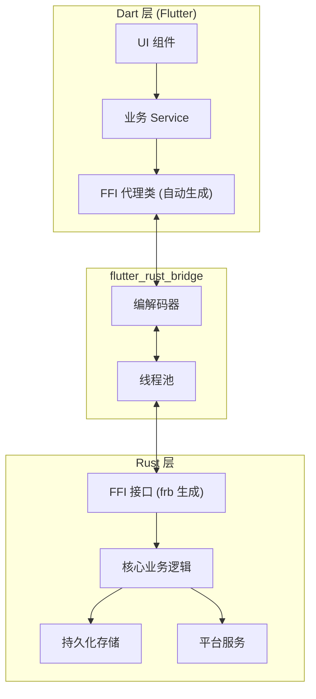
```mermaid
flowchart TB
    subgraph Dart["Dart 层 (Flutter)"]
        UI["UI 组件"]
        Service["业务 Service"]
        FFI_Dart["FFI 代理类 (自动生成)"]
    end
    
    subgraph Bridge["flutter_rust_bridge"]
        Codec["编解码器"]
        ThreadPool["线程池"]
    end
    
    subgraph Rust["Rust 层"]
        FFI_Rust["FFI 接口 (frb 生成)"]
        Core["核心业务逻辑"]
        Storage["持久化存储"]
        Platform["平台服务"]
    end
    
    UI --> Service
    Service --> FFI_Dart
    FFI_Dart <--> Codec
    Codec <--> ThreadPool
    ThreadPool <--> FFI_Rust
    FFI_Rust --> Core
    Core --> Storage
    Core --> Platform
```

### 1.2 通信机制

- **同步调用**：Dart 主线程 → Rust 同步函数 → 直接返回
- **异步调用**：Dart → Rust async 函数 → Future/await 模式
- **流式通信**：Dart Stream ← Rust StreamSink（实时翻译进度等）
- **类型安全**：所有类型由 flutter_rust_bridge 代码生成器自动生成，编译期检查

### 1.3 版本管理

| 组件 | 版本 | 兼容性策略 |
|------|------|-----------|
| flutter_rust_bridge | 2.11.0 | 遵循语义化版本，大版本升级需重新生成代码 |
| FFI API 版本 | v1 | 接口路径包含版本号：`/ffi/v1/` |
| 协议版本 | 1.0.0 | 向后兼容，新增接口不破坏现有调用 |

---

## 2. 接口清单

### 2.1 翻译服务

| 接口 | 类型 | 描述 | 优先级 | 性能要求 |
|------|------|------|--------|---------|
| `translate` | async | 单厂商翻译 | P0 | 响应 < 3000ms (P95) |
| `translateCompare` | async | 多厂商并行翻译 | P1 | 响应 < 5000ms (P95) |
| `detectLanguage` | async | 自动语言检测 | P0 | 响应 < 1000ms (P95) |

### 2.2 配置管理

| 接口 | 类型 | 描述 | 优先级 | 性能要求 |
|------|------|------|--------|---------|
| `getProviders` | sync | 获取所有厂商配置 | P0 | 响应 < 50ms |
| `saveProvider` | sync | 保存/更新厂商配置 | P0 | 响应 < 100ms |
| `deleteProvider` | sync | 删除厂商配置 | P0 | 响应 < 50ms |
| `testProvider` | async | 测试厂商连接 | P0 | 响应 < 5000ms |
| `getActiveSession` | sync | 获取当前会话状态 | P0 | 响应 < 20ms |
| `updateSession` | sync | 更新会话状态 | P0 | 响应 < 50ms |

### 2.3 系统服务

| 接口 | 类型 | 描述 | 优先级 | 性能要求 |
|------|------|------|--------|---------|
| `detectDesktopEnv` | sync | 检测桌面环境 | P0 | 响应 < 100ms |
| `ocrScreenshot` | async | OCR截图识别 | P0 | 响应 < 2000ms (P95) |
| `getShortcuts` | sync | 获取快捷键配置 | P0 | 响应 < 20ms |
| `updateShortcut` | sync | 更新快捷键配置 | P0 | 响应 < 50ms |
| `registerHotkeys` | async | 注册全局快捷键 | P0 | 响应 < 200ms |
| `unregisterHotkeys` | sync | 注销全局快捷键 | P0 | 响应 < 100ms |

### 2.4 剪贴板服务

| 接口 | 类型 | 描述 | 优先级 | 性能要求 |
|------|------|------|--------|---------|
| `getClipboardText` | sync | 读取剪贴板文本 | P0 | 响应 < 50ms |
| `setClipboardText` | sync | 写入剪贴板文本 | P0 | 响应 < 50ms |

### 2.5 托盘服务

| 接口 | 类型 | 描述 | 优先级 | 性能要求 |
|------|------|------|--------|---------|
| `initTray` | async | 初始化系统托盘 | P0 | 响应 < 500ms |
| `showTrayNotification` | sync | 显示托盘通知 | P1 | 响应 < 100ms |

---

## 3. 接口详细设计

### 3.1 translate - 单厂商翻译

**类型**：async
**描述**：调用指定翻译厂商进行文本翻译

**Rust 签名**：
```rust
pub async fn translate(request: TranslateRequest) -> Result<TranslationResult, TranslateError>
```

**Dart 签名**：
```dart
Future<TranslationResult> translate(TranslateRequest request)
```

**请求参数**：

| 参数 | 类型 | 必填 | 校验规则 | 说明 |
|------|------|------|---------|------|
| text | String | 是 | 长度 1-5000 字符 | 待翻译文本 |
| source_lang | String | 是 | ISO 639-1 代码，如 "en", "zh" | 源语言 |
| target_lang | String | 是 | ISO 639-1 代码，如 "en", "zh" | 目标语言 |
| provider_id | String | 是 | 必须存在于厂商配置中 | 翻译厂商标识 |
| rule_id | Option<String> | 否 | 必须存在于翻译规则中 | 翻译规则 ID |

**返回值**：

```rust
TranslationResult {
    provider_id: String,        // 厂商标识
    provider_name: String,      // 厂商名称
    source_text: String,        // 源文本
    translated_text: String,    // 翻译结果
    response_time_ms: u64,      // 响应时间（毫秒）
    is_success: bool,           // 是否成功
    error_message: Option<String> // 错误信息（失败时）
}
```

**错误码**：

| 错误类型 | 触发条件 | Dart 异常处理 |
|---------|---------|--------------|
| ProviderNotFound | provider_id 不存在 | 提示"翻译服务不可用" |
| ApiKeyMissing | 厂商 API Key 未配置 | 引导用户配置 API Key |
| RequestFailed | API 请求失败 | 显示错误信息，支持重试 |
| Timeout | 请求超时（> 3000ms） | 提示"请求超时，请重试" |
| RateLimited | 触发频率限制 | 提示"请求过于频繁" |

**调用时序图**：

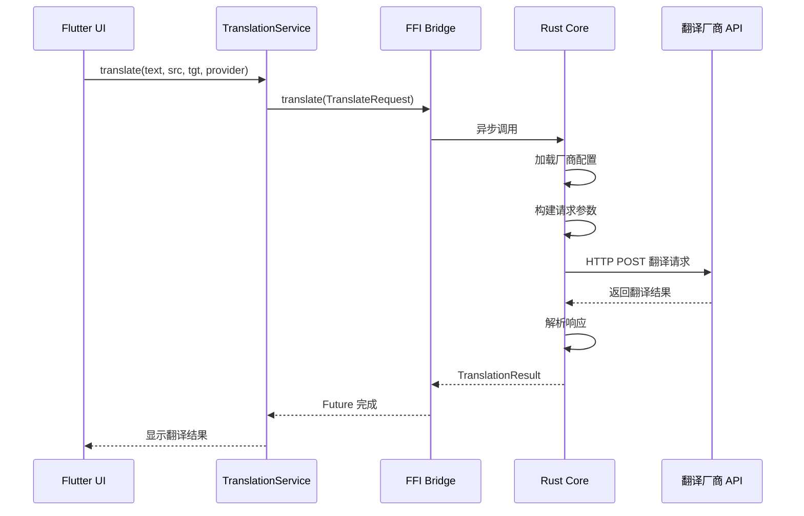
```mermaid
sequenceDiagram
    participant UI as Flutter UI
    participant Service as TranslationService
    participant FFI as FFI Bridge
    participant Rust as Rust Core
    participant API as 翻译厂商 API
    
    UI->>Service: translate(text, src, tgt, provider)
    Service->>FFI: translate(TranslateRequest)
    FFI->>Rust: 异步调用
    Rust->>Rust: 加载厂商配置
    Rust->>Rust: 构建请求参数
    Rust->>API: HTTP POST 翻译请求
    API-->>Rust: 返回翻译结果
    Rust->>Rust: 解析响应
    Rust-->>FFI: TranslationResult
    FFI-->>Service: Future 完成
    Service-->>UI: 显示翻译结果
```

**前置条件**：
- 厂商配置已保存且激活
- API Key 已正确配置
- 网络连接可用

**后置条件**：
- 更新会话状态（记录最后使用的厂商）
- 记录翻译历史（可选）

---

### 3.2 translateCompare - 多厂商并行翻译

**类型**：async
**描述**：并行调用多个翻译厂商，对比翻译结果

**Rust 签名**：
```rust
pub async fn translate_compare(
    text: String,
    source_lang: String,
    target_lang: String,
    provider_ids: Vec<String>,
    rule_id: Option<String>
) -> Result<Vec<TranslationResult>, TranslateError>
```

**Dart 签名**：
```dart
Future<List<TranslationResult>> translateCompare(
    String text,
    String sourceLang,
    String targetLang,
    List<String> providerIds,
    String? ruleId
)
```

**请求参数**：

| 参数 | 类型 | 必填 | 校验规则 | 说明 |
|------|------|------|---------|------|
| text | String | 是 | 长度 1-5000 字符 | 待翻译文本 |
| source_lang | String | 是 | ISO 639-1 代码 | 源语言 |
| target_lang | String | 是 | ISO 639-1 代码 | 目标语言 |
| provider_ids | Vec<String> | 是 | 长度 2-5，所有 ID 必须有效 | 厂商标识列表 |
| rule_id | Option<String> | 否 | 必须存在于翻译规则中 | 翻译规则 ID |

**返回值**：`Vec<TranslationResult>` - 各厂商翻译结果列表

**错误码**：

| 错误类型 | 触发条件 | Dart 异常处理 |
|---------|---------|--------------|
| ProviderNotFound | 任一 provider_id 不存在 | 提示"部分翻译服务不可用" |
| ApiKeyMissing | 任一厂商 API Key 未配置 | 引导用户配置缺失的 API Key |
| RequestFailed | 部分或全部请求失败 | 显示成功结果，标记失败厂商 |
| Timeout | 请求超时（> 5000ms） | 提示"部分请求超时" |

**调用时序图**：

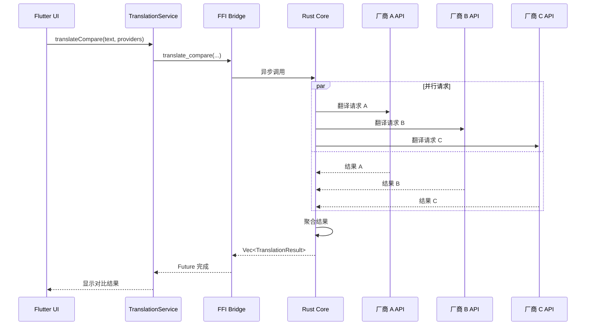
```mermaid
sequenceDiagram
    participant UI as Flutter UI
    participant Service as TranslationService
    participant FFI as FFI Bridge
    participant Rust as Rust Core
    participant API1 as 厂商 A API
    participant API2 as 厂商 B API
    participant API3 as 厂商 C API
    
    UI->>Service: translateCompare(text, providers)
    Service->>FFI: translate_compare(...)
    FFI->>Rust: 异步调用
    par 并行请求
        Rust->>API1: 翻译请求 A
        Rust->>API2: 翻译请求 B
        Rust->>API3: 翻译请求 C
    and
        API1-->>Rust: 结果 A
        API2-->>Rust: 结果 B
        API3-->>Rust: 结果 C
    end
    Rust->>Rust: 聚合结果
    Rust-->>FFI: Vec<TranslationResult>
    FFI-->>Service: Future 完成
    Service-->>UI: 显示对比结果
```

**前置条件**：
- 所有指定厂商配置已保存且激活
- 所有厂商 API Key 已正确配置

**后置条件**：
- 更新会话状态（记录最后对比的厂商列表）

---

### 3.3 detectLanguage - 自动语言检测

**类型**：async
**描述**：自动检测输入文本的语言

**Rust 签名**：
```rust
pub async fn detect_language(text: String) -> Result<String, TranslateError>
```

**Dart 签名**：
```dart
Future<String> detectLanguage(String text)
```

**请求参数**：

| 参数 | 类型 | 必填 | 校验规则 | 说明 |
|------|------|------|---------|------|
| text | String | 是 | 长度 1-10000 字符 | 待检测文本 |

**返回值**：`String` - ISO 639-1 语言代码（如 "en", "zh", "ja"）

**错误码**：

| 错误类型 | 触发条件 | Dart 异常处理 |
|---------|---------|--------------|
| RequestFailed | 检测服务请求失败 | 提示"语言检测失败" |
| Timeout | 请求超时（> 1000ms） | 提示"检测超时" |

**调用时序图**：

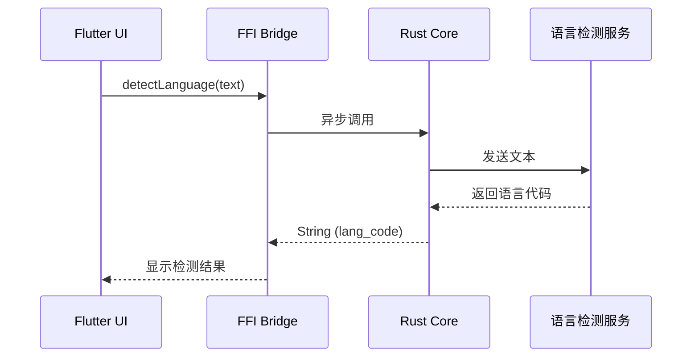
```mermaid
sequenceDiagram
    participant UI as Flutter UI
    participant FFI as FFI Bridge
    participant Rust as Rust Core
    participant Detector as 语言检测服务
    
    UI->>FFI: detectLanguage(text)
    FFI->>Rust: 异步调用
    Rust->>Detector: 发送文本
    Detector-->>Rust: 返回语言代码
    Rust-->>FFI: String (lang_code)
    FFI-->>UI: 显示检测结果
```

**前置条件**：
- 网络连接可用

**后置条件**：
- 无

---

### 3.4 getProviders - 获取所有厂商配置

**类型**：sync
**描述**：获取所有已配置的翻译厂商列表

**Rust 签名**：
```rust
pub fn get_providers() -> Result<Vec<ProviderConfig>, ConfigError>
```

**Dart 签名**：
```dart
List<ProviderConfig> getProviders()
```

**请求参数**：无

**返回值**：`Vec<ProviderConfig>` - 厂商配置列表

**错误码**：

| 错误类型 | 触发条件 | Dart 异常处理 |
|---------|---------|--------------|
| StorageError | 存储读取失败 | 提示"配置加载失败" |

**调用时序图**：

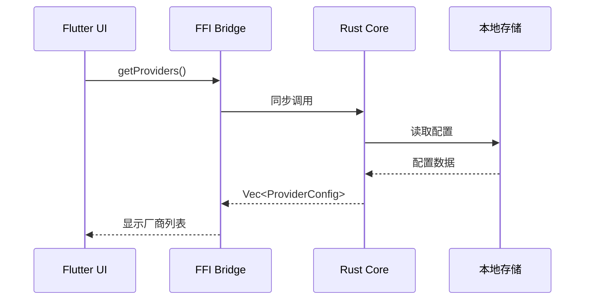
```mermaid
sequenceDiagram
    participant UI as Flutter UI
    participant FFI as FFI Bridge
    participant Rust as Rust Core
    participant Storage as 本地存储
    
    UI->>FFI: getProviders()
    FFI->>Rust: 同步调用
    Rust->>Storage: 读取配置
    Storage-->>Rust: 配置数据
    Rust-->>FFI: Vec<ProviderConfig>
    FFI-->>UI: 显示厂商列表
```

**前置条件**：
- 存储已初始化

**后置条件**：
- 无

---

### 3.5 saveProvider - 保存/更新厂商配置

**类型**：sync
**描述**：保存新厂商配置或更新现有配置

**Rust 签名**：
```rust
pub fn save_provider(config: ProviderConfig) -> Result<(), ConfigError>
```

**Dart 签名**：
```dart
void saveProvider(ProviderConfig config)
```

**请求参数**：

| 参数 | 类型 | 必填 | 校验规则 | 说明 |
|------|------|------|---------|------|
| config.id | String | 是 | UUID 格式 | 厂商标识 |
| config.name | String | 是 | 长度 1-50 字符 | 厂商名称 |
| config.api_key | String | 是 | 长度 > 0 | API 密钥 |
| config.api_url | String | 是 | 有效 URL 格式 | API 地址 |
| config.model | String | 是 | 长度 1-100 字符 | 模型名称 |
| config.auth_type | String | 是 | "api_key" 或 "oauth" | 认证类型 |
| config.is_active | bool | 是 | - | 是否启用 |
| config.sort_order | i32 | 是 | ≥ 0 | 排序权重 |

**返回值**：`()` - 成功无返回

**错误码**：

| 错误类型 | 触发条件 | Dart 异常处理 |
|---------|---------|--------------|
| ValidationError | 字段校验失败 | 提示具体字段错误 |
| StorageError | 存储写入失败 | 提示"保存失败" |
| SecretStoreUnavailable | 密钥存储不可用 | 提示"安全存储不可用" |

**调用时序图**：

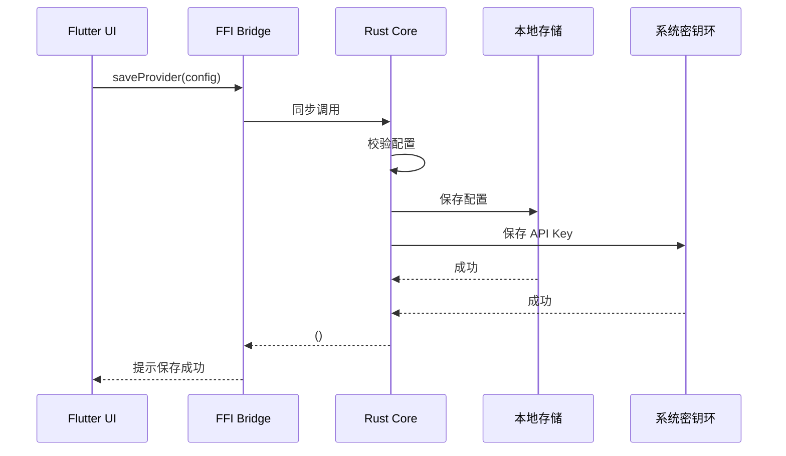
```mermaid
sequenceDiagram
    participant UI as Flutter UI
    participant FFI as FFI Bridge
    participant Rust as Rust Core
    participant Storage as 本地存储
    participant Keyring as 系统密钥环
    
    UI->>FFI: saveProvider(config)
    FFI->>Rust: 同步调用
    Rust->>Rust: 校验配置
    Rust->>Storage: 保存配置
    Rust->>Keyring: 保存 API Key
    Storage-->>Rust: 成功
    Keyring-->>Rust: 成功
    Rust-->>FFI: ()
    FFI-->>UI: 提示保存成功
```

**前置条件**：
- 存储已初始化
- 系统密钥环可用

**后置条件**：
- 厂商配置持久化
- API Key 安全存储

---

### 3.6 deleteProvider - 删除厂商配置

**类型**：sync
**描述**：删除指定厂商配置

**Rust 签名**：
```rust
pub fn delete_provider(provider_id: String) -> Result<(), ConfigError>
```

**Dart 签名**：
```dart
void deleteProvider(String providerId)
```

**请求参数**：

| 参数 | 类型 | 必填 | 校验规则 | 说明 |
|------|------|------|---------|------|
| provider_id | String | 是 | 必须存在于配置中 | 厂商标识 |

**返回值**：`()` - 成功无返回

**错误码**：

| 错误类型 | 触发条件 | Dart 异常处理 |
|---------|---------|--------------|
| ProviderNotFound | provider_id 不存在 | 提示"厂商不存在" |
| StorageError | 存储删除失败 | 提示"删除失败" |

**调用时序图**：

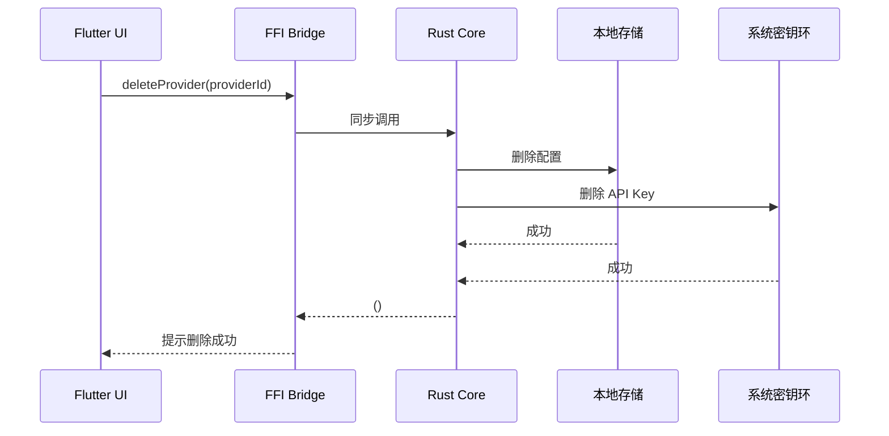
```mermaid
sequenceDiagram
    participant UI as Flutter UI
    participant FFI as FFI Bridge
    participant Rust as Rust Core
    participant Storage as 本地存储
    participant Keyring as 系统密钥环
    
    UI->>FFI: deleteProvider(providerId)
    FFI->>Rust: 同步调用
    Rust->>Storage: 删除配置
    Rust->>Keyring: 删除 API Key
    Storage-->>Rust: 成功
    Keyring-->>Rust: 成功
    Rust-->>FFI: ()
    FFI-->>UI: 提示删除成功
```

**前置条件**：
- 厂商配置存在

**后置条件**：
- 厂商配置从存储中删除
- API Key 从密钥环中删除

---

### 3.7 testProvider - 测试厂商连接

**类型**：async
**描述**：测试指定厂商的连接是否正常

**Rust 签名**：
```rust
pub async fn test_provider(provider_id: String) -> Result<TestResult, TranslateError>
```

**Dart 签名**：
```dart
Future<TestResult> testProvider(String providerId)
```

**请求参数**：

| 参数 | 类型 | 必填 | 校验规则 | 说明 |
|------|------|------|---------|------|
| provider_id | String | 是 | 必须存在于配置中 | 厂商标识 |

**返回值**：

```rust
pub struct TestResult {
    pub is_success: bool,
    pub response_time_ms: u64,
    pub message: String,
}
```

**错误码**：

| 错误类型 | 触发条件 | Dart 异常处理 |
|---------|---------|--------------|
| ProviderNotFound | provider_id 不存在 | 提示"厂商不存在" |
| ApiKeyMissing | API Key 未配置 | 提示"请先配置 API Key" |
| RequestFailed | API 请求失败 | 显示错误详情 |
| Timeout | 请求超时（> 5000ms） | 提示"连接超时" |

**调用时序图**：

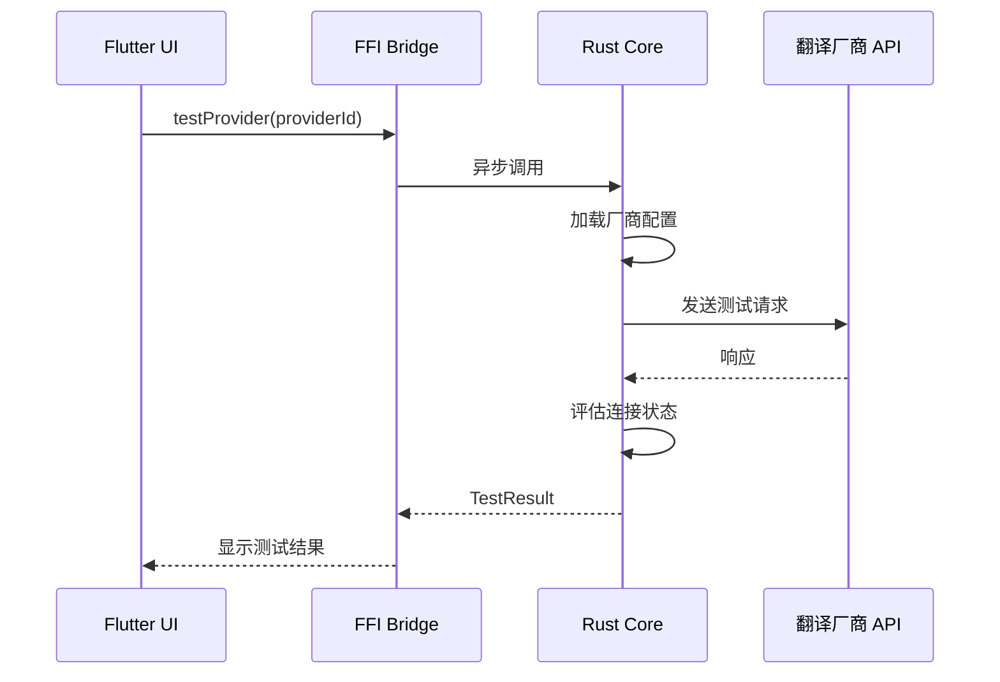
```mermaid
sequenceDiagram
    participant UI as Flutter UI
    participant FFI as FFI Bridge
    participant Rust as Rust Core
    participant API as 翻译厂商 API
    
    UI->>FFI: testProvider(providerId)
    FFI->>Rust: 异步调用
    Rust->>Rust: 加载厂商配置
    Rust->>API: 发送测试请求
    API-->>Rust: 响应
    Rust->>Rust: 评估连接状态
    Rust-->>FFI: TestResult
    FFI-->>UI: 显示测试结果
```

**前置条件**：
- 厂商配置存在
- API Key 已配置

**后置条件**：
- 无

---

### 3.8 getActiveSession - 获取当前会话状态

**类型**：sync
**描述**：获取当前翻译会话状态

**Rust 签名**：
```rust
pub fn get_active_session() -> Result<ActiveSession, ConfigError>
```

**Dart 签名**：
```dart
ActiveSession getActiveSession()
```

**请求参数**：无

**返回值**：`ActiveSession` - 会话状态

**错误码**：

| 错误类型 | 触发条件 | Dart 异常处理 |
|---------|---------|--------------|
| StorageError | 存储读取失败 | 返回默认会话状态 |

**调用时序图**：

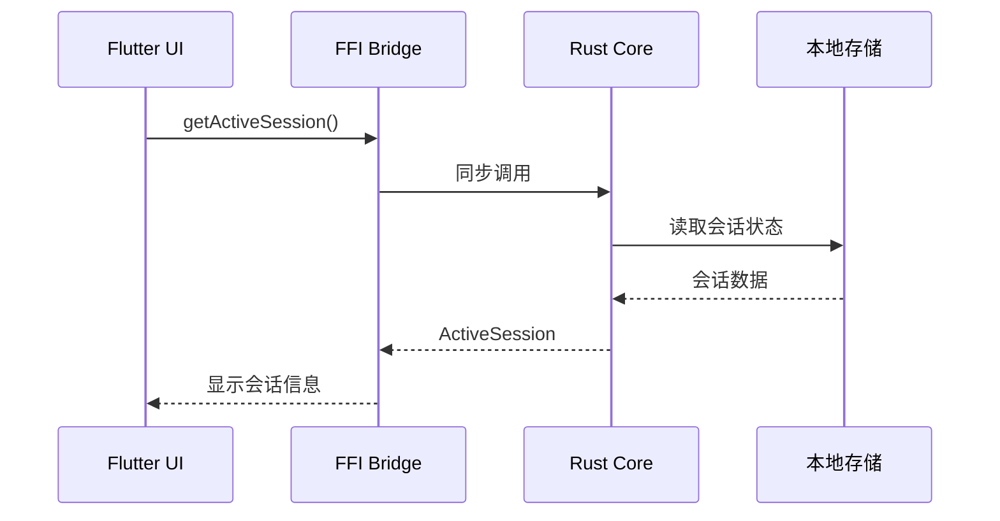
```mermaid
sequenceDiagram
    participant UI as Flutter UI
    participant FFI as FFI Bridge
    participant Rust as Rust Core
    participant Storage as 本地存储
    
    UI->>FFI: getActiveSession()
    FFI->>Rust: 同步调用
    Rust->>Storage: 读取会话状态
    Storage-->>Rust: 会话数据
    Rust-->>FFI: ActiveSession
    FFI-->>UI: 显示会话信息
```

**前置条件**：
- 存储已初始化

**后置条件**：
- 无

---

### 3.9 updateSession - 更新会话状态

**类型**：sync
**描述**：更新当前翻译会话状态

**Rust 签名**：
```rust
pub fn update_session(session: ActiveSession) -> Result<(), ConfigError>
```

**Dart 签名**：
```dart
void updateSession(ActiveSession session)
```

**请求参数**：

| 参数 | 类型 | 必填 | 校验规则 | 说明 |
|------|------|------|---------|------|
| session.last_provider_id | String | 是 | 必须为有效厂商 ID | 最后使用的厂商 |
| session.last_compare_providers | Vec<String> | 是 | 所有 ID 必须有效 | 最后对比的厂商列表 |
| session.last_used | DateTime | 是 | 有效时间戳 | 最后使用时间 |

**返回值**：`()` - 成功无返回

**错误码**：

| 错误类型 | 触发条件 | Dart 异常处理 |
|---------|---------|--------------|
| StorageError | 存储写入失败 | 静默失败（不影响主流程） |

**调用时序图**：

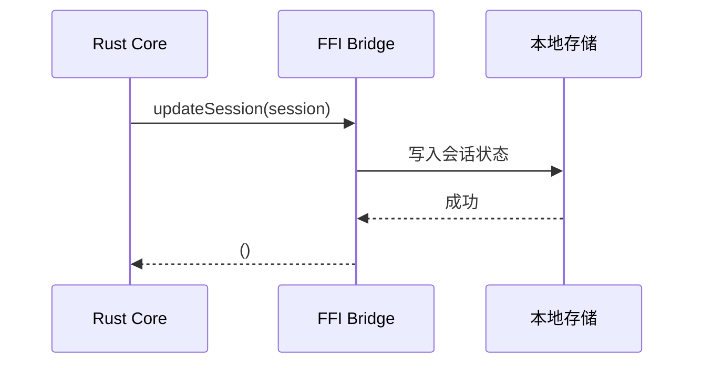
```mermaid
sequenceDiagram
    participant Core as Rust Core
    participant FFI as FFI Bridge
    participant Storage as 本地存储
    
    Core->>FFI: updateSession(session)
    FFI->>Storage: 写入会话状态
    Storage-->>FFI: 成功
    FFI-->>Core: ()
```

**前置条件**：
- 存储已初始化

**后置条件**：
- 会话状态持久化

---

### 3.10 detectDesktopEnv - 检测桌面环境

**类型**：sync
**描述**：检测当前运行的桌面环境

**Rust 签名**：
```rust
pub fn detect_desktop_env() -> DesktopEnv
```

**Dart 签名**：
```dart
DesktopEnv detectDesktopEnv()
```

**请求参数**：无

**返回值**：`DesktopEnv` 枚举

```rust
pub enum DesktopEnv {
    Kde,
    Hyprland,
    Unknown,
}
```

**错误码**：无（始终返回有效枚举值）

**调用时序图**：

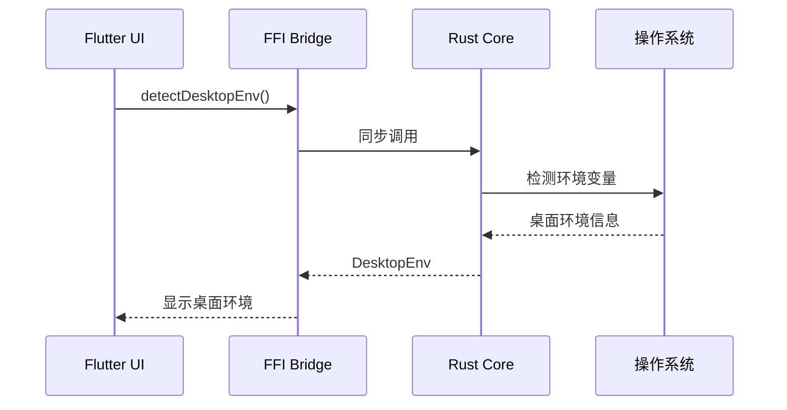
```mermaid
sequenceDiagram
    participant UI as Flutter UI
    participant FFI as FFI Bridge
    participant Rust as Rust Core
    participant OS as 操作系统
    
    UI->>FFI: detectDesktopEnv()
    FFI->>Rust: 同步调用
    Rust->>OS: 检测环境变量
    OS-->>Rust: 桌面环境信息
    Rust-->>FFI: DesktopEnv
    FFI-->>UI: 显示桌面环境
```

**前置条件**：
- 无

**后置条件**：
- 无

---

### 3.11 ocrScreenshot - OCR截图识别

**类型**：async
**描述**：截取屏幕并进行 OCR 文字识别

**Rust 签名**：
```rust
pub async fn ocr_screenshot() -> Result<String, OcrError>
```

**Dart 签名**：
```dart
Future<String> ocrScreenshot()
```

**请求参数**：无

**返回值**：`String` - 识别出的文本内容

**错误码**：

| 错误类型 | 触发条件 | Dart 异常处理 |
|---------|---------|--------------|
| ScreenshotFailed | 截图失败 | 提示"截图失败" |
| RecognitionFailed | OCR 识别失败 | 提示"文字识别失败" |
| NoTextDetected | 未检测到文字 | 提示"未识别到文字" |
| PermissionDenied | 权限不足 | 引导用户授权屏幕录制权限 |

**调用时序图**：

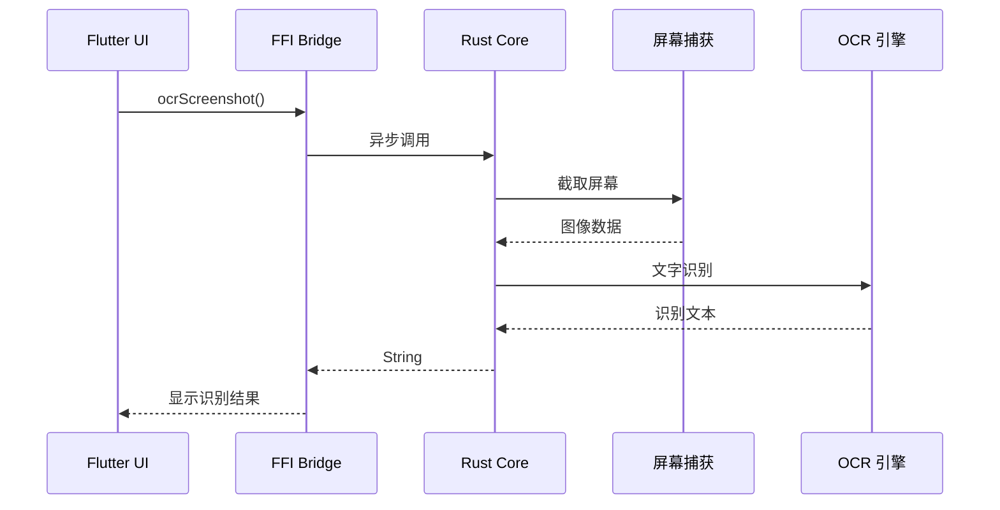
```mermaid
sequenceDiagram
    participant UI as Flutter UI
    participant FFI as FFI Bridge
    participant Rust as Rust Core
    participant Screen as 屏幕捕获
    participant OCR as OCR 引擎
    
    UI->>FFI: ocrScreenshot()
    FFI->>Rust: 异步调用
    Rust->>Screen: 截取屏幕
    Screen-->>Rust: 图像数据
    Rust->>OCR: 文字识别
    OCR-->>Rust: 识别文本
    Rust-->>FFI: String
    FFI-->>UI: 显示识别结果
```

**前置条件**：
- 屏幕录制权限已授予
- OCR 引擎已初始化

**后置条件**：
- 无

---

### 3.12 getShortcuts - 获取快捷键配置

**类型**：sync
**描述**：获取所有快捷键绑定配置

**Rust 签名**：
```rust
pub fn get_shortcuts() -> Result<Vec<ShortcutBinding>, ConfigError>
```

**Dart 签名**：
```dart
List<ShortcutBinding> getShortcuts()
```

**请求参数**：无

**返回值**：`Vec<ShortcutBinding>` - 快捷键配置列表

**错误码**：

| 错误类型 | 触发条件 | Dart 异常处理 |
|---------|---------|--------------|
| StorageError | 存储读取失败 | 返回默认快捷键配置 |

**调用时序图**：

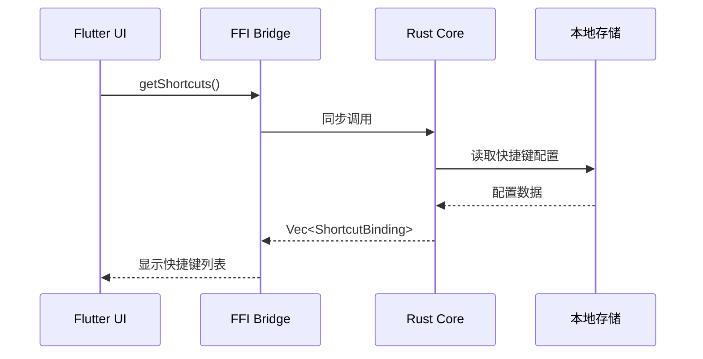
```mermaid
sequenceDiagram
    participant UI as Flutter UI
    participant FFI as FFI Bridge
    participant Rust as Rust Core
    participant Storage as 本地存储
    
    UI->>FFI: getShortcuts()
    FFI->>Rust: 同步调用
    Rust->>Storage: 读取快捷键配置
    Storage-->>Rust: 配置数据
    Rust-->>FFI: Vec<ShortcutBinding>
    FFI-->>UI: 显示快捷键列表
```

**前置条件**：
- 存储已初始化

**后置条件**：
- 无

---

### 3.13 updateShortcut - 更新快捷键配置

**类型**：sync
**描述**：更新指定快捷键绑定

**Rust 签名**：
```rust
pub fn update_shortcut(shortcut: ShortcutBinding) -> Result<(), ConfigError>
```

**Dart 签名**：
```dart
void updateShortcut(ShortcutBinding shortcut)
```

**请求参数**：

| 参数 | 类型 | 必填 | 校验规则 | 说明 |
|------|------|------|---------|------|
| shortcut.action | String | 是 | 预定义动作枚举 | 快捷动作 |
| shortcut.key_combination | String | 是 | 有效快捷键格式 | 按键组合 |
| shortcut.enabled | bool | 是 | - | 是否启用 |

**返回值**：`()` - 成功无返回

**错误码**：

| 错误类型 | 触发条件 | Dart 异常处理 |
|---------|---------|--------------|
| ValidationError | 快捷键格式无效 | 提示"快捷键格式错误" |
| StorageError | 存储写入失败 | 提示"保存失败" |

**调用时序图**：

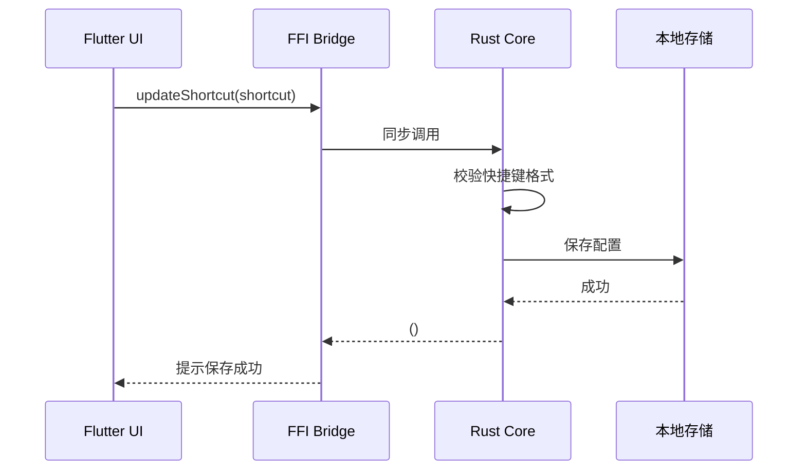
```mermaid
sequenceDiagram
    participant UI as Flutter UI
    participant FFI as FFI Bridge
    participant Rust as Rust Core
    participant Storage as 本地存储
    
    UI->>FFI: updateShortcut(shortcut)
    FFI->>Rust: 同步调用
    Rust->>Rust: 校验快捷键格式
    Rust->>Storage: 保存配置
    Storage-->>Rust: 成功
    Rust-->>FFI: ()
    FFI-->>UI: 提示保存成功
```

**前置条件**：
- 存储已初始化

**后置条件**：
- 快捷键配置持久化

---

### 3.14 registerHotkeys - 注册全局快捷键

**类型**：async
**描述**：注册全局快捷键监听

**Rust 签名**：
```rust
pub async fn register_hotkeys(shortcuts: Vec<ShortcutBinding>) -> Result<(), ConfigError>
```

**Dart 签名**：
```dart
Future<void> registerHotkeys(List<ShortcutBinding> shortcuts)
```

**请求参数**：

| 参数 | 类型 | 必填 | 校验规则 | 说明 |
|------|------|------|---------|------|
| shortcuts | Vec<ShortcutBinding> | 是 | 长度 ≥ 1 | 快捷键列表 |

**返回值**：`()` - 成功无返回

**错误码**：

| 错误类型 | 触发条件 | Dart 异常处理 |
|---------|---------|--------------|
| PermissionDenied | 权限不足 | 引导用户授权辅助功能权限 |
| StorageError | 注册失败 | 提示"注册失败" |

**调用时序图**：

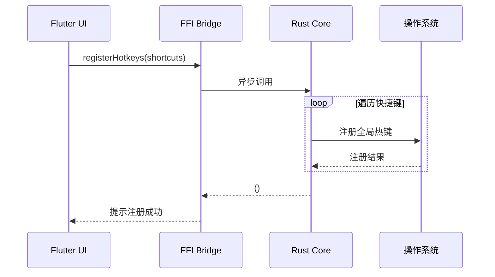
```mermaid
sequenceDiagram
    participant UI as Flutter UI
    participant FFI as FFI Bridge
    participant Rust as Rust Core
    participant OS as 操作系统
    
    UI->>FFI: registerHotkeys(shortcuts)
    FFI->>Rust: 异步调用
    loop 遍历快捷键
        Rust->>OS: 注册全局热键
        OS-->>Rust: 注册结果
    end
    Rust-->>FFI: ()
    FFI-->>UI: 提示注册成功
```

**前置条件**：
- 快捷键配置已保存
- 必要的系统权限已授予

**后置条件**：
- 全局快捷键已注册
- 快捷键事件监听已启动

---

### 3.15 unregisterHotkeys - 注销全局快捷键

**类型**：sync
**描述**：注销所有已注册的全局快捷键

**Rust 签名**：
```rust
pub fn unregister_hotkeys() -> Result<(), ConfigError>
```

**Dart 签名**：
```dart
void unregisterHotkeys()
```

**请求参数**：无

**返回值**：`()` - 成功无返回

**错误码**：

| 错误类型 | 触发条件 | Dart 异常处理 |
|---------|---------|--------------|
| StorageError | 注销失败 | 静默失败 |

**调用时序图**：

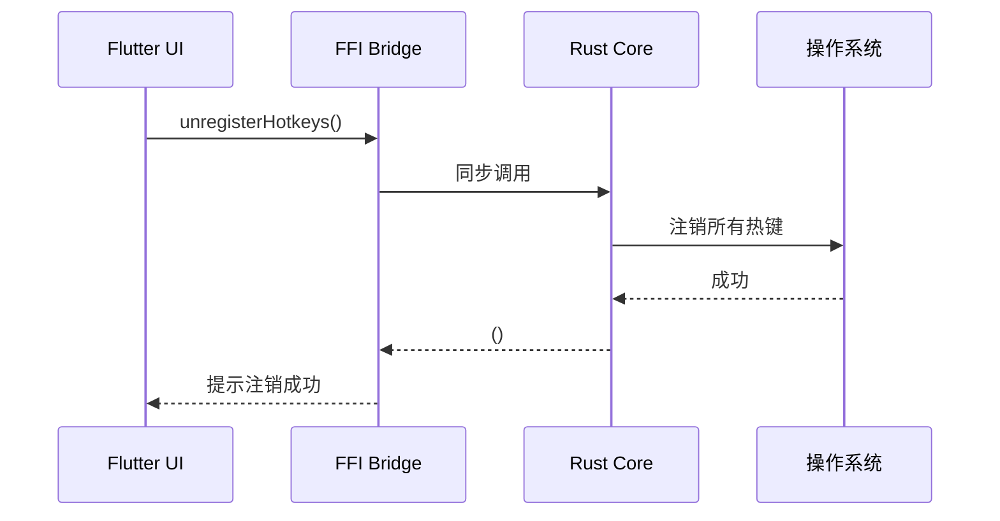
```mermaid
sequenceDiagram
    participant UI as Flutter UI
    participant FFI as FFI Bridge
    participant Rust as Rust Core
    participant OS as 操作系统
    
    UI->>FFI: unregisterHotkeys()
    FFI->>Rust: 同步调用
    Rust->>OS: 注销所有热键
    OS-->>Rust: 成功
    Rust-->>FFI: ()
    FFI-->>UI: 提示注销成功
```

**前置条件**：
- 快捷键已注册

**后置条件**：
- 全局快捷键已注销
- 事件监听已停止

---

### 3.16 getClipboardText - 读取剪贴板文本

**类型**：sync
**描述**：读取系统剪贴板中的文本内容

**Rust 签名**：
```rust
pub fn get_clipboard_text() -> Result<String, ClipboardError>
```

**Dart 签名**：
```dart
String getClipboardText()
```

**请求参数**：无

**返回值**：`String` - 剪贴板文本内容

**错误码**：

| 错误类型 | 触发条件 | Dart 异常处理 |
|---------|---------|--------------|
| PermissionDenied | 权限不足 | 引导用户授权 |
| EmptyClipboard | 剪贴板为空 | 返回空字符串 |

**调用时序图**：

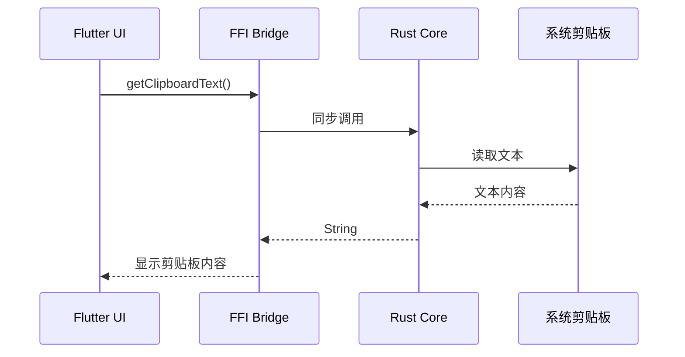
```mermaid
sequenceDiagram
    participant UI as Flutter UI
    participant FFI as FFI Bridge
    participant Rust as Rust Core
    participant Clipboard as 系统剪贴板
    
    UI->>FFI: getClipboardText()
    FFI->>Rust: 同步调用
    Rust->>Clipboard: 读取文本
    Clipboard-->>Rust: 文本内容
    Rust-->>FFI: String
    FFI-->>UI: 显示剪贴板内容
```

**前置条件**：
- 剪贴板访问权限已授予

**后置条件**：
- 无

---

### 3.17 setClipboardText - 写入剪贴板文本

**类型**：sync
**描述**：将文本写入系统剪贴板

**Rust 签名**：
```rust
pub fn set_clipboard_text(text: String) -> Result<(), ClipboardError>
```

**Dart 签名**：
```dart
void setClipboardText(String text)
```

**请求参数**：

| 参数 | 类型 | 必填 | 校验规则 | 说明 |
|------|------|------|---------|------|
| text | String | 是 | 长度 1-10000 字符 | 要写入的文本 |

**返回值**：`()` - 成功无返回

**错误码**：

| 错误类型 | 触发条件 | Dart 异常处理 |
|---------|---------|--------------|
| PermissionDenied | 权限不足 | 引导用户授权 |
| WriteFailed | 写入失败 | 提示"写入剪贴板失败" |

**调用时序图**：

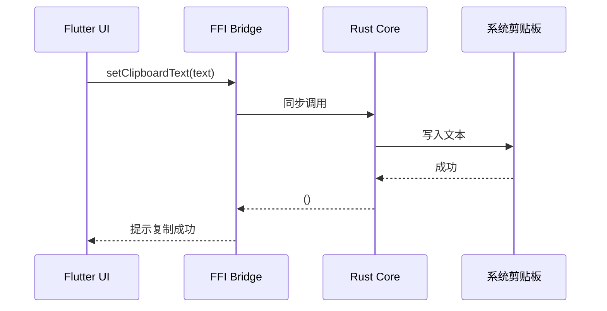
```mermaid
sequenceDiagram
    participant UI as Flutter UI
    participant FFI as FFI Bridge
    participant Rust as Rust Core
    participant Clipboard as 系统剪贴板
    
    UI->>FFI: setClipboardText(text)
    FFI->>Rust: 同步调用
    Rust->>Clipboard: 写入文本
    Clipboard-->>Rust: 成功
    Rust-->>FFI: ()
    FFI-->>UI: 提示复制成功
```

**前置条件**：
- 剪贴板访问权限已授予

**后置条件**：
- 剪贴板内容已更新

---

### 3.18 initTray - 初始化系统托盘

**类型**：async
**描述**：初始化系统托盘图标和菜单

**Rust 签名**：
```rust
pub async fn init_tray(config: TrayConfig) -> Result<(), TrayError>
```

**Dart 签名**：
```dart
Future<void> initTray(TrayConfig config)
```

**请求参数**：

```rust
pub struct TrayConfig {
    pub icon_path: String,
    pub tooltip: String,
    pub menu_items: Vec<TrayMenuItem>,
}

pub struct TrayMenuItem {
    pub id: String,
    pub label: String,
    pub enabled: bool,
    pub checked: Option<bool>,
}
```

**返回值**：`()` - 成功无返回

**错误码**：

| 错误类型 | 触发条件 | Dart 异常处理 |
|---------|---------|--------------|
| InitFailed | 托盘初始化失败 | 提示"托盘初始化失败" |
| IconNotFound | 图标文件不存在 | 使用默认图标 |

**调用时序图**：

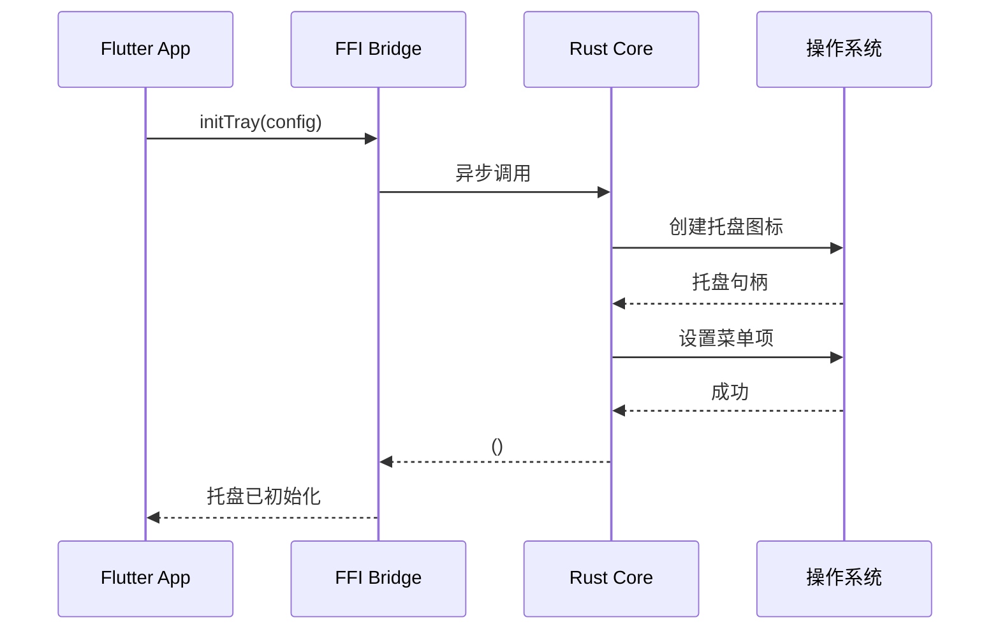
```mermaid
sequenceDiagram
    participant App as Flutter App
    participant FFI as FFI Bridge
    participant Rust as Rust Core
    participant OS as 操作系统
    
    App->>FFI: initTray(config)
    FFI->>Rust: 异步调用
    Rust->>OS: 创建托盘图标
    OS-->>Rust: 托盘句柄
    Rust->>OS: 设置菜单项
    OS-->>Rust: 成功
    Rust-->>FFI: ()
    FFI-->>App: 托盘已初始化
```

**前置条件**：
- 托盘图标文件存在
- 操作系统支持系统托盘

**后置条件**：
- 系统托盘图标已显示
- 菜单项已配置
- 托盘事件监听已启动

---

### 3.19 showTrayNotification - 显示托盘通知

**类型**：sync
**描述**：显示系统托盘通知消息

**Rust 签名**：
```rust
pub fn show_tray_notification(title: String, body: String) -> Result<(), TrayError>
```

**Dart 签名**：
```dart
void showTrayNotification(String title, String body)
```

**请求参数**：

| 参数 | 类型 | 必填 | 校验规则 | 说明 |
|------|------|------|---------|------|
| title | String | 是 | 长度 1-100 字符 | 通知标题 |
| body | String | 是 | 长度 1-500 字符 | 通知内容 |

**返回值**：`()` - 成功无返回

**错误码**：

| 错误类型 | 触发条件 | Dart 异常处理 |
|---------|---------|--------------|
| NotificationFailed | 通知显示失败 | 静默失败 |

**调用时序图**：

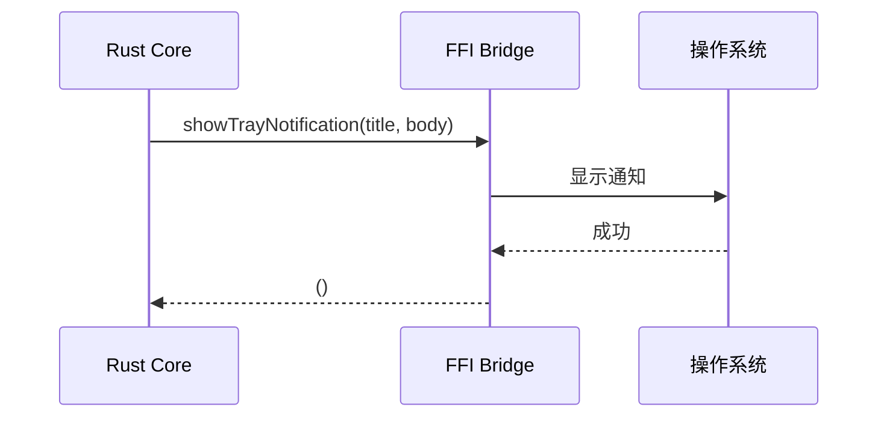
```mermaid
sequenceDiagram
    participant Core as Rust Core
    participant FFI as FFI Bridge
    participant OS as 操作系统
    
    Core->>FFI: showTrayNotification(title, body)
    FFI->>OS: 显示通知
    OS-->>FFI: 成功
    FFI-->>Core: ()
```

**前置条件**：
- 系统托盘已初始化
- 通知权限已授予

**后置条件**：
- 通知已显示

---

## 4. 共享类型定义

### 4.1 TranslateRequest - 翻译请求

```rust
pub struct TranslateRequest {
    pub text: String,              // 待翻译文本
    pub source_lang: String,       // 源语言 (ISO 639-1)
    pub target_lang: String,       // 目标语言 (ISO 639-1)
    pub provider_id: String,       // 厂商标识
    pub rule_id: Option<String>,   // 翻译规则 ID（可选）
}
```

**字段说明**：

| 字段 | 类型 | 必填 | 校验规则 | 说明 |
|------|------|------|---------|------|
| text | String | 是 | 长度 1-5000 | 待翻译文本 |
| source_lang | String | 是 | ISO 639-1 代码 | 源语言 |
| target_lang | String | 是 | ISO 639-1 代码 | 目标语言 |
| provider_id | String | 是 | 必须存在于配置中 | 厂商标识 |
| rule_id | Option<String> | 否 | 必须存在于规则中 | 翻译规则 |

---

### 4.2 TranslationResult - 翻译结果

```rust
pub struct TranslationResult {
    pub provider_id: String,
    pub provider_name: String,
    pub source_text: String,
    pub translated_text: String,
    pub response_time_ms: u64,
    pub is_success: bool,
    pub error_message: Option<String>,
}
```

**字段说明**：

| 字段 | 类型 | 说明 |
|------|------|------|
| provider_id | String | 厂商标识 |
| provider_name | String | 厂商显示名称 |
| source_text | String | 源文本 |
| translated_text | String | 翻译结果 |
| response_time_ms | u64 | 响应时间（毫秒） |
| is_success | bool | 是否成功 |
| error_message | Option<String> | 错误信息（失败时） |

---

### 4.3 ProviderConfig - 厂商配置

```rust
pub struct ProviderConfig {
    pub id: String,
    pub name: String,
    pub api_key: String,
    pub api_url: String,
    pub model: String,
    pub auth_type: String,
    pub is_active: bool,
    pub sort_order: i32,
}
```

**字段说明**：

| 字段 | 类型 | 校验规则 | 说明 |
|------|------|---------|------|
| id | String | UUID 格式 | 厂商标识 |
| name | String | 长度 1-50 | 厂商名称 |
| api_key | String | 长度 > 0 | API 密钥 |
| api_url | String | 有效 URL | API 地址 |
| model | String | 长度 1-100 | 模型名称 |
| auth_type | String | "api_key" 或 "oauth" | 认证类型 |
| is_active | bool | - | 是否启用 |
| sort_order | i32 | ≥ 0 | 排序权重 |

---

### 4.4 TranslationRule - 翻译规则

```rust
pub struct TranslationRule {
    pub id: String,
    pub provider_id: String,
    pub role_name: String,
    pub system_prompt: String,
    pub custom_rules: String,
    pub is_default: bool,
}
```

**字段说明**：

| 字段 | 类型 | 说明 |
|------|------|------|
| id | String | 规则标识 |
| provider_id | String | 关联厂商 |
| role_name | String | 角色名称 |
| system_prompt | String | 系统提示词 |
| custom_rules | String | 自定义规则（JSON） |
| is_default | bool | 是否为默认规则 |

---

### 4.5 ActiveSession - 会话状态

```rust
pub struct ActiveSession {
    pub last_provider_id: String,
    pub last_compare_providers: Vec<String>,
    pub last_used: DateTime,
}
```

**字段说明**：

| 字段 | 类型 | 说明 |
|------|------|------|
| last_provider_id | String | 最后使用的厂商 |
| last_compare_providers | Vec<String> | 最后对比的厂商列表 |
| last_used | DateTime | 最后使用时间 |

---

### 4.6 ShortcutBinding - 快捷键绑定

```rust
pub struct ShortcutBinding {
    pub action: String,
    pub key_combination: String,
    pub enabled: bool,
}
```

**字段说明**：

| 字段 | 类型 | 说明 |
|------|------|------|
| action | String | 快捷动作标识 |
| key_combination | String | 按键组合（如 "Ctrl+Shift+T"） |
| enabled | bool | 是否启用 |

---

### 4.7 DesktopEnv - 桌面环境

```rust
pub enum DesktopEnv {
    Kde,
    Hyprland,
    Unknown,
}
```

**枚举值说明**：

| 值 | 说明 |
|----|------|
| Kde | KDE Plasma 桌面环境 |
| Hyprland | Hyprland Wayland 合成器 |
| Unknown | 未知或不支持的桌面环境 |

---

### 4.8 错误类型

#### TranslateError - 翻译错误

```rust
pub enum TranslateError {
    ProviderNotFound,
    ApiKeyMissing,
    RequestFailed { status: u16, message: String },
    Timeout,
    RateLimited,
}
```

| 变体 | 说明 |
|------|------|
| ProviderNotFound | 指定的厂商不存在 |
| ApiKeyMissing | API Key 未配置 |
| RequestFailed | API 请求失败（携带状态码和消息） |
| Timeout | 请求超时 |
| RateLimited | 触发频率限制 |

#### ConfigError - 配置错误

```rust
pub enum ConfigError {
    StorageError { message: String },
    ValidationError { field: String, message: String },
    SecretStoreUnavailable,
}
```

| 变体 | 说明 |
|------|------|
| StorageError | 存储操作失败 |
| ValidationError | 字段校验失败（携带字段名和消息） |
| SecretStoreUnavailable | 系统密钥环不可用 |

#### OcrError - OCR 错误

```rust
pub enum OcrError {
    ScreenshotFailed { message: String },
    RecognitionFailed { message: String },
    NoTextDetected,
    PermissionDenied,
}
```

| 变体 | 说明 |
|------|------|
| ScreenshotFailed | 截图失败 |
| RecognitionFailed | OCR 识别失败 |
| NoTextDetected | 未检测到文字 |
| PermissionDenied | 权限不足 |

#### ClipboardError - 剪贴板错误

```rust
pub enum ClipboardError {
    PermissionDenied,
    EmptyClipboard,
    WriteFailed,
}
```

| 变体 | 说明 |
|------|------|
| PermissionDenied | 权限不足 |
| EmptyClipboard | 剪贴板为空 |
| WriteFailed | 写入失败 |

#### TrayError - 托盘错误

```rust
pub enum TrayError {
    InitFailed,
    IconNotFound,
    NotificationFailed,
}
```

| 变体 | 说明 |
|------|------|
| InitFailed | 初始化失败 |
| IconNotFound | 图标文件不存在 |
| NotificationFailed | 通知显示失败 |

---

## 5. 错误处理规范

### 5.1 错误类型映射

| Rust 错误类型 | Dart 异常类型 | 错误码前缀 | 说明 |
|--------------|--------------|-----------|------|
| TranslateError | TranslateException | TR_ | 翻译相关错误 |
| ConfigError | ConfigException | CF_ | 配置相关错误 |
| OcrError | OcrException | OC_ | OCR 相关错误 |
| ClipboardError | ClipboardException | CB_ | 剪贴板相关错误 |
| TrayError | TrayException | TRAY_ | 托盘相关错误 |

### 5.2 Dart 端异常转换

```dart
// flutter_rust_bridge 自动生成的异常转换
// 示例：手动处理的场景

Future<TranslationResult> safeTranslate(TranslateRequest request) async {
  try {
    return await translate(request);
  } on TranslateException catch (e) {
    switch (e.errorType) {
      case 'ProviderNotFound':
        throw UserFriendlyException('翻译服务不可用，请检查配置');
      case 'ApiKeyMissing':
        throw UserFriendlyException('请先配置 API Key');
      case 'Timeout':
        throw UserFriendlyException('请求超时，请重试');
      case 'RateLimited':
        throw UserFriendlyException('请求过于频繁，请稍后重试');
      default:
        throw UserFriendlyException('翻译失败：${e.message}');
    }
  }
}
```

### 5.3 错误码定义表

| 错误码 | 异常类型 | 含义 | 触发条件 | 用户提示 |
|--------|---------|------|---------|---------|
| TR_001 | TranslateException | 厂商不存在 | provider_id 无效 | "翻译服务不可用" |
| TR_002 | TranslateException | API Key 缺失 | 未配置 API Key | "请先配置 API Key" |
| TR_003 | TranslateException | 请求失败 | API 返回错误 | "翻译失败：{message}" |
| TR_004 | TranslateException | 请求超时 | 超过 3000ms | "请求超时，请重试" |
| TR_005 | TranslateException | 频率限制 | 触发限流 | "请求过于频繁" |
| CF_001 | ConfigException | 存储错误 | 读写失败 | "配置操作失败" |
| CF_002 | ConfigException | 校验错误 | 字段无效 | "{field} 格式错误" |
| CF_003 | ConfigException | 密钥环不可用 | 系统密钥环异常 | "安全存储不可用" |
| OC_001 | OcrException | 截图失败 | 屏幕捕获失败 | "截图失败" |
| OC_002 | OcrException | 识别失败 | OCR 引擎异常 | "文字识别失败" |
| OC_003 | OcrException | 未检测到文字 | 图片无文字 | "未识别到文字" |
| OC_004 | OcrException | 权限不足 | 未授权屏幕录制 | "请授权屏幕录制权限" |
| CB_001 | ClipboardException | 权限不足 | 未授权剪贴板访问 | "请授权剪贴板访问" |
| CB_002 | ClipboardException | 剪贴板为空 | 无文本内容 | "剪贴板为空" |
| CB_003 | ClipboardException | 写入失败 | 系统异常 | "写入剪贴板失败" |
| TRAY_001 | TrayException | 初始化失败 | 托盘创建失败 | "托盘初始化失败" |
| TRAY_002 | TrayException | 图标不存在 | 文件路径无效 | "使用默认图标" |
| TRAY_003 | TrayException | 通知失败 | 系统通知异常 | 静默失败 |

---

## 6. 异步流设计

### 6.1 实时翻译进度流

```rust
// Rust 端：使用 StreamSink 推送进度
pub async fn translate_with_progress(
    request: TranslateRequest,
    sink: StreamSink<TranslateProgress>
) -> Result<TranslationResult, TranslateError>

pub enum TranslateProgress {
    Connecting { provider_id: String },
    Sending { progress: f32 },
    Waiting { estimated_ms: u64 },
    Receiving { progress: f32 },
    Completed { response_time_ms: u64 },
}
```

```dart
// Dart 端：监听进度流
Stream<TranslateProgress> translateWithProgress(
    TranslateRequest request
)
```

**调用时序图**：

```mermaid
sequenceDiagram
    participant UI as Flutter UI
    participant Service as TranslationService
    participant FFI as FFI Bridge
    participant Rust as Rust Core
    participant API as 翻译厂商 API
    
    UI->>Service: translateWithProgress(request)
    Service->>FFI: translate_with_progress(request, sink)
    FFI->>Rust: 创建 StreamSink
    
    loop 翻译过程
        Rust->>Rust: 构建请求
        Rust->>sink: Connecting
        Rust->>API: 发送请求
        Rust->>sink: Sending
        API-->>Rust: 响应中
        Rust->>sink: Waiting
        API-->>Rust: 返回数据
        Rust->>sink: Receiving
        Rust->>sink: Completed
    end
    
    Rust-->>FFI: TranslationResult
    FFI-->>Service: Future + Stream
    Service-->>UI: 显示结果
```

### 6.2 快捷键事件流

```rust
// Rust 端：推送快捷键事件
pub fn start_hotkey_listener(sink: StreamSink<HotkeyEvent>)

pub struct HotkeyEvent {
    pub action: String,
    pub timestamp: DateTime,
}
```

```dart
// Dart 端：监听快捷键事件
Stream<HotkeyEvent> startHotkeyListener()
```

---

## 7. 性能约束

### 7.1 超时设置

| 接口类型 | 超时时间 | 说明 |
|---------|---------|------|
| 翻译请求 | 3000ms | 单厂商翻译 |
| 对比翻译 | 5000ms | 多厂商并行，取最慢响应 |
| 语言检测 | 1000ms | 轻量请求 |
| 厂商测试 | 5000ms | 连接测试 |
| OCR 识别 | 2000ms | 截图 + 识别 |
| 托盘初始化 | 500ms | 系统调用 |
| 同步接口 | 100ms | 本地操作 |

### 7.2 并发限制

| 场景 | 限制 | 说明 |
|------|------|------|
| 翻译请求 | 最多 3 并发 | 防止 API 限流 |
| 对比翻译 | 最多 5 厂商 | 并行请求上限 |
| OCR 请求 | 单线程 | 避免资源竞争 |
| 配置读写 | 互斥锁 | 保证数据一致性 |

### 7.3 内存约束

| 资源 | 限制 | 说明 |
|------|------|------|
| 翻译文本 | ≤ 5000 字符 | 单次翻译上限 |
| OCR 图像 | ≤ 10MB | 截图大小限制 |
| 配置缓存 | ≤ 1MB | 内存缓存上限 |
| 流式缓冲 | ≤ 100 条 | 进度事件缓冲 |

### 7.4 性能指标

| 指标 | 目标值 | 测量方式 |
|------|--------|---------|
| FFI 调用开销 | < 1ms | 同步接口基准测试 |
| 异步调度延迟 | < 5ms | Future 完成时间 |
| 内存泄漏 | 0 bytes/hour | 长时间运行监控 |
| CPU 占用 | < 5% | 空闲状态监控 |

---

## 8. 版本兼容

### 8.1 接口升级策略

| 变更类型 | 兼容性 | 处理方式 |
|---------|--------|---------|
| 新增接口 | 向后兼容 | 直接添加，无需版本升级 |
| 新增可选参数 | 向后兼容 | 使用 Option<T> 类型 |
| 新增枚举变体 | 向后兼容 | 旧版本忽略新变体 |
| 删除接口 | 不兼容 | 标记 @deprecated，保留 2 版本 |
| 修改参数类型 | 不兼容 | 新增接口，废弃旧接口 |
| 修改返回值 | 不兼容 | 新增接口，废弃旧接口 |

### 8.2 向后兼容保证

1. **接口不删除**：废弃接口保留至少 2 个大版本
2. **参数可选**：新增参数使用 `Option<T>` 类型
3. **枚举扩展**：新增变体不影响旧版本匹配
4. **错误码稳定**：错误码一旦发布不修改含义
5. **类型兼容**：Rust 和 Dart 类型映射保持一致

### 8.3 版本标识

```rust
// Rust 端版本标识
pub const FFI_API_VERSION: &str = "1.0.0";

// Dart 端版本检查
Future<void> checkApiVersion() async {
  final version = await getApiVersion();
  if (!isCompatible(version)) {
    throw IncompatibleVersionException(version);
  }
}
```

---

## 9. 测试方案

### 9.1 测试分层

```mermaid
flowchart TB
    subgraph L1["L1: 单元测试"]
        UT1["Rust 单元测试"]
        UT2["Dart 单元测试"]
    end
    
    subgraph L2["L2: 集成测试"]
        IT1["FFI 桥接测试"]
        IT2["Mock API 测试"]
    end
    
    subgraph L3["L3: E2E 测试"]
        E2E1["完整流程测试"]
        E2E2["性能基准测试"]
    end
    
    L1 --> L2 --> L3
```

### 9.2 测试用例

#### 单元测试

| 测试目标 | 测试内容 | 工具 |
|---------|---------|------|
| Rust 核心逻辑 | 翻译请求构建、参数校验、错误处理 | cargo test |
| Dart 服务层 | 异常转换、参数验证、状态管理 | flutter test |
| 类型转换 | Rust ↔ Dart 类型映射正确性 | flutter_rust_bridge 生成测试 |

#### 集成测试

| 测试场景 | 测试内容 | 工具 |
|---------|---------|------|
| FFI 桥接 | 同步/异步调用、流式通信 | flutter_rust_bridge test |
| Mock API | 模拟厂商响应、超时、错误 | mockito (Rust) |
| 配置存储 | 读写一致性、并发安全 | tempdir + serde_json |

#### E2E 测试

| 测试场景 | 测试内容 | 工具 |
|---------|---------|------|
| 完整翻译流程 | UI → FFI → API → 结果展示 | integration_test |
| 性能基准 | 响应时间、内存占用、CPU 使用 | flutter_driver |
| 错误恢复 | 网络断开、API 异常、权限拒绝 | chaos engineering |

### 9.3 测试覆盖率目标

| 层级 | 覆盖率目标 | 测量工具 |
|------|-----------|---------|
| Rust 核心逻辑 | ≥ 80% | cargo-tarpaulin |
| Dart 服务层 | ≥ 70% | flutter test --coverage |
| FFI 接口 | 100% | 手动验证 |

### 9.4 CI/CD 集成

```yaml
# .github/workflows/test.yml
name: FFI Tests
on: [push, pull_request]

jobs:
  rust-tests:
    runs-on: ubuntu-latest
    steps:
      - uses: actions/checkout@v4
      - run: cargo test --workspace
      
  dart-tests:
    runs-on: ubuntu-latest
    steps:
      - uses: actions/checkout@v4
      - run: flutter test
      
  ffi-integration:
    runs-on: ubuntu-latest
    steps:
      - uses: actions/checkout@v4
      - run: flutter test integration_test/
```

---

## 10. 自检清单

- [ ] 所有接口的 Rust 和 Dart 签名已对照
- [ ] 每个接口的参数校验规则完整
- [ ] 错误码覆盖所有异常场景
- [ ] Mermaid 时序图标注了所有参与者
- [ ] 前置/后置条件已定义
- [ ] 性能约束已量化
- [ ] 版本兼容策略已明确
- [ ] 测试方案覆盖三层架构
- [ ] 共享类型定义完整
- [ ] 异步流设计包含进度和事件监听