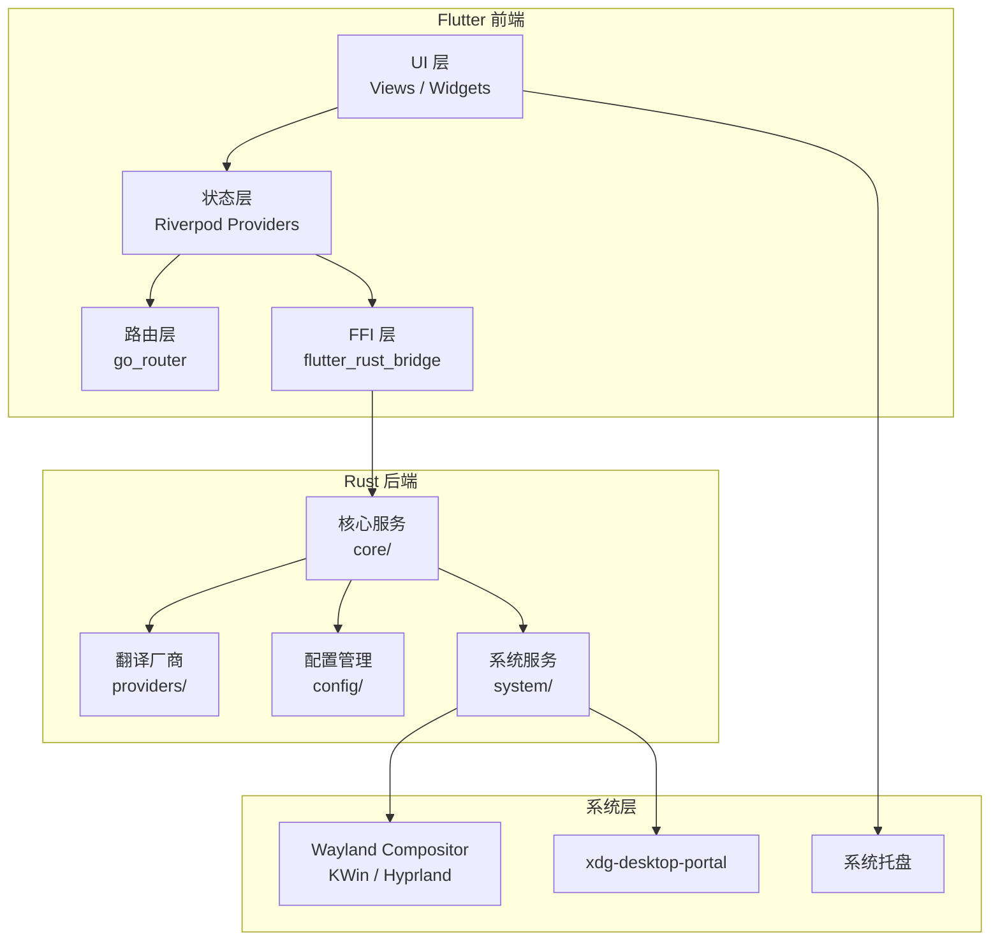
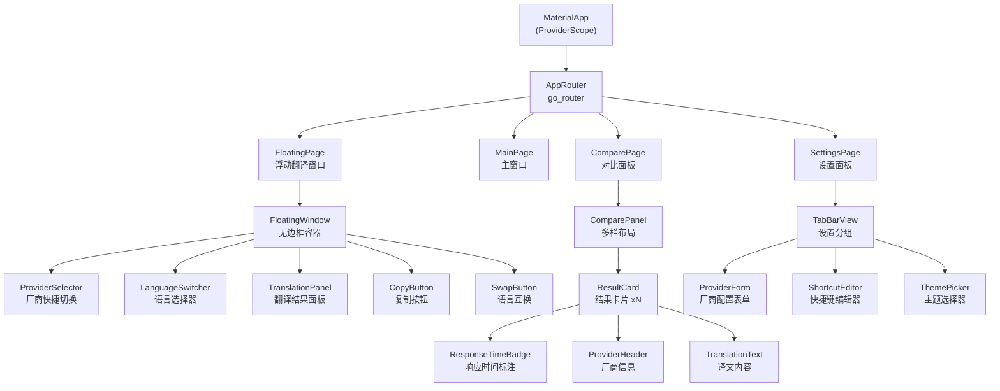
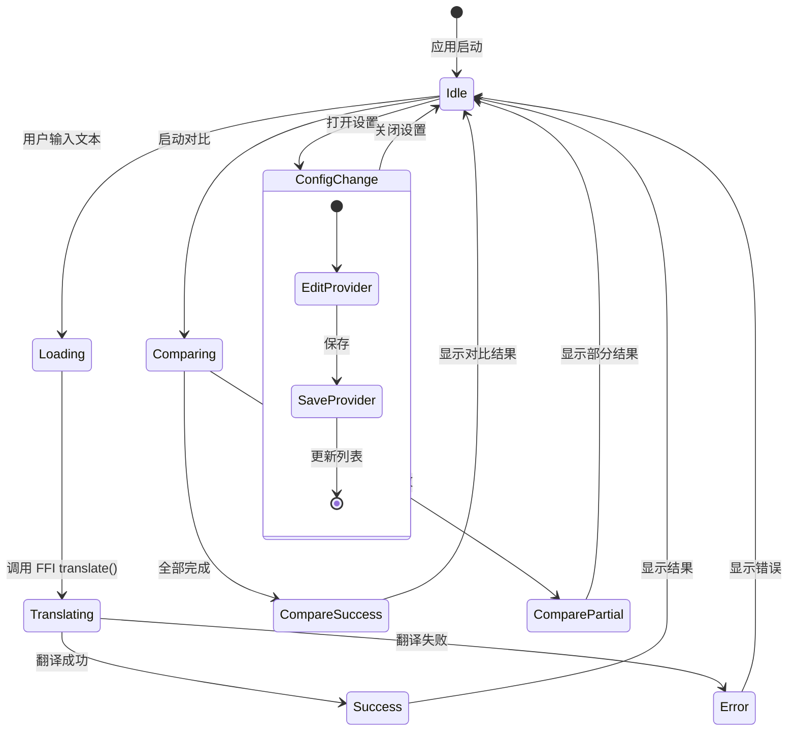
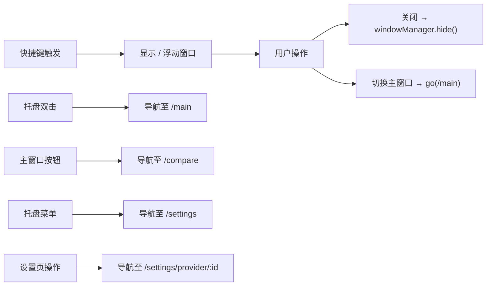
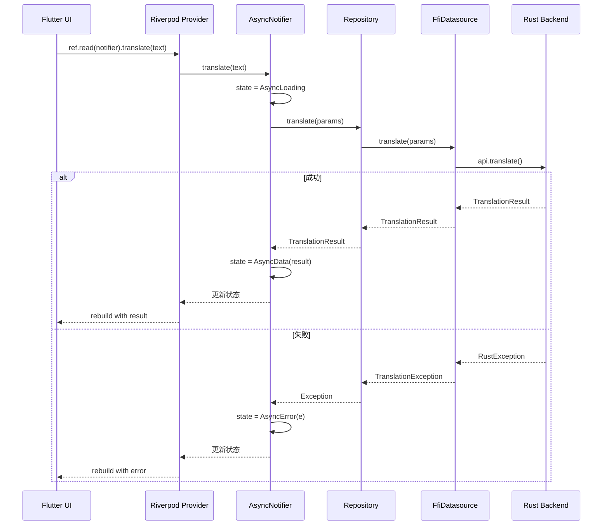

# Flutter 翻译工具前端开发文档

> 生成日期：2026-04-24
> 关联 PRD：`docs/需求文档.md`
> 技术栈：Flutter 3.41.7 + Dart 3.9.2 + Riverpod 2.6 + go_router 16 + flutter_rust_bridge 2.11.0

---

## 目录

- [1. 技术概述](#1-技术概述)
- [2. 系统架构](#2-系统架构)
- [3. 详细设计](#3-详细设计)
- [4. UI组件设计](#4-ui组件设计)
- [5. 状态管理](#5-状态管理)
- [6. 路由设计](#6-路由设计)
- [7. FFI集成](#7-ffi集成)
- [8. 性能优化](#8-性能优化)
- [9. 测试方案](#9-测试方案)
- [10. 构建与部署](#10-构建与部署)

---

## 1. 技术概述

### 1.1 目标

开发一款 Linux 桌面端浮动翻译工具，支持多厂商翻译引擎并行对比、快捷键唤出、OCR 截图翻译，提供流畅的桌面级交互体验。

### 1.2 技术选型

| 技术 | 版本 | 用途 | 选型理由 |
|------|------|------|----------|
| Flutter | 3.41.7 | UI 框架 | 跨平台渲染一致性，Linux Wayland 支持成熟 |
| Dart | 3.9.2 | 开发语言 | 与 Flutter 绑定，强类型安全 |
| Riverpod | 2.6+ | 状态管理 | 编译时安全，支持异步依赖注入，测试友好 |
| go_router | 16+ | 路由管理 | 声明式路由，支持深度链接和导航守卫 |
| flutter_rust_bridge | 2.11.0 | FFI 桥接 | 自动生成类型安全绑定，零手写 FFI 代码 |
| freezed | 2.5+ | 不可变数据类 | 编译时代码生成，联合类型支持 |
| json_serializable | 6.8+ | JSON 序列化 | 与 freezed 配合，配置持久化 |
| window_manager | 0.4+ | 窗口控制 | 无边框窗口、置顶、透明背景 |
| tray_manager | 0.2+ | 系统托盘 | 托盘菜单、图标、右键操作 |
| global_hotkey | 0.2+ | 全局快捷键 | 后台监听快捷键，不受焦点限制 |

### 1.3 约束条件

- **目标平台**：Linux Wayland（KDE Plasma 6+ / Hyprland 0.35+）
- **窗口行为**：无边框、可置顶、半透明背景、点击外部自动收起
- **Wayland 限制**：全局快捷键需通过 xdg-desktop-portal 或 compositor 特定 API 实现
- **KDE Plasma 6 适配**：使用 `kwin` 脚本注册全局快捷键，窗口圆角由 compositor 处理
- **Hyprland 适配**：通过 hyprctl 查询窗口规则，使用 `windowrulev2` 控制窗口行为
- **性能要求**：冷启动 < 2s，翻译响应 < 500ms（P95），内存占用 < 150MB

---

## 2. 系统架构

### 2.1 整体架构图



### 2.2 模块划分

| 模块 | 职责 | 目录 | 依赖 |
|------|------|------|------|
| `app/` | 应用入口、初始化、路由配置 | `lib/app/` | 全部 |
| `core/` | 核心模型、常量、工具类 | `lib/core/` | 无 |
| `data/` | FFI 封装、数据源、Repository | `lib/data/` | FFI |
| `domain/` | 业务逻辑、UseCases | `lib/domain/` | data |
| `presentation/` | UI 组件、页面、主题 | `lib/presentation/` | domain |
| `providers/` | Riverpod 状态定义 | `lib/providers/` | domain |
| `services/` | 系统服务（托盘、快捷键、窗口） | `lib/services/` | FFI |

### 2.3 项目目录结构

```
flutter_translate/
├── lib/
│   ├── app/
│   │   ├── app.dart                    # MaterialApp 入口
│   │   ├── router/                     # go_router 路由配置
│   │   │   ├── app_router.dart
│   │   │   ├── route_names.dart
│   │   │   └── guards/
│   │   │       └── auth_guard.dart
│   │   └── theme/                      # 主题配置
│   │       ├── app_theme.dart
│   │       ├── colors.dart
│   │       └── typography.dart
│   ├── core/
│   │   ├── constants/
│   │   │   ├── app_constants.dart
│   │   │   └── storage_keys.dart
│   │   ├── enums/
│   │   │   ├── desktop_env.dart
│   │   │   ├── provider_type.dart
│   │   │   └── translation_status.dart
│   │   ├── errors/
│   │   │   ├── app_exception.dart
│   │   │   └── failure.dart
│   │   └── utils/
│   │       ├── debounce.dart
│   │       └── platform_detector.dart
│   ├── data/
│   │   ├── datasources/
│   │   │   └── ffi_datasource.dart     # FFI 调用封装
│   │   ├── models/                     # 数据模型（freezed）
│   │   │   ├── provider_config.dart
│   │   │   ├── translation_result.dart
│   │   │   ├── translation_rule.dart
│   │   │   ├── active_session.dart
│   │   │   ├── shortcut_binding.dart
│   │   │   └── language_pref.dart
│   │   └── repositories/
│   │       ├── translation_repository.dart
│   │       ├── config_repository.dart
│   │       └── session_repository.dart
│   ├── domain/
│   │   ├── entities/
│   │   │   └── translation_session.dart
│   │   └── usecases/
│   │       ├── translate_usecase.dart
│   │       ├── compare_usecase.dart
│   │       ├── ocr_usecase.dart
│   │       └── config_usecase.dart
│   ├── presentation/
│   │   ├── widgets/                    # 可复用组件
│   │   │   ├── floating_window/
│   │   │   │   ├── floating_window.dart
│   │   │   │   ├── translation_panel.dart
│   │   │   │   ├── provider_selector.dart
│   │   │   │   └── language_switcher.dart
│   │   │   ├── compare_panel/
│   │   │   │   ├── compare_panel.dart
│   │   │   │   └── result_card.dart
│   │   │   ├── settings/
│   │   │   │   ├── settings_panel.dart
│   │   │   │   ├── provider_form.dart
│   │   │   │   ├── shortcut_editor.dart
│   │   │   │   └── theme_picker.dart
│   │   │   └── common/
│   │   │       ├── loading_indicator.dart
│   │   │       ├── error_banner.dart
│   │   │       └── response_time_badge.dart
│   │   ├── pages/
│   │   │   ├── floating_page.dart      # 浮动翻译窗口
│   │   │   ├── main_page.dart          # 主窗口
│   │   │   ├── compare_page.dart       # 多厂商对比
│   │   │   └── settings_page.dart      # 设置面板
│   │   └── controllers/                # 页面级控制器
│   │       ├── translation_controller.dart
│   │       └── settings_controller.dart
│   ├── providers/
│   │   ├── translation_provider.dart
│   │   ├── config_provider.dart
│   │   ├── session_provider.dart
│   │   ├── theme_provider.dart
│   │   └── shortcut_provider.dart
│   ├── services/
│   │   ├── tray_service.dart           # 系统托盘
│   │   ├── hotkey_service.dart         # 全局快捷键
│   │   └── window_service.dart         # 窗口管理
│   └── main.dart                       # 应用入口
├── rust/                               # Rust 后端（flutter_rust_bridge）
│   ├── src/
│   │   └── api.rs
│   └── Cargo.toml
├── test/
│   ├── unit/
│   ├── widget/
│   └── integration/
├── linux/                              # Linux 平台配置
│   ├── flutter/
│   └── runner/
├── pubspec.yaml
└── build.yaml                          # freezed/json_serializable 配置
```

---

## 3. 详细设计

### 3.1 数据模型设计

使用 `freezed` 生成不可变数据类，与 Rust 后端类型对齐。

```dart
// lib/data/models/provider_config.dart
import 'package:freezed_annotation/freezed_annotation.dart';

part 'provider_config.freezed.dart';
part 'provider_config.g.dart';

@freezed
class ProviderConfig with _$ProviderConfig {
  const factory ProviderConfig({
    required String id,
    required String name,
    required String apiKey,
    required String apiUrl,
    required String model,
    @Default('bearer') String authType,
    @Default(false) bool isActive,
    @Default(0) int sortOrder,
  }) = _ProviderConfig;

  factory ProviderConfig.fromJson(Map<String, dynamic> json) =>
      _$ProviderConfigFromJson(json);
}
```

```dart
// lib/data/models/translation_result.dart
@freezed
class TranslationResult with _$TranslationResult {
  const factory TranslationResult({
    required String providerId,
    required String providerName,
    required String sourceText,
    required String translatedText,
    required int responseTimeMs,  // Duration 序列化为毫秒
    @Default(true) bool isSuccess,
    String? errorMessage,
  }) = _TranslationResult;

  factory TranslationResult.fromJson(Map<String, dynamic> json) =>
      _$TranslationResultFromJson(json);

  Duration get responseTime => Duration(milliseconds: responseTimeMs);
}
```

```dart
// lib/data/models/active_session.dart
@freezed
class ActiveSession with _$ActiveSession {
  const factory ActiveSession({
    required String lastProviderId,
    @Default([]) List<String> lastCompareProviders,
    required int lastUsedTimestamp,  // DateTime 序列化为时间戳
  }) = _ActiveSession;

  factory ActiveSession.fromJson(Map<String, dynamic> json) =>
      _$ActiveSessionFromJson(json);

  DateTime get lastUsed => DateTime.fromMillisecondsSinceEpoch(lastUsedTimestamp);
}
```

```dart
// lib/data/models/shortcut_binding.dart
@freezed
class ShortcutBinding with _$ShortcutBinding {
  const factory ShortcutBinding({
    required String action,
    required String keyCombination,
    @Default(true) bool enabled,
  }) = _ShortcutBinding;

  factory ShortcutBinding.fromJson(Map<String, dynamic> json) =>
      _$ShortcutBindingFromJson(json);
}
```

```dart
// lib/data/models/language_pref.dart
@freezed
class LanguagePref with _$LanguagePref {
  const factory LanguagePref({
    required String code,
    required String displayName,
    @Default(0) int usageCount,
    @Default(false) bool isFavorite,
  }) = _LanguagePref;

  factory LanguagePref.fromJson(Map<String, dynamic> json) =>
      _$LanguagePrefFromJson(json);
}
```

```dart
// lib/data/models/translation_rule.dart
@freezed
class TranslationRule with _$TranslationRule {
  const factory TranslationRule({
    required String id,
    required String providerId,
    required String roleName,
    required String systemPrompt,
    @Default('') String customRules,
    @Default(false) bool isDefault,
  }) = _TranslationRule;

  factory TranslationRule.fromJson(Map<String, dynamic> json) =>
      _$TranslationRuleFromJson(json);
}
```

### 3.2 FFI 调用封装

```dart
// lib/data/datasources/ffi_datasource.dart
import 'package:flutter_translate_rust/flutter_translate_rust.dart';
import '../../core/errors/app_exception.dart';

class FfiDatasource {
  // ========== 翻译服务 ==========

  Future<TranslationResult> translate({
    required String text,
    required String sourceLang,
    required String targetLang,
    required String providerId,
  }) async {
    try {
      return await api.translate(
        text: text,
        sourceLang: sourceLang,
        targetLang: targetLang,
        providerId: providerId,
      );
    } on RustException catch (e) {
      throw TranslationException(e.message);
    }
  }

  Future<List<TranslationResult>> translateCompare({
    required String text,
    required String sourceLang,
    required String targetLang,
    required List<String> providerIds,
  }) async {
    try {
      return await api.translateCompare(
        text: text,
        sourceLang: sourceLang,
        targetLang: targetLang,
        providerIds: providerIds,
      );
    } on RustException catch (e) {
      throw TranslationException(e.message);
    }
  }

  // ========== 配置管理 ==========

  List<ProviderConfig> getProviders() {
    try {
      return api.getProviders();
    } on RustException catch (e) {
      throw ConfigException(e.message);
    }
  }

  Future<void> saveProvider(ProviderConfig config) async {
    try {
      await api.saveProvider(config);
    } on RustException catch (e) {
      throw ConfigException(e.message);
    }
  }

  Future<void> deleteProvider(String id) async {
    try {
      await api.deleteProvider(id);
    } on RustException catch (e) {
      throw ConfigException(e.message);
    }
  }

  Future<bool> testProvider(String providerId) async {
    try {
      return await api.testProvider(providerId);
    } on RustException catch (e) {
      throw ConfigException(e.message);
    }
  }

  // ========== 会话管理 ==========

  ActiveSession getActiveSession() {
    try {
      return api.getActiveSession();
    } on RustException catch (e) {
      throw SessionException(e.message);
    }
  }

  Future<void> updateSession({
    String? providerId,
    List<String>? compareProviders,
  }) async {
    try {
      await api.updateSession(
        providerId: providerId,
        compareProviders: compareProviders,
      );
    } on RustException catch (e) {
      throw SessionException(e.message);
    }
  }

  // ========== 系统服务 ==========

  DesktopEnv detectDesktopEnv() {
    try {
      return api.detectDesktopEnv();
    } on RustException catch (e) {
      throw SystemException(e.message);
    }
  }

  Future<String> ocrScreenshot() async {
    try {
      return await api.ocrScreenshot();
    } on RustException catch (e) {
      throw OcrException(e.message);
    }
  }

  List<ShortcutBinding> getShortcuts() {
    try {
      return api.getShortcuts();
    } on RustException catch (e) {
      throw ShortcutException(e.message);
    }
  }

  Future<void> updateShortcut(ShortcutBinding binding) async {
    try {
      await api.updateShortcut(binding);
    } on RustException catch (e) {
      throw ShortcutException(e.message);
    }
  }
}
```

### 3.3 Repository 层

```dart
// lib/data/repositories/translation_repository.dart
import '../datasources/ffi_datasource.dart';
import '../models/translation_result.dart';

class TranslationRepository {
  final FfiDatasource _ffi;

  TranslationRepository(this._ffi);

  Future<TranslationResult> translate({
    required String text,
    required String sourceLang,
    required String targetLang,
    required String providerId,
  }) {
    return _ffi.translate(
      text: text,
      sourceLang: sourceLang,
      targetLang: targetLang,
      providerId: providerId,
    );
  }

  Future<List<TranslationResult>> translateCompare({
    required String text,
    required String sourceLang,
    required String targetLang,
    required List<String> providerIds,
  }) {
    return _ffi.translateCompare(
      text: text,
      sourceLang: sourceLang,
      targetLang: targetLang,
      providerIds: providerIds,
    );
  }
}
```

```dart
// lib/data/repositories/config_repository.dart
import '../datasources/ffi_datasource.dart';
import '../models/provider_config.dart';

class ConfigRepository {
  final FfiDatasource _ffi;

  ConfigRepository(this._ffi);

  List<ProviderConfig> getProviders() => _ffi.getProviders();

  Future<void> saveProvider(ProviderConfig config) =>
      _ffi.saveProvider(config);

  Future<void> deleteProvider(String id) => _ffi.deleteProvider(id);

  Future<bool> testProvider(String providerId) =>
      _ffi.testProvider(providerId);
}
```

### 3.4 浮动翻译窗口实现

浮动窗口是核心交互入口，通过快捷键唤出，支持快速翻译和复制。

```dart
// lib/presentation/pages/floating_page.dart
import 'package:flutter/material.dart';
import 'package:flutter_riverpod/flutter_riverpod.dart';
import '../../providers/translation_provider.dart';
import '../../providers/config_provider.dart';
import '../widgets/floating_window/floating_window.dart';

class FloatingPage extends ConsumerWidget {
  const FloatingPage({super.key});

  @override
  Widget build(BuildContext context, WidgetRef ref) {
    final currentProvider = ref.watch(activeProviderProvider);
    final translationState = ref.watch(translationProvider);

    return FloatingWindow(
      providerName: currentProvider?.name ?? '未选择',
      onProviderTap: () => _showProviderPicker(context, ref),
      translationState: translationState,
      onTranslate: (text) {
        ref.read(translationProvider.notifier).translate(text);
      },
      onCopy: (text) {
        // 复制到剪贴板
      },
      onSwapLanguages: () {
        ref.read(translationProvider.notifier).swapLanguages();
      },
    );
  }

  void _showProviderPicker(BuildContext context, WidgetRef ref) {
    final providers = ref.read(configProvider).getProviders();
    showModalBottomSheet(
      context: context,
      builder: (context) => ListView.builder(
        itemCount: providers.length,
        itemBuilder: (context, index) {
          final p = providers[index];
          return ListTile(
            leading: Icon(Icons.translate),
            title: Text(p.name),
            subtitle: Text(p.model),
            trailing: p.isActive ? const Icon(Icons.check) : null,
            onTap: () {
              ref.read(activeProviderProvider.notifier).state = p;
              Navigator.pop(context);
            },
          );
        },
      ),
    );
  }
}
```

### 3.5 多厂商对比面板

```dart
// lib/presentation/pages/compare_page.dart
import 'package:flutter/material.dart';
import 'package:flutter_riverpod/flutter_riverpod.dart';
import '../../providers/translation_provider.dart';
import '../widgets/compare_panel/compare_panel.dart';

class ComparePage extends ConsumerWidget {
  const ComparePage({super.key});

  @override
  Widget build(BuildContext context, WidgetRef ref) {
    final compareResults = ref.watch(compareResultsProvider);
    final isComparing = ref.watch(isComparingProvider);

    return Scaffold(
      appBar: AppBar(
        title: const Text('翻译对比'),
        actions: [
          IconButton(
            icon: const Icon(Icons.compare_arrows),
            onPressed: () => _startCompare(ref),
          ),
        ],
      ),
      body: ComparePanel(
        results: compareResults,
        isLoading: isComparing,
        columnCount: ref.watch(compareColumnCountProvider),
      ),
    );
  }

  void _startCompare(WidgetRef ref) {
    ref.read(translationProvider.notifier).startCompare();
  }
}
```

```dart
// lib/presentation/widgets/compare_panel/compare_panel.dart
import 'package:flutter/material.dart';
import '../../data/models/translation_result.dart';
import '../common/response_time_badge.dart';

class ComparePanel extends StatelessWidget {
  final List<TranslationResult> results;
  final bool isLoading;
  final int columnCount;

  const ComparePanel({
    super.key,
    required this.results,
    required this.isLoading,
    required this.columnCount,
  });

  @override
  Widget build(BuildContext context) {
    if (isLoading) {
      return const Center(child: CircularProgressIndicator());
    }

    return LayoutBuilder(
      builder: (context, constraints) {
        final columnWidth = constraints.maxWidth / columnCount;
        return Row(
          crossAxisAlignment: CrossAxisAlignment.start,
          children: results.map((r) {
            return SizedBox(
              width: columnWidth,
              child: Card(
                margin: const EdgeInsets.all(8),
                child: Column(
                  crossAxisAlignment: CrossAxisAlignment.start,
                  children: [
                    ListTile(
                      title: Text(r.providerName),
                      trailing: ResponseTimeBadge(r.responseTime),
                    ),
                    const Divider(height: 1),
                    Expanded(
                      child: Padding(
                        padding: const EdgeInsets.all(16),
                        child: SelectableText(r.translatedText),
                      ),
                    ),
                    if (!r.isSuccess)
                      Padding(
                        padding: const EdgeInsets.all(8),
                        child: Text(
                          r.errorMessage ?? '未知错误',
                          style: TextStyle(color: Colors.red[700]),
                        ),
                      ),
                  ],
                ),
              ),
            );
          }).toList(),
        );
      },
    );
  }
}
```

### 3.6 设置面板

```dart
// lib/presentation/pages/settings_page.dart
import 'package:flutter/material.dart';
import 'package:flutter_riverpod/flutter_riverpod.dart';
import '../../providers/config_provider.dart';
import '../../providers/shortcut_provider.dart';
import '../../providers/theme_provider.dart';
import '../widgets/settings/provider_form.dart';
import '../widgets/settings/shortcut_editor.dart';
import '../widgets/settings/theme_picker.dart';

class SettingsPage extends ConsumerWidget {
  const SettingsPage({super.key});

  @override
  Widget build(BuildContext context, WidgetRef ref) {
    return DefaultTabController(
      length: 4,
      child: Scaffold(
        appBar: AppBar(
          title: const Text('设置'),
          bottom: const TabBar(
            tabs: [
              Tab(icon: Icon(Icons.settings_ethernet), text: '厂商'),
              Tab(icon: Icon(Icons.keyboard), text: '快捷键'),
              Tab(icon: Icon(Icons.language), text: '语言'),
              Tab(icon: Icon(Icons.palette), text: '外观'),
            ],
          ),
        ),
        body: TabBarView(
          children: [
            _buildProviderTab(ref),
            _buildShortcutTab(ref),
            _buildLanguageTab(ref),
            _buildThemeTab(ref),
          ],
        ),
      ),
    );
  }

  Widget _buildProviderTab(WidgetRef ref) {
    final providers = ref.watch(providersListProvider);
    return ListView.builder(
      itemCount: providers.length + 1,
      itemBuilder: (context, index) {
        if (index == providers.length) {
          return ListTile(
            leading: const Icon(Icons.add),
            title: const Text('添加厂商'),
            onTap: () => _showProviderForm(context, ref),
          );
        }
        final p = providers[index];
        return ProviderFormTile(config: p, onDelete: () {
          ref.read(configProvider).deleteProvider(p.id);
        });
      },
    );
  }

  Widget _buildShortcutTab(WidgetRef ref) {
    final shortcuts = ref.watch(shortcutsProvider);
    return ListView.builder(
      itemCount: shortcuts.length,
      itemBuilder: (context, index) {
        final s = shortcuts[index];
        return ShortcutEditorTile(binding: s);
      },
    );
  }

  Widget _buildLanguageTab(WidgetRef ref) {
    return const Center(child: Text('语言偏好设置'));
  }

  Widget _buildThemeTab(WidgetRef ref) {
    final themeMode = ref.watch(themeModeProvider);
    return ThemePicker(currentMode: themeMode);
  }

  void _showProviderForm(BuildContext context, WidgetRef ref) {
    showDialog(
      context: context,
      builder: (context) => const ProviderFormDialog(),
    );
  }
}
```

---

## 4. UI组件设计

### 4.1 核心组件树



### 4.2 响应式布局策略

| 场景 | 布局策略 | 断点 |
|------|----------|------|
| 浮动窗口 | 固定宽度 480px，高度自适应内容 | 无 |
| 对比面板 2 栏 | 每栏 50% 宽度 | 宽度 > 800px |
| 对比面板 3 栏 | 每栏 33.3% 宽度 | 宽度 > 1200px |
| 对比面板 4 栏 | 每栏 25% 宽度 | 宽度 > 1600px |
| 设置面板 | 左侧导航 + 右侧内容 | 宽度 > 1000px |
| 移动端适配 | 单栏堆叠，底部导航 | 宽度 < 600px（预留） |

```dart
// lib/presentation/widgets/common/responsive_layout.dart
import 'package:flutter/material.dart';

class ResponsiveCompareLayout extends StatelessWidget {
  final List<Widget> children;
  final int columnCount;

  const ResponsiveCompareLayout({
    super.key,
    required this.children,
    required this.columnCount,
  });

  @override
  Widget build(BuildContext context) {
    return LayoutBuilder(
      builder: (context, constraints) {
        final maxWidth = constraints.maxWidth;
        final effectiveColumns = _calculateColumns(maxWidth, columnCount);
        final columnWidth = maxWidth / effectiveColumns;

        return Wrap(
          children: children.map((child) {
            return SizedBox(
              width: columnWidth,
              child: child,
            );
          }).toList(),
        );
      },
    );
  }

  int _calculateColumns(double width, int requested) {
    if (width < 600) return 1;
    if (width < 800) return 2;
    if (width < 1200) return 3;
    return requested.clamp(1, 4);
  }
}
```

### 4.3 主题系统

```dart
// lib/app/theme/app_theme.dart
import 'package:flutter/material.dart';
import '../../core/constants/app_constants.dart';

class AppTheme {
  static ThemeData get light => ThemeData(
        useMaterial3: true,
        brightness: Brightness.light,
        colorScheme: ColorScheme.fromSeed(
          seedColor: AppColors.primary,
          brightness: Brightness.light,
        ),
        cardTheme: CardTheme(
          elevation: 0,
          shape: RoundedRectangleBorder(
            borderRadius: BorderRadius.circular(12),
          ),
        ),
        appBarTheme: const AppBarTheme(
          elevation: 0,
          centerTitle: true,
        ),
      );

  static ThemeData get dark => ThemeData(
        useMaterial3: true,
        brightness: Brightness.dark,
        colorScheme: ColorScheme.fromSeed(
          seedColor: AppColors.primary,
          brightness: Brightness.dark,
        ),
        cardTheme: CardTheme(
          elevation: 0,
          shape: RoundedRectangleBorder(
            borderRadius: BorderRadius.circular(12),
          ),
        ),
      );
}
```

```dart
// lib/app/theme/colors.dart
import 'package:flutter/material.dart';

class AppColors {
  static const primary = Color(0xFF6366F1);
  static const primaryLight = Color(0xFF818CF8);
  static const primaryDark = Color(0xFF4F46E5);

  static const success = Color(0xFF22C55E);
  static const warning = Color(0xFFF59E0B);
  static const error = Color(0xFFEF4444);

  static const surfaceLight = Color(0xFFF8FAFC);
  static const surfaceDark = Color(0xFF1E293B);

  static const floatingBgLight = Color(0xFFFFFFFF);
  static const floatingBgDark = Color(0xFF0F172A);
}
```

### 4.4 浮动窗口组件

```dart
// lib/presentation/widgets/floating_window/floating_window.dart
import 'package:flutter/material.dart';
import 'package:window_manager/window_manager.dart';
import '../../data/models/translation_result.dart';

class FloatingWindow extends StatefulWidget {
  final String providerName;
  final VoidCallback onProviderTap;
  final TranslationResult? translationState;
  final Function(String) onTranslate;
  final Function(String) onCopy;
  final VoidCallback onSwapLanguages;

  const FloatingWindow({
    super.key,
    required this.providerName,
    required this.onProviderTap,
    required this.translationState,
    required this.onTranslate,
    required this.onCopy,
    required this.onSwapLanguages,
  });

  @override
  State<FloatingWindow> createState() => _FloatingWindowState();
}

class _FloatingWindowState extends State<FloatingWindow>
    with WindowListener {
  final TextEditingController _controller = TextEditingController();

  @override
  void initState() {
    super.initState();
    windowManager.addListener(this);
    _initWindow();
  }

  @override
  void dispose() {
    windowManager.removeListener(this);
    _controller.dispose();
    super.dispose();
  }

  Future<void> _initWindow() async {
    await windowManager.setAsFrameless();
    await windowManager.setSize(const Size(480, 320));
    await windowManager.setMinimumSize(const Size(320, 200));
    await windowManager.setMaximumSize(const Size(640, 600));
    await windowManager.setSkipTaskbar(true);
    await windowManager.setAlwaysOnTop(true);
  }

  @override
  void onWindowFocus() {
    // 窗口获得焦点时的行为
  }

  @override
  Widget build(BuildContext context) {
    return Material(
      type: MaterialType.transparency,
      child: Container(
        decoration: BoxDecoration(
          color: Theme.of(context).colorScheme.surface,
          borderRadius: BorderRadius.circular(12),
          boxShadow: [
            BoxShadow(
              color: Colors.black.withOpacity(0.15),
              blurRadius: 20,
              offset: const Offset(0, 8),
            ),
          ],
        ),
        child: Column(
          mainAxisSize: MainAxisSize.min,
          children: [
            _buildTitleBar(),
            _buildInputArea(),
            if (widget.translationState != null)
              _buildTranslationResult(),
          ],
        ),
      ),
    );
  }

  Widget _buildTitleBar() {
    return GestureDetector(
      onPanStart: (details) => windowManager.startDragging(),
      child: Container(
        padding: const EdgeInsets.symmetric(horizontal: 12, vertical: 8),
        child: Row(
          children: [
            GestureDetector(
              onTap: widget.onProviderTap,
              child: Row(
                children: [
                  const Icon(Icons.translate, size: 18),
                  const SizedBox(width: 4),
                  Text(widget.providerName),
                  const Icon(Icons.arrow_drop_down, size: 18),
                ],
              ),
            ),
            const Spacer(),
            IconButton(
              icon: const Icon(Icons.close, size: 18),
              onPressed: () => windowManager.hide(),
              padding: EdgeInsets.zero,
              constraints: const BoxConstraints(),
            ),
          ],
        ),
      ),
    );
  }

  Widget _buildInputArea() {
    return Padding(
      padding: const EdgeInsets.symmetric(horizontal: 12),
      child: TextField(
        controller: _controller,
        maxLines: 4,
        minLines: 2,
        decoration: InputDecoration(
          hintText: '输入要翻译的文本...',
          border: OutlineInputBorder(
            borderRadius: BorderRadius.circular(8),
          ),
          suffixIcon: Row(
            mainAxisSize: MainAxisSize.min,
            children: [
              IconButton(
                icon: const Icon(Icons.swap_horiz),
                onPressed: widget.onSwapLanguages,
              ),
              IconButton(
                icon: const Icon(Icons.send),
                onPressed: () => widget.onTranslate(_controller.text),
              ),
            ],
          ),
        ),
      ),
    );
  }

  Widget _buildTranslationResult() {
    final result = widget.translationState!;
    return Container(
      margin: const EdgeInsets.all(12),
      padding: const EdgeInsets.all(12),
      decoration: BoxDecoration(
        color: Theme.of(context).colorScheme.surfaceContainerHighest,
        borderRadius: BorderRadius.circular(8),
      ),
      child: Column(
        crossAxisAlignment: CrossAxisAlignment.start,
        children: [
          Row(
            children: [
              Text(
                result.providerName,
                style: Theme.of(context).textTheme.labelSmall,
              ),
              const Spacer(),
              Text(
                '${result.responseTime.inMilliseconds}ms',
                style: Theme.of(context).textTheme.labelSmall,
              ),
            ],
          ),
          const SizedBox(height: 8),
          SelectableText(result.translatedText),
          const SizedBox(height: 8),
          Align(
            alignment: Alignment.centerRight,
            child: IconButton(
              icon: const Icon(Icons.copy, size: 18),
              onPressed: () => widget.onCopy(result.translatedText),
            ),
          ),
        ],
      ),
    );
  }
}
```

### 4.5 响应时间标注组件

```dart
// lib/presentation/widgets/common/response_time_badge.dart
import 'package:flutter/material.dart';
import '../../../core/constants/app_constants.dart';

class ResponseTimeBadge extends StatelessWidget {
  final Duration responseTime;

  const ResponseTimeBadge(this.responseTime, {super.key});

  @override
  Widget build(BuildContext context) {
    final color = _getColor(responseTime);
    final label = _getLabel(responseTime);

    return Container(
      padding: const EdgeInsets.symmetric(horizontal: 8, vertical: 2),
      decoration: BoxDecoration(
        color: color.withOpacity(0.15),
        borderRadius: BorderRadius.circular(12),
      ),
      child: Text(
        label,
        style: TextStyle(
          color: color,
          fontSize: 11,
          fontWeight: FontWeight.w600,
        ),
      ),
    );
  }

  Color _getColor(Duration time) {
    if (time < AppConstants.fastResponse) return Colors.green;
    if (time < AppConstants.normalResponse) return Colors.orange;
    return Colors.red;
  }

  String _getLabel(Duration time) {
    if (time < AppConstants.fastResponse) return '快速';
    if (time < AppConstants.normalResponse) return '正常';
    return '较慢';
  }
}
```

---

## 5. 状态管理

### 5.1 Riverpod Provider 设计

### 5.1 Provider 总览

| Provider | 类型 | 作用 | 依赖 |
|----------|------|------|------|
| `ffiDatasourceProvider` | Provider | FFI 数据源单例 | 无 |
| `translationRepositoryProvider` | Provider | 翻译 Repository | ffiDatasourceProvider |
| `configRepositoryProvider` | Provider | 配置 Repository | ffiDatasourceProvider |
| `activeProviderProvider` | StateProvider | 当前选中的翻译厂商 | 无 |
| `translationProvider` | AsyncNotifierProvider | 翻译状态管理 | translationRepositoryProvider |
| `compareResultsProvider` | Provider | 对比结果列表 | translationProvider |
| `isComparingProvider` | Provider | 是否正在对比 | translationProvider |
| `providersListProvider` | Provider | 厂商配置列表 | configRepositoryProvider |
| `sessionProvider` | StateProvider | 活跃会话状态 | 无 |
| `themeModeProvider` | StateProvider | 主题模式 | 无 |
| `shortcutsProvider` | Provider | 快捷键配置 | ffiDatasourceProvider |
| `desktopEnvProvider` | Provider | 桌面环境检测 | ffiDatasourceProvider |

### 5.2 核心 Provider 实现

```dart
// lib/providers/translation_provider.dart
import 'package:flutter_riverpod/flutter_riverpod.dart';
import '../data/datasources/ffi_datasource.dart';
import '../data/models/translation_result.dart';
import '../data/repositories/translation_repository.dart';

// FFI 数据源
final ffiDatasourceProvider = Provider<FfiDatasource>((ref) {
  return FfiDatasource();
});

// 翻译 Repository
final translationRepositoryProvider = Provider<TranslationRepository>((ref) {
  return TranslationRepository(ref.watch(ffiDatasourceProvider));
});

// 翻译状态 Notifier
class TranslationNotifier extends AsyncNotifier<TranslationResult?> {
  @override
  Future<TranslationResult?> build() async {
    return null;
  }

  Future<void> translate(String text) async {
    if (text.isEmpty) return;

    state = const AsyncLoading();

    final activeProvider = ref.read(activeProviderProvider);
    if (activeProvider == null) {
      state = AsyncError('未选择翻译厂商', StackTrace.current);
      return;
    }

    final session = ref.read(sessionProvider);

    try {
      final result = await ref.read(translationRepositoryProvider).translate(
            text: text,
            sourceLang: session.sourceLang,
            targetLang: session.targetLang,
            providerId: activeProvider.id,
          );

      state = AsyncData(result);

      // 更新会话
      ref.read(sessionProvider.notifier).update(
            providerId: activeProvider.id,
          );
    } catch (e, st) {
      state = AsyncError(e, st);
    }
  }

  Future<void> startCompare() async {
    final compareProviders = ref.read(sessionProvider).lastCompareProviders;
    if (compareProviders.isEmpty) return;

    state = const AsyncLoading();

    try {
      final results = await ref.read(translationRepositoryProvider).translateCompare(
            text: ref.read(currentTextInputProvider) ?? '',
            sourceLang: ref.read(sessionProvider).sourceLang,
            targetLang: ref.read(sessionProvider).targetLang,
            providerIds: compareProviders,
          );

      ref.read(compareResultsProvider.notifier).state = results;
      state = const AsyncData(null);
    } catch (e, st) {
      state = AsyncError(e, st);
    }
  }

  void swapLanguages() {
    ref.read(sessionProvider.notifier).swapLanguages();
  }
}

final translationProvider =
    AsyncNotifierProvider<TranslationNotifier, TranslationResult?>(
  TranslationNotifier.new,
);

// 当前选中的厂商
final activeProviderProvider = StateProvider<ProviderConfig?>((ref) => null);

// 当前输入的文本
final currentTextInputProvider = StateProvider<String?>((ref) => null);
```

```dart
// lib/providers/config_provider.dart
import 'package:flutter_riverpod/flutter_riverpod.dart';
import '../data/datasources/ffi_datasource.dart';
import '../data/models/provider_config.dart';
import '../data/repositories/config_repository.dart';

final configRepositoryProvider = Provider<ConfigRepository>((ref) {
  return ConfigRepository(ref.watch(ffiDatasourceProvider));
});

final configProvider = Provider<ConfigRepository>((ref) {
  return ref.watch(configRepositoryProvider);
});

final providersListProvider = Provider<List<ProviderConfig>>((ref) {
  return ref.watch(configProvider).getProviders();
});
```

```dart
// lib/providers/session_provider.dart
import 'package:flutter_riverpod/flutter_riverpod.dart';
import '../data/datasources/ffi_datasource.dart';

class SessionState {
  final String sourceLang;
  final String targetLang;
  final String lastProviderId;
  final List<String> lastCompareProviders;
  final int lastUsedTimestamp;

  const SessionState({
    this.sourceLang = 'auto',
    this.targetLang = 'zh',
    this.lastProviderId = '',
    this.lastCompareProviders = const [],
    this.lastUsedTimestamp = 0,
  });

  SessionState copyWith({
    String? sourceLang,
    String? targetLang,
    String? providerId,
    List<String>? compareProviders,
  }) {
    return SessionState(
      sourceLang: sourceLang ?? this.sourceLang,
      targetLang: targetLang ?? this.targetLang,
      lastProviderId: providerId ?? this.lastProviderId,
      lastCompareProviders: compareProviders ?? this.lastCompareProviders,
      lastUsedTimestamp: DateTime.now().millisecondsSinceEpoch,
    );
  }

  void swapLanguages() {
    // 在 Notifier 中处理
  }
}

class SessionNotifier extends StateNotifier<SessionState> {
  final FfiDatasource _ffi;

  SessionNotifier(this._ffi) : super(const SessionState()) {
    _loadSession();
  }

  void _loadSession() {
    try {
      final session = _ffi.getActiveSession();
      state = SessionState(
        lastProviderId: session.lastProviderId,
        lastCompareProviders: session.lastCompareProviders,
        lastUsedTimestamp: session.lastUsedTimestamp,
      );
    } catch (_) {
      // 使用默认值
    }
  }

  void update({String? providerId, List<String>? compareProviders}) {
    state = state.copyWith(
      providerId: providerId,
      compareProviders: compareProviders,
    );
    _ffi.updateSession(
      providerId: providerId,
      compareProviders: compareProviders,
    );
  }

  void swapLanguages() {
    final temp = state.sourceLang;
    state = state.copyWith(
      sourceLang: state.targetLang,
      targetLang: temp,
    );
  }

  void setSourceLang(String code) {
    state = state.copyWith(sourceLang: code);
  }

  void setTargetLang(String code) {
    state = state.copyWith(targetLang: code);
  }
}

final sessionProvider = StateNotifierProvider<SessionNotifier, SessionState>(
  (ref) => SessionNotifier(ref.watch(ffiDatasourceProvider)),
);
```

```dart
// lib/providers/theme_provider.dart
import 'package:flutter/material.dart';
import 'package:flutter_riverpod/flutter_riverpod.dart';

final themeModeProvider = StateProvider<ThemeMode>((ref) {
  return ThemeMode.system;
});
```

```dart
// lib/providers/shortcut_provider.dart
import 'package:flutter_riverpod/flutter_riverpod.dart';
import '../data/datasources/ffi_datasource.dart';
import '../data/models/shortcut_binding.dart';

final shortcutsProvider = Provider<List<ShortcutBinding>>((ref) {
  return ref.watch(ffiDatasourceProvider).getShortcuts();
});
```

### 5.3 状态流图



---

## 6. 路由设计

### 6.1 路由表

| 路径 | 页面 | 说明 | 访问方式 |
|------|------|------|----------|
| `/` | FloatingPage | 浮动翻译窗口（默认页） | 快捷键唤出 |
| `/main` | MainPage | 主窗口 | 托盘双击 / 设置中打开 |
| `/compare` | ComparePage | 多厂商对比面板 | 主窗口导航 |
| `/settings` | SettingsPage | 设置面板 | 托盘菜单 / 主窗口导航 |
| `/settings/provider/:id` | ProviderFormPage | 厂商编辑页 | 设置面板内导航 |

### 6.2 go_router 配置

```dart
// lib/app/router/app_router.dart
import 'package:flutter/material.dart';
import 'package:go_router/go_router.dart';
import '../../presentation/pages/floating_page.dart';
import '../../presentation/pages/main_page.dart';
import '../../presentation/pages/compare_page.dart';
import '../../presentation/pages/settings_page.dart';
import 'route_names.dart';

final routerConfig = GoRouter(
  initialLocation: RouteNames.floating,
  debugLogDiagnostics: true,
  routes: [
    GoRoute(
      path: RouteNames.floating,
      name: RouteNames.floating,
      builder: (context, state) => const FloatingPage(),
    ),
    GoRoute(
      path: RouteNames.main,
      name: RouteNames.main,
      builder: (context, state) => const MainPage(),
    ),
    GoRoute(
      path: RouteNames.compare,
      name: RouteNames.compare,
      builder: (context, state) => const ComparePage(),
    ),
    GoRoute(
      path: RouteNames.settings,
      name: RouteNames.settings,
      builder: (context, state) => const SettingsPage(),
      routes: [
        GoRoute(
          path: 'provider/:id',
          name: RouteNames.providerEdit,
          builder: (context, state) {
            final id = state.pathParameters['id']!;
            return ProviderFormPage(providerId: id);
          },
        ),
      ],
    ),
  ],
  errorBuilder: (context, state) => Scaffold(
    body: Center(
      child: Text('页面未找到: ${state.error}'),
    ),
  ),
);
```

```dart
// lib/app/router/route_names.dart
class RouteNames {
  static const floating = '/';
  static const main = '/main';
  static const compare = '/compare';
  static const settings = '/settings';
  static const providerEdit = 'provider';
}
```

### 6.3 导航守卫

```dart
// lib/app/router/guards/auth_guard.dart
import 'package:flutter/material.dart';
import 'package:go_router/go_router.dart';

class NavigationGuard extends GoRouterRedirect {
  @override
  FutureOr<String?> redirect(
    BuildContext context,
    GoRouterState state,
  ) async {
    // 浮动窗口始终允许访问
    if (state.matchedLocation == '/') return null;

    // 检查主窗口是否已初始化
    final isReady = context.read<AppReadyProvider>();
    if (!isReady) {
      return '/';
    }

    return null;
  }
}
```

### 6.4 路由导航流图



---

## 7. FFI集成

### 7.1 flutter_rust_bridge 集成方案

### 7.1.1 桥接配置

```yaml
# pubspec.yaml 依赖配置
dependencies:
  flutter_rust_bridge: ^2.11.0
  freezed_annotation: ^2.4.0
  json_annotation: ^4.9.0

dev_dependencies:
  build_runner: ^2.4.0
  freezed: ^2.5.0
  json_serializable: ^6.8.0
  flutter_rust_bridge_generator: ^2.11.0
```

```yaml
# build.yaml
targets:
  $default:
    builders:
      freezed:
        options:
          union_key: type
          union_value_case: pascal
      json_serializable:
        options:
          explicit_to_json: true
          include_if_null: false
```

### 7.1.2 Rust API 定义（参考）

```rust
// rust/src/api/translation.rs
use flutter_rust_bridge::frb;

#[frb(sync)]
pub fn get_providers() -> Vec<ProviderConfig> {
    // 从配置存储读取
}

#[frb(async)]
pub async fn translate(
    text: String,
    source_lang: String,
    target_lang: String,
    provider_id: String,
) -> Result<TranslationResult, BridgeError> {
    // 调用对应厂商 API
}

#[frb(async)]
pub async fn translate_compare(
    text: String,
    source_lang: String,
    target_lang: String,
    provider_ids: Vec<String>,
) -> Result<Vec<TranslationResult>, BridgeError> {
    // 并行调用多个厂商
}
```

### 7.2 错误处理

```dart
// lib/core/errors/app_exception.dart
sealed class AppException implements Exception {
  final String message;
  final String? code;

  const AppException(this.message, {this.code});
}

class TranslationException extends AppException {
  const TranslationException(super.message, {super.code});
}

class ConfigException extends AppException {
  const ConfigException(super.message, {super.code});
}

class SessionException extends AppException {
  const SessionException(super.message, {super.code});
}

class OcrException extends AppException {
  const OcrException(super.message, {super.code});
}

class ShortcutException extends AppException {
  const ShortcutException(super.message, {super.code});
}

class SystemException extends AppException {
  const SystemException(super.message, {super.code});
}
```

```dart
// lib/core/errors/failure.dart
sealed class Failure {
  final String message;

  const Failure(this.message);
}

class TranslationFailure extends Failure {
  const TranslationFailure(super.message);
}

class NetworkFailure extends Failure {
  const NetworkFailure(super.message);
}

class ConfigFailure extends Failure {
  const ConfigFailure(super.message);
}
```

### 7.3 异步流处理

对于需要实时反馈的场景（如流式翻译），使用 Stream 封装：

```dart
// lib/data/datasources/streaming_datasource.dart
import 'dart:async';
import 'package:flutter_translate_rust/flutter_translate_rust.dart';

class StreamingDatasource {
  Stream<TranslationChunk> translateStream({
    required String text,
    required String sourceLang,
    required String targetLang,
    required String providerId,
  }) async* {
    // Rust 端返回 Stream，flutter_rust_bridge 自动映射
    final stream = api.translateStream(
      text: text,
      sourceLang: sourceLang,
      targetLang: targetLang,
      providerId: providerId,
    );

    await for (final chunk in stream) {
      yield chunk;
    }
  }
}
```

### 7.4 FFI 调用时序图



---

## 8. 性能优化

### 8.1 启动优化

| 策略 | 实现方式 | 预期效果 |
|------|----------|----------|
| 延迟初始化 | FFI 桥接在首次调用时初始化，非阻塞启动 | 冷启动减少 300-500ms |
| 按需加载 | 设置面板、对比面板使用懒加载 | 首屏渲染减少 100-200ms |
| 配置预读 | 启动时异步读取厂商配置到内存 | 避免首次翻译时阻塞 |
| 资源预编译 | 使用 `--aot` 模式构建 Release | 启动速度提升 40% |

```dart
// lib/main.dart - 延迟初始化示例
void main() async {
  WidgetsFlutterBinding.ensureInitialized();

  // 非阻塞初始化
  final initFuture = Future.wait([
    _initWindowManager(),
    _preloadConfig(),
  ]);

  runApp(
    ProviderScope(
      child: Consumer(
        builder: (context, ref, child) {
          // 后台完成初始化
          initFuture.then((_) {
            ref.read(appReadyProvider.notifier).state = true;
          });
          return const FlutterTranslateApp();
        },
      ),
    ),
  );
}
```

### 8.2 渲染优化

| 策略 | 实现方式 | 预期效果 |
|------|----------|----------|
| RepaintBoundary | 翻译结果区域使用独立 RepaintBoundary | 减少不必要的重绘 |
| const 构造 | 静态组件使用 const 构造器 | 减少 Widget 重建 |
| Selector | 使用 ref.watch(selector) 精确监听 | 减少 Provider 触发重建 |
| ListView.builder | 长列表使用 builder 模式 | 内存占用降低 60% |

```dart
// 使用 Selector 精确监听
class TranslationPanel extends ConsumerWidget {
  @override
  Widget build(BuildContext context, WidgetRef ref) {
    // 只监听 translatedText 字段，而非整个对象
    final translatedText = ref.watch(
      translationProvider.select(
        (result) => result?.value?.translatedText,
      ),
    );

    return Text(translatedText ?? '');
  }
}
```

### 8.3 内存管理

| 策略 | 实现方式 |
|------|----------|
| 控制器释放 | TextEditingController 在 dispose 中释放 |
| 监听器清理 | WindowListener、StreamSubscription 在 dispose 中取消 |
| 图片缓存 | 使用 `cacheWidth`/`cacheHeight` 限制图片分辨率 |
| FFI 内存 | Rust 端使用 `Box::leak` 时确保 Flutter 端调用释放 |

### 8.4 Wayland 特定优化

| 场景 | KDE Plasma 6 | Hyprland 0.35+ |
|------|-------------|----------------|
| 窗口透明 | 使用 `windowManager.setBackgroundMaterial()` | 通过 hyprctl 设置 `opacity` |
| 全局快捷键 | 通过 `xdg-desktop-portal` 注册 | 使用 `hyprctl bind` 或 `global_shortcut` 插件 |
| 窗口置顶 | `windowManager.setAlwaysOnTop(true)` 有效 | 需要配置 `windowrulev2 = float, title:...` |
| 圆角处理 | KWin 自动处理 | 需要设置 `rounding` 规则 |
| 截图 OCR | 使用 `xdg-desktop-portal` 的 Screenshot 接口 | 使用 `grim` + `slurp` 命令行工具 |

```dart
// lib/services/window_service.dart - 桌面环境适配
import 'package:window_manager/window_manager.dart';
import '../data/datasources/ffi_datasource.dart';
import '../core/enums/desktop_env.dart';

class WindowService {
  final FfiDatasource _ffi;
  DesktopEnv? _env;

  WindowService(this._ffi);

  Future<void> init() async {
    _env = _ffi.detectDesktopEnv();
    await _applyEnvSpecificRules();
  }

  Future<void> _applyEnvSpecificRules() async {
    switch (_env) {
      case DesktopEnv.kdePlasma:
        await _setupKdeRules();
        break;
      case DesktopEnv.hyprland:
        await _setupHyprlandRules();
        break;
      default:
        break;
    }
  }

  Future<void> _setupKdeRules() async {
    // KDE Plasma 6: 窗口规则通过 KWin 脚本管理
    // 此处通过 FFI 调用 Rust 端执行 kwriteconfig6
    await _ffi.applyKdeWindowRules();
  }

  Future<void> _setupHyprlandRules() async {
    // Hyprland: 通过 hyprctl 设置窗口规则
    await _ffi.applyHyprlandWindowRules();
  }

  Future<void> showFloatingWindow() async {
    await windowManager.show();
    await windowManager.focus();

    if (_env == DesktopEnv.hyprland) {
      // Hyprland 需要显式设置浮动规则
      await _ffi.setHyprlandFloatRule();
    }
  }
}
```

---

## 9. 测试方案

### 9.1 单元测试

```dart
// test/unit/translation_notifier_test.dart
import 'package:flutter_test/flutter_test.dart';
import 'package:flutter_riverpod/flutter_riverpod.dart';
import 'package:mocktail/mocktail.dart';

import 'package:flutter_translate/providers/translation_provider.dart';
import 'package:flutter_translate/data/repositories/translation_repository.dart';

class MockTranslationRepository extends Mock
    implements TranslationRepository {}

void main() {
  late ProviderContainer container;
  late MockTranslationRepository mockRepo;

  setUp(() {
    mockRepo = MockTranslationRepository();
    container = ProviderContainer(
      overrides: [
        translationRepositoryProvider.overrideWithValue(mockRepo),
      ],
    );
    addTearDown(container.dispose);
  });

  test('translate 成功时返回结果', () async {
    final result = TranslationResult(
      providerId: 'openai',
      providerName: 'OpenAI',
      sourceText: 'hello',
      translatedText: '你好',
      responseTimeMs: 150,
    );

    when(() => mockRepo.translate(
          text: any(named: 'text'),
          sourceLang: any(named: 'sourceLang'),
          targetLang: any(named: 'targetLang'),
          providerId: any(named: 'providerId'),
        )).thenAnswer((_) async => result);

    await container.read(translationProvider.notifier).translate('hello');

    final state = container.read(translationProvider);
    expect(state.hasValue, true);
    expect(state.value?.translatedText, '你好');
  });

  test('translate 失败时返回错误', () async {
    when(() => mockRepo.translate(
          text: any(named: 'text'),
          sourceLang: any(named: 'sourceLang'),
          targetLang: any(named: 'targetLang'),
          providerId: any(named: 'providerId'),
        )).thenThrow(const TranslationException('API Error'));

    await container.read(translationProvider.notifier).translate('hello');

    final state = container.read(translationProvider);
    expect(state.hasError, true);
  });
}
```

### 9.2 Widget 测试

```dart
// test/widget/response_time_badge_test.dart
import 'package:flutter/material.dart';
import 'package:flutter_test/flutter_test.dart';
import 'package:flutter_translate/presentation/widgets/common/response_time_badge.dart';

void main() {
  testWidgets('快速响应显示绿色', (tester) async {
    await tester.pumpWidget(
      MaterialApp(
        home: Scaffold(
          body: ResponseTimeBadge(Duration(milliseconds: 100)),
        ),
      ),
    );

    expect(find.text('快速'), findsOneWidget);
  });

  testWidgets('正常响应显示橙色', (tester) async {
    await tester.pumpWidget(
      MaterialApp(
        home: Scaffold(
          body: ResponseTimeBadge(Duration(milliseconds: 500)),
        ),
      ),
    );

    expect(find.text('正常'), findsOneWidget);
  });

  testWidgets('较慢响应显示红色', (tester) async {
    await tester.pumpWidget(
      MaterialApp(
        home: Scaffold(
          body: ResponseTimeBadge(Duration(seconds: 2)),
        ),
      ),
    );

    expect(find.text('较慢'), findsOneWidget);
  });
}
```

### 9.3 集成测试

```dart
// test/integration/translation_flow_test.dart
import 'package:flutter/material.dart';
import 'package:flutter_test/flutter_test.dart';
import 'package:integration_test/integration_test.dart';
import 'package:flutter_translate/main.dart' as app;

void main() {
  IntegrationTestWidgetsFlutterBinding.ensureInitialized();

  testWidgets('完整翻译流程', (tester) async {
    app.main();
    await tester.pumpAndSettle();

    // 输入文本
    await tester.enterText(
      find.byType(TextField),
      'Hello, world!',
    );
    await tester.pump();

    // 点击翻译按钮
    await tester.tap(find.byIcon(Icons.send));
    await tester.pumpAndSettle();

    // 验证结果展示
    expect(find.textContaining('你好'), findsOneWidget);
  });

  testWidgets('厂商切换功能', (tester) async {
    app.main();
    await tester.pumpAndSettle();

    // 点击厂商选择器
    await tester.tap(find.byType(ProviderSelector));
    await tester.pumpAndSettle();

    // 选择新厂商
    await tester.tap(find.text('DeepL'));
    await tester.pumpAndSettle();

    // 验证厂商名称已更新
    expect(find.text('DeepL'), findsOneWidget);
  });
}
```

### 9.4 测试覆盖目标

| 测试类型 | 覆盖目标 | 工具 |
|----------|----------|------|
| 单元测试 | Provider / Notifier / UseCase | flutter_test + mocktail |
| Widget 测试 | 核心 UI 组件 | flutter_test |
| 集成测试 | 端到端翻译流程 | integration_test |
| FFI 测试 | Rust 接口契约 | flutter_rust_bridge 内置测试 |

---

## 10. 构建与部署

### 10.1 构建流程


### 10.2 构建命令

```bash
# 1. 生成 FFI 绑定
flutter_rust_bridge generate

# 2. 生成 freezed / json_serializable 代码
dart run build_runner build --delete-conflicting-outputs

# 3. Debug 构建（含热重载）
flutter run -d linux

# 4. Release 构建
flutter build linux --release

# 5. 构建 AppImage
cd build/linux/x64/release/bundle
linuxdeploy --appdir AppDir \
  --executable flutter_translate \
  --desktop-file flutter_translate.desktop \
  --icon-file flutter_translate.svg \
  --output appimage

# 6. 构建 Flatpak（可选）
flatpak-builder --force-clean build-dir \
  com.example.flutter_translate.yaml
```

### 10.3 打包配置

```yaml
# pubspec.yaml
flutter:
  uses-material-design: true
  assets:
    - assets/icons/
    - assets/images/

  # Linux 平台特定配置
  linux:
    application-id: com.example.flutter-translate
    executable-name: flutter-translate
    single-app-instance: true
```

```desktop
# linux/flutter_translate.desktop
[Desktop Entry]
Name=Flutter Translate
Comment=桌面翻译工具
Exec=flutter-translate
Icon=flutter-translate
Type=Application
Categories=Utility;
Terminal=false
StartupWMClass=flutter_translate
```

### 10.4 发布检查清单

- [ ] `flutter analyze` 无 warning
- [ ] `flutter test` 全部通过
- [ ] `dart run build_runner build` 无错误
- [ ] Release 构建成功
- [ ] AppImage 在 KDE Plasma 6 测试通过
- [ ] AppImage 在 Hyprland 测试通过
- [ ] 全局快捷键在两个环境下正常工作
- [ ] 窗口透明度 / 圆角渲染正常
- [ ] 内存占用 < 150MB
- [ ] 冷启动时间 < 2s

---

## 附录

### A. 快捷键默认配置

| 操作 | 默认快捷键 | 说明 |
|------|-----------|------|
| 唤出浮动窗口 | `Ctrl + Alt + T` | 全局快捷键 |
| OCR 截图翻译 | `Ctrl + Alt + O` | 全局快捷键 |
| 切换下一厂商 | `Ctrl + Alt + N` | 浮动窗口内 |
| 启动对比模式 | `Ctrl + Alt + C` | 全局快捷键 |
| 复制译文 | `Ctrl + C` | 浮动窗口内 |
| 关闭浮动窗口 | `Esc` | 浮动窗口内 |

### B. 支持的语言列表（部分）

| 代码 | 显示名称 | 备注 |
|------|----------|------|
| `auto` | 自动检测 | 源语言 |
| `zh` | 简体中文 | |
| `zh-TW` | 繁体中文 | |
| `en` | English | |
| `ja` | 日本語 | |
| `ko` | 한국어 | |
| `fr` | Français | |
| `de` | Deutsch | |
| `es` | Español | |
| `ru` | Русский | |

### C. 厂商类型枚举

```dart
// lib/core/enums/provider_type.dart
enum ProviderType {
  openAI('OpenAI', 'gpt-4o'),
  deepL('DeepL', 'deepl'),
  google('Google', 'gemini'),
  anthropic('Anthropic', 'claude-3.5-sonnet'),
  azure('Azure', 'gpt-4o'),
  custom('自定义', '');

  final String displayName;
  final String defaultModel;

  const ProviderType(this.displayName, this.defaultModel);
}
```

### D. 桌面环境枚举

```dart
// lib/core/enums/desktop_env.dart
enum DesktopEnv {
  kdePlasma('KDE Plasma'),
  hyprland('Hyprland'),
  gnome('GNOME'),
  sway('Sway'),
  unknown('Unknown');

  final String displayName;

  const DesktopEnv(this.displayName);
}
```

### E. 应用常量

```dart
// lib/core/constants/app_constants.dart
class AppConstants {
  // 响应时间阈值
  static const Duration fastResponse = Duration(milliseconds: 300);
  static const Duration normalResponse = Duration(milliseconds: 1000);

  // 窗口尺寸
  static const double floatingMinWidth = 320;
  static const double floatingMinHeight = 200;
  static const double floatingDefaultWidth = 480;
  static const double floatingDefaultHeight = 320;

  // 对比面板
  static const int minCompareColumns = 2;
  static const int maxCompareColumns = 4;

  // 防抖延迟
  static const Duration translateDebounce = Duration(milliseconds: 500);

  // 存储键
  static const String keyThemeMode = 'theme_mode';
  static const String keyLastProvider = 'last_provider';
  static const String keyLastCompareProviders = 'last_compare_providers';
}
```
