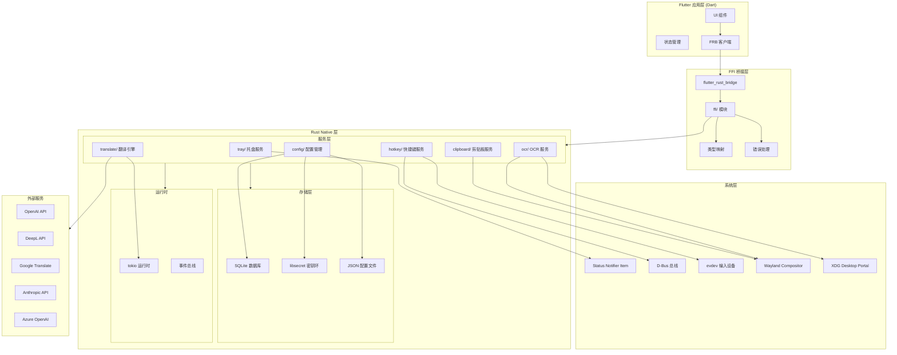
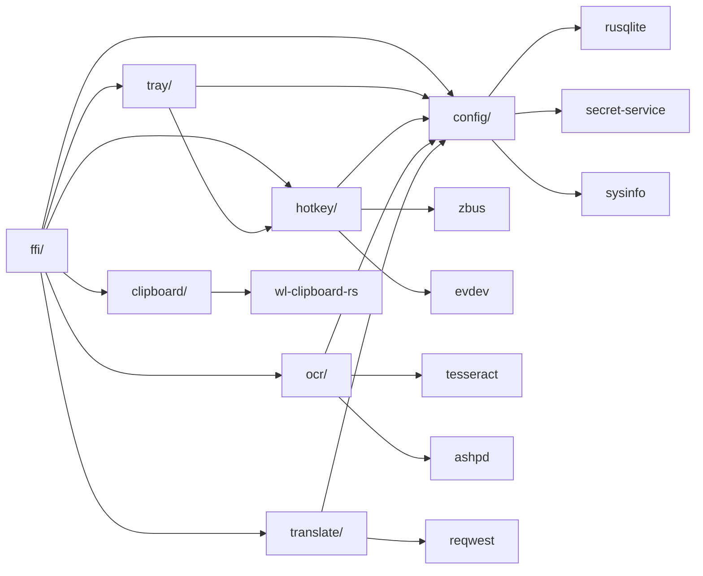

# Flutter Translate - Rust 后端开发文档

> 生成日期：2026-04-24
> 技术栈：Rust 1.85+ (edition 2024) / flutter_rust_bridge 2.11.0 / tokio 1.47
> 目标平台：Linux (Wayland) - KDE Plasma 6+ / Hyprland 0.35+

---

## 1. 技术概述

### 1.1 项目目标

为 Flutter 桌面应用提供 Linux (Wayland) 平台原生能力支持，包括系统托盘、全局快捷键、剪贴板操作、OCR 截图识别、多厂商翻译引擎集成及配置管理。通过 flutter_rust_bridge 实现 Dart/Rust 高效 FFI 通信。

### 1.2 技术选型

| 层级 | 技术 | 版本 | 说明 |
|---|---|---|---|
| 语言 | Rust | 1.85+ (edition 2024) | 内存安全、零成本抽象 |
| FFI 桥接 | flutter_rust_bridge | 2.11.0 | Dart/Rust 类型安全桥接 |
| 异步运行时 | tokio | 1.47 | 多线程异步运行时 |
| HTTP 客户端 | reqwest | 0.12+ | 异步 HTTP 请求 |
| 数据库 | SQLite (rusqlite) | 0.32+ | 轻量级本地存储 |
| 加密存储 | libsecret | 0.2+ (via secret-service) | 桌面环境密钥环 |
| 系统托盘 | SNI (status-notifier-item) | - | freedesktop 标准 |
| D-Bus | zbus | 4.4+ | 异步 D-Bus 通信 |
| 输入监听 | evdev | 0.12+ | Linux 输入设备 |
| OCR | tesseract | 0.4+ | 光学字符识别 |
| 截图 | grim + slurp / KDE Portal | - | Wayland 截图方案 |
| 序列化 | serde / serde_json | 1.0+ | JSON 序列化 |
| 配置 | config | 0.14+ | 多格式配置加载 |

### 1.3 约束条件

- **平台限制**：仅支持 Linux Wayland 会话，不支持 X11
- **桌面环境**：KDE Plasma 6+ 或 Hyprland 0.35+
- **权限要求**：剪贴板/快捷键需用户授权，截图需 portal 交互
- **性能要求**：翻译请求响应 < 3s (P95)，OCR 识别 < 5s (P95)
- **安全要求**：API Key 必须通过 libsecret 加密存储

---

## 2. 系统架构

### 2.1 整体架构图



### 2.2 模块划分

| 模块 | 路径 | 职责 | 依赖模块 |
|---|---|---|---|
| FFI 桥接 | `ffi/` | Dart/Rust 类型映射、接口导出、错误转换 | 所有服务模块 |
| 托盘服务 | `tray/` | SNI 注册、菜单渲染、事件分发 | config, hotkey |
| 快捷键服务 | `hotkey/` | 全局快捷键注册、evdev 监听、D-Bus 集成 | config, dbus |
| 剪贴板服务 | `clipboard/` | Wayland 剪贴板读写、内容监听 | wl-clipboard-rs |
| OCR 服务 | `ocr/` | 截图捕获、tesseract 识别、portal 交互 | config, clipboard |
| 翻译引擎 | `translate/` | 多厂商适配、并行请求、路由分发 | config, http |
| 配置管理 | `config/` | SQLite/JSON 存储、libsecret 加密、环境检测 | storage, crypto |

### 2.3 依赖关系图



---

## 3. 详细设计

### 3.1 托盘服务 (tray/)

#### 3.1.1 核心职责

- 注册 Status Notifier Item (SNI) 到系统托盘
- 渲染右键菜单（翻译历史、设置、退出）
- 处理菜单点击事件并转发至对应服务

#### 3.1.2 数据结构

```rust
pub struct TrayService {
    notifier: StatusNotifierItem,
    menu: Menu,
    event_tx: mpsc::Sender<TrayEvent>,
    event_rx: mpsc::Receiver<TrayEvent>,
}

pub enum TrayEvent {
    MenuItemClicked(String),
    IconActivated,
    SecondaryActivated,
    Scroll(i32, String),
}

pub struct MenuItem {
    pub id: String,
    pub label: String,
    pub icon: Option<String>,
    pub enabled: bool,
    pub toggle_type: Option<ToggleType>,
}

pub enum ToggleType {
    Checkmark(bool),
    Radio { group: String, selected: bool },
}
```

#### 3.1.3 SNI 注册实现

```rust
use zbus::{Connection, proxy, interface};

#[interface(name = "org.kde.StatusNotifierItem")]
struct StatusNotifierItem {
    #[zbus(property)]
    async fn icon_name(&self) -> String {
        "flutter-translate".into()
    }

    #[zbus(property)]
    async fn title(&self) -> String {
        "Flutter Translate".into()
    }

    #[zbus(property)]
    async fn menu(&self) -> zbus::zvariant::ObjectPath<'static> {
        self.menu_path.clone()
    }

    // 激活信号
    #[zbus(signal)]
    async fn activate(&self, x: i32, y: i32) -> zbus::Result<()>;
}

impl TrayService {
    pub async fn new() -> Result<Self, TrayError> {
        let conn = Connection::session().await?;
        let notifier = StatusNotifierItem::new(conn).await?;
        // 注册到 org.kde.StatusNotifierWatcher
        Self::register_watcher(&notifier).await?;
        Ok(Self { /* ... */ })
    }
}
```

#### 3.1.4 错误处理

```rust
#[derive(Debug, thiserror::Error)]
pub enum TrayError {
    #[error("D-Bus connection failed: {0}")]
    DbusError(#[from] zbus::Error),
    #[error("Menu registration failed: {0}")]
    MenuError(String),
    #[error("Watcher not available: {0}")]
    WatcherError(String),
}
```

### 3.2 快捷键服务 (hotkey/)

#### 3.2.1 核心职责

- 注册/注销全局快捷键
- KDE GlobalShortcuts D-Bus 集成
- evdev 底层键盘事件监听（备用方案）
- 快捷键冲突检测

#### 3.2.2 数据结构

```rust
pub struct HotkeyService {
    kde_client: Option<KdeGlobalShortcuts>,
    evdev_listener: Option<EvdevListener>,
    registered: HashMap<String, ShortcutBinding>,
    event_tx: broadcast::Sender<HotkeyEvent>,
}

pub struct ShortcutBinding {
    pub id: String,
    pub action: String,
    pub key_combination: String, // e.g., "Ctrl+Shift+F"
    pub enabled: bool,
}

pub enum HotkeyEvent {
    Triggered { action: String, timestamp: Instant },
    Registered { id: String },
    Unregistered { id: String },
    Conflict { id: String, existing_id: String },
}
```

#### 3.2.3 KDE D-Bus 集成

```rust
#[proxy(
    interface = "org.kde.kglobalaccel.Component",
    default_service = "org.kde.kglobalaccel",
    path = "/components/flutter_translate"
)]
trait KdeGlobalShortcuts {
    async fn register_shortcut(
        &self,
        action_name: &str,
        component_name: &str,
        default_shortcut: &str,
        description: &str,
    ) -> zbus::Result<()>;

    async fn unregister_shortcut(
        &self,
        action_name: &str,
    ) -> zbus::Result<()>;

    #[zbus(signal)]
    fn shortcut_triggered(&self, action_name: &str) -> zbus::Result<()>;
}

impl HotkeyService {
    pub async fn register_kde_shortcut(
        &self,
        binding: &ShortcutBinding,
    ) -> Result<(), HotkeyError> {
        if let Some(client) = &self.kde_client {
            client
                .register_shortcut(
                    &binding.action,
                    "flutter_translate",
                    &binding.key_combination,
                    &binding.action,
                )
                .await?;
        }
        Ok(())
    }
}
```

#### 3.2.4 evdev 监听（备用方案）

```rust
use evdev::{Device, InputEventKind, Key};

pub struct EvdevListener {
    devices: Vec<Device>,
    active_modifiers: HashSet<Key>,
}

impl EvdevListener {
    pub async fn start(&mut self, tx: mpsc::Sender<HotkeyEvent>) -> Result<(), HotkeyError> {
        let devices = Self::find_keyboard_devices()?;
        
        for mut device in devices {
            let tx_clone = tx.clone();
            tokio::spawn(async move {
                while let Ok(events) = device.fetch_events().await {
                    for event in events {
                        if let InputEventKind::Key(key) = event.kind() {
                            Self::handle_key_event(key, event.value(), &mut self.active_modifiers);
                            Self::check_shortcut_combination(&self.active_modifiers, key, &tx_clone).await;
                        }
                    }
                }
            });
        }
        Ok(())
    }

    fn find_keyboard_devices() -> Result<Vec<Device>, HotkeyError> {
        evdev::enumerate()
            .filter(|(_, dev)| dev.supported_keys().map_or(false, |keys| keys.contains(Key::KEY_A)))
            .map(|(path, _)| Device::open(path))
            .collect::<Result<_, _>>()
            .map_err(HotkeyError::from)
    }
}
```

#### 3.2.5 错误处理

```rust
#[derive(Debug, thiserror::Error)]
pub enum HotkeyError {
    #[error("D-Bus error: {0}")]
    DbusError(#[from] zbus::Error),
    #[error("evdev error: {0}")]
    EvdevError(#[from] evdev::Error),
    #[error("Shortcut already registered: {0}")]
    AlreadyRegistered(String),
    #[error("No keyboard devices found")]
    NoKeyboardDevices,
}
```

### 3.3 剪贴板服务 (clipboard/)

#### 3.3.1 核心职责

- Wayland 剪贴板读取（PRIMARY 和 CLIPBOARD selection）
- 剪贴板内容变更监听
- 文本/图片格式支持

#### 3.3.2 数据结构

```rust
pub struct ClipboardService {
    watcher: ClipboardWatcher,
    last_content: Arc<RwLock<Option<String>>>,
}

pub enum ClipboardSelection {
    Clipboard,
    Primary,
}

pub struct ClipboardContent {
    pub text: Option<String>,
    pub image: Option<Vec<u8>>,
    pub mime_type: String,
}
```

#### 3.3.3 实现方案

```rust
use wl_clipboard_rs::prelude::*;

impl ClipboardService {
    pub fn new() -> Result<Self, ClipboardError> {
        Ok(Self {
            watcher: ClipboardWatcher::new()?,
            last_content: Arc::new(RwLock::new(None)),
        })
    }

    pub fn get_text(&self, selection: ClipboardSelection) -> Result<String, ClipboardError> {
        let seat = match selection {
            ClipboardSelection::Clipboard => Seat::Unspecified,
            ClipboardSelection::Primary => Seat::Unspecified,
        };
        
        let mut opts = PasteOptions::default();
        opts.selection(match selection {
            ClipboardSelection::Clipboard => Selection::Clipboard,
            ClipboardSelection::Primary => Selection::Primary,
        });

        let content = paste(opts)?;
        let text = String::from_utf8(content).map_err(|e| ClipboardError::Utf8Error(e))?;
        Ok(text)
    }

    pub fn set_text(&self, text: String) -> Result<(), ClipboardError> {
        let mut opts = CopyOptions::new();
        opts.foreground(true);
        copy(text.into_bytes(), opts)?;
        Ok(())
    }

    pub async fn watch_changes(&self, tx: mpsc::Sender<String>) -> Result<(), ClipboardError> {
        let mut watch = Watch::new()?;
        while let Ok(event) = watch.next().await {
            if let Some(text) = self.get_text(ClipboardSelection::Clipboard).ok() {
                tx.send(text).await.map_err(|_| ClipboardError::ChannelError)?;
            }
        }
        Ok(())
    }
}
```

#### 3.3.4 错误处理

```rust
#[derive(Debug, thiserror::Error)]
pub enum ClipboardError {
    #[error("wl-clipboard error: {0}")]
    WlError(#[from] wl_clipboard_rs::paste::Error),
    #[error("UTF-8 conversion error: {0}")]
    Utf8Error(std::string::FromUtf8Error),
    #[error("Clipboard empty")]
    Empty,
    #[error("Channel send error")]
    ChannelError,
}
```

### 3.4 OCR 服务 (ocr/)

#### 3.4.1 核心职责

- 屏幕区域截图（KDE Portal / Hyprland grim+slurp）
- tesseract OCR 识别
- 多语言支持
- 截图缓存管理

#### 3.4.2 数据结构

```rust
pub struct OcrService {
    tesseract: Tesseract,
    desktop_env: DesktopEnv,
    screenshot_cache: LruCache<String, Vec<u8>>,
}

pub struct OcrResult {
    pub text: String,
    pub confidence: f64,
    pub language: String,
    pub processing_time_ms: u64,
}

pub enum ScreenshotMethod {
    KdePortal,
    GrimSlurp,
}
```

#### 3.4.3 KDE Portal 截图

```rust
use ashpd::desktop::screenshot::Screenshot;

impl OcrService {
    pub async fn screenshot_kde_portal(&self) -> Result<Vec<u8>, OcrError> {
        let proxy = Screenshot::new().await?;
        let response = proxy
            .request()
            .modal(false)
            .send()
            .await?;
        
        let uri = response.uri();
        let path = uri.path();
        let image_data = tokio::fs::read(path).await?;
        Ok(image_data)
    }
}
```

#### 3.4.4 Hyprland grim+slurp 截图

```rust
use tokio::process::Command;

impl OcrService {
    pub async fn screenshot_grim_slurp(&self) -> Result<Vec<u8>, OcrError> {
        // slurp 获取用户选择区域
        let slurp_output = Command::new("slurp")
            .output()
            .await?;
        
        if !slurp_output.status.success() {
            return Err(OcrError::UserCancelled);
        }
        
        let region = String::from_utf8_lossy(&slurp_output.stdout);
        let region = region.trim();

        // grim 截图指定区域
        let temp_path = "/tmp/flutter_translate_screenshot.png";
        let grim_output = Command::new("grim")
            .arg("-g")
            .arg(region)
            .arg(temp_path)
            .output()
            .await?;

        if !grim_output.status.success() {
            return Err(OcrError::ScreenshotFailed);
        }

        let image_data = tokio::fs::read(temp_path).await?;
        Ok(image_data)
    }
}
```

#### 3.4.5 tesseract 识别

```rust
use tesseract::Tesseract;

impl OcrService {
    pub async fn recognize(&self, image_data: &[u8], lang: &str) -> Result<OcrResult, OcrError> {
        let start = Instant::now();
        
        // 写入临时文件（tesseract 需要文件路径）
        let temp_path = "/tmp/flutter_translate_ocr_input.png";
        tokio::fs::write(temp_path, image_data).await?;

        let mut tess = Tesseract::new(None, Some(temp_path))?;
        tess.set_variable("tessedit_pageseg_mode", "3")?;
        tess.set_language(lang)?;
        
        let text = tess.recognize()?;
        let confidence = tess.mean_confidence();
        
        let processing_time = start.elapsed().as_millis() as u64;
        
        Ok(OcrResult {
            text,
            confidence,
            language: lang.to_string(),
            processing_time_ms: processing_time,
        })
    }
}
```

#### 3.4.6 错误处理

```rust
#[derive(Debug, thiserror::Error)]
pub enum OcrError {
    #[error("Portal error: {0}")]
    PortalError(#[from] ashpd::Error),
    #[error("Command execution failed: {0}")]
    CommandError(std::io::Error),
    #[error("Tesseract error: {0}")]
    TesseractError(String),
    #[error("User cancelled selection")]
    UserCancelled,
    #[error("Screenshot failed")]
    ScreenshotFailed,
    #[error("IO error: {0}")]
    IoError(#[from] std::io::Error),
}
```

### 3.5 配置管理 (config/)

#### 3.5.1 核心职责

- SQLite 数据库操作（配置读写）
- libsecret 加密存储（API Key）
- JSON 配置文件加载
- 桌面环境检测

#### 3.5.2 数据结构

```rust
pub struct ConfigManager {
    db: Arc<Mutex<rusqlite::Connection>>,
    secret_service: SecretService,
    desktop_env: DesktopEnv,
}

#[derive(Debug, serde::Serialize, serde::Deserialize)]
pub struct UserConfig {
    pub id: String,
    pub theme: String,
    pub default_target_lang: String,
    pub auto_detect: bool,
    pub history_enabled: bool,
    pub created_at: DateTime<Utc>,
    pub updated_at: DateTime<Utc>,
}

#[derive(Debug, serde::Serialize, serde::Deserialize)]
pub struct ProviderConfig {
    pub id: String,
    pub name: String,
    pub api_key: Option<String>, // 加密存储，不直接保存在 DB
    pub api_url: Option<String>,
    pub model: String,
    pub auth_type: String,
    pub is_active: bool,
    pub sort_order: i32,
    pub created_at: DateTime<Utc>,
}

#[derive(Debug, Clone, PartialEq)]
pub enum DesktopEnv {
    KdePlasma,
    Hyprland,
    Gnome,
    Unknown,
}
```

#### 3.5.3 桌面环境检测

```rust
impl ConfigManager {
    pub fn detect_desktop_env() -> DesktopEnv {
        let xdg_current_desktop = std::env::var("XDG_CURRENT_DESKTOP")
            .unwrap_or_default()
            .to_lowercase();
        
        let wayland_display = std::env::var("WAYLAND_DISPLAY")
            .unwrap_or_default()
            .to_lowercase();

        if xdg_current_desktop.contains("hyprland") {
            DesktopEnv::Hyprland
        } else if xdg_current_desktop.contains("kde") {
            DesktopEnv::KdePlasma
        } else if xdg_current_desktop.contains("gnome") {
            DesktopEnv::Gnome
        } else {
            DesktopEnv::Unknown
        }
    }
}
```

#### 3.5.4 libsecret 加密存储

```rust
use secret_service::{EncryptionType, SecretService};

impl ConfigManager {
    pub async fn store_api_key(&self, provider_id: &str, api_key: &str) -> Result<(), ConfigError> {
        let ss = SecretService::connect(EncryptionType::Dh).await?;
        
        let collection = ss.get_default_collection().await?;
        let attributes = HashMap::from([
            ("application", "flutter-translate"),
            ("provider_id", provider_id),
        ]);
        
        collection
            .create_item(
                &format!("Flutter Translate - {}", provider_id),
                attributes,
                api_key.as_bytes(),
                true,
                "text/plain",
            )
            .await?;
        
        Ok(())
    }

    pub async fn retrieve_api_key(&self, provider_id: &str) -> Result<String, ConfigError> {
        let ss = SecretService::connect(EncryptionType::Dh).await?;
        
        let attributes = HashMap::from([
            ("application", "flutter-translate"),
            ("provider_id", provider_id),
        ]);
        
        let items = ss.search_items(attributes).await?;
        let unlocked = items.get_unlocked().first()
            .ok_or(ConfigError::KeyNotFound(provider_id.to_string()))?;
        
        let secret = unlocked.get_secret().await?;
        String::from_utf8(secret).map_err(|e| ConfigError::Utf8Error(e))
    }

    pub async fn delete_api_key(&self, provider_id: &str) -> Result<(), ConfigError> {
        let ss = SecretService::connect(EncryptionType::Dh).await?;
        
        let attributes = HashMap::from([
            ("application", "flutter-translate"),
            ("provider_id", provider_id),
        ]);
        
        let items = ss.search_items(attributes).await?;
        for item in items.get_unlocked() {
            item.delete().await?;
        }
        
        Ok(())
    }
}
```

#### 3.5.5 SQLite 初始化

```rust
impl ConfigManager {
    pub fn init_db() -> Result<rusqlite::Connection, ConfigError> {
        let db_path = Self::get_db_path();
        let conn = rusqlite::Connection::open(db_path)?;
        
        conn.execute_batch(
            r#"
            CREATE TABLE IF NOT EXISTS user_config (
                id TEXT PRIMARY KEY,
                theme TEXT NOT NULL DEFAULT 'dark',
                default_target_lang TEXT NOT NULL DEFAULT 'en',
                auto_detect BOOLEAN NOT NULL DEFAULT 1,
                history_enabled BOOLEAN NOT NULL DEFAULT 0,
                created_at DATETIME NOT NULL,
                updated_at DATETIME NOT NULL
            );

            CREATE TABLE IF NOT EXISTS translation_provider (
                id TEXT PRIMARY KEY,
                name TEXT NOT NULL,
                api_key TEXT,
                api_url TEXT,
                model TEXT NOT NULL,
                auth_type TEXT NOT NULL DEFAULT 'bearer',
                is_active BOOLEAN NOT NULL DEFAULT 1,
                sort_order INTEGER NOT NULL DEFAULT 0,
                created_at DATETIME NOT NULL
            );

            CREATE TABLE IF NOT EXISTS translation_rule (
                id TEXT PRIMARY KEY,
                provider_id TEXT NOT NULL REFERENCES translation_provider(id),
                role_name TEXT NOT NULL,
                system_prompt TEXT,
                custom_rules TEXT,
                is_default BOOLEAN NOT NULL DEFAULT 0
            );

            CREATE TABLE IF NOT EXISTS shortcut_binding (
                id TEXT PRIMARY KEY,
                action TEXT NOT NULL,
                key_combination TEXT NOT NULL,
                enabled BOOLEAN NOT NULL DEFAULT 1
            );

            CREATE TABLE IF NOT EXISTS language_pref (
                id TEXT PRIMARY KEY,
                code TEXT NOT NULL UNIQUE,
                display_name TEXT NOT NULL,
                usage_count INTEGER NOT NULL DEFAULT 0,
                is_favorite BOOLEAN NOT NULL DEFAULT 0
            );

            CREATE TABLE IF NOT EXISTS active_session (
                id TEXT PRIMARY KEY,
                last_provider_id TEXT REFERENCES translation_provider(id),
                last_compare_providers TEXT,
                last_used DATETIME NOT NULL
            );

            CREATE TABLE IF NOT EXISTS translation_preference (
                id TEXT PRIMARY KEY,
                source_text_hash TEXT NOT NULL,
                best_provider_id TEXT REFERENCES translation_provider(id),
                times_selected INTEGER NOT NULL DEFAULT 0,
                last_selected DATETIME
            );
            "#,
        )?;
        
        Ok(conn)
    }
}
```

#### 3.5.6 错误处理

```rust
#[derive(Debug, thiserror::Error)]
pub enum ConfigError {
    #[error("Database error: {0}")]
    DbError(#[from] rusqlite::Error),
    #[error("Secret service error: {0}")]
    SecretError(#[from] secret_service::Error),
    #[error("Key not found: {0}")]
    KeyNotFound(String),
    #[error("UTF-8 error: {0}")]
    Utf8Error(std::string::FromUtf8Error),
    #[error("Config not found: {0}")]
    NotFound(String),
    #[error("Serialization error: {0}")]
    SerdeError(#[from] serde_json::Error),
}
```

---

## 4. 翻译引擎设计

### 4.1 Provider trait 设计

#### 4.1.1 核心 trait 定义

```rust
use async_trait::async_trait;

#[async_trait]
pub trait TranslateProvider: Send + Sync {
    /// 执行翻译请求
    async fn translate(&self, request: TranslateRequest) -> Result<TranslationResult, TranslateError>;
    
    /// 测试连接有效性
    async fn test_connection(&self) -> Result<bool, TranslateError>;
    
    /// 厂商名称
    fn name(&self) -> &str;
    
    /// 支持的模型列表
    fn supported_models(&self) -> Vec<String>;
    
    /// 厂商唯一标识
    fn provider_id(&self) -> &str;
    
    /// 是否支持流式输出
    fn supports_streaming(&self) -> bool {
        false
    }
}
```

#### 4.1.2 请求/响应数据结构

```rust
#[derive(Debug, Clone)]
pub struct TranslateRequest {
    pub text: String,
    pub source_lang: String,
    pub target_lang: String,
    pub model: Option<String>,
    pub system_prompt: Option<String>,
    pub temperature: Option<f64>,
}

#[derive(Debug, Clone)]
pub struct TranslationResult {
    pub text: String,
    pub source_lang: String,
    pub target_lang: String,
    pub provider_id: String,
    pub model: String,
    pub latency_ms: u64,
    pub confidence: Option<f64>,
}
```

### 4.2 内置厂商实现

#### 4.2.1 OpenAI 实现

```rust
pub struct OpenAiProvider {
    client: reqwest::Client,
    api_key: String,
    model: String,
    api_url: String,
}

#[async_trait]
impl TranslateProvider for OpenAiProvider {
    async fn translate(&self, request: TranslateRequest) -> Result<TranslationResult, TranslateError> {
        let start = Instant::now();
        
        let body = serde_json::json!({
            "model": self.model,
            "messages": [
                {
                    "role": "system",
                    "content": request.system_prompt.unwrap_or_else(|| self.default_system_prompt(&request))
                },
                {
                    "role": "user",
                    "content": request.text
                }
            ],
            "temperature": request.temperature.unwrap_or(0.3),
        });

        let response = self.client
            .post(&self.api_url)
            .header("Authorization", format!("Bearer {}", self.api_key))
            .json(&body)
            .send()
            .await?;

        if !response.status().is_success() {
            return Err(TranslateError::ApiError {
                provider: self.name().to_string(),
                status: response.status().as_u16(),
                message: response.text().await.unwrap_or_default(),
            });
        }

        let json: serde_json::Value = response.json().await?;
        let text = json["choices"][0]["message"]["content"]
            .as_str()
            .unwrap_or("")
            .to_string();

        Ok(TranslationResult {
            text,
            source_lang: request.source_lang,
            target_lang: request.target_lang,
            provider_id: self.provider_id().to_string(),
            model: self.model.clone(),
            latency_ms: start.elapsed().as_millis() as u64,
            confidence: None,
        })
    }

    async fn test_connection(&self) -> Result<bool, TranslateError> {
        let request = TranslateRequest {
            text: "Hello".to_string(),
            source_lang: "en".to_string(),
            target_lang: "en".to_string(),
            model: Some(self.model.clone()),
            system_prompt: None,
            temperature: None,
        };
        
        match self.translate(request).await {
            Ok(_) => Ok(true),
            Err(TranslateError::ApiError { status, .. }) if status == 401 => Ok(false),
            Err(e) => Err(e),
        }
    }

    fn name(&self) -> &str {
        "OpenAI"
    }

    fn supported_models(&self) -> Vec<String> {
        vec![
            "gpt-4o".to_string(),
            "gpt-4o-mini".to_string(),
            "gpt-4-turbo".to_string(),
        ]
    }

    fn provider_id(&self) -> &str {
        "openai"
    }
}
```

#### 4.2.2 DeepL 实现

```rust
pub struct DeepLProvider {
    client: reqwest::Client,
    api_key: String,
    api_url: String,
}

#[async_trait]
impl TranslateProvider for DeepLProvider {
    async fn translate(&self, request: TranslateRequest) -> Result<TranslationResult, TranslateError> {
        let start = Instant::now();
        
        let response = self.client
            .post(&self.api_url)
            .header("Authorization", format!("DeepL-Auth-Key {}", self.api_key))
            .form(&[
                ("text", &request.text),
                ("source_lang", &request.source_lang.to_uppercase()),
                ("target_lang", &request.target_lang.to_uppercase()),
            ])
            .send()
            .await?;

        let json: serde_json::Value = response.json().await?;
        let text = json["translations"][0]["text"]
            .as_str()
            .unwrap_or("")
            .to_string();

        Ok(TranslationResult {
            text,
            source_lang: request.source_lang,
            target_lang: request.target_lang,
            provider_id: self.provider_id().to_string(),
            model: "deepl".to_string(),
            latency_ms: start.elapsed().as_millis() as u64,
            confidence: None,
        })
    }

    fn name(&self) -> &str {
        "DeepL"
    }

    fn supported_models(&self) -> Vec<String> {
        vec!["deepl".to_string()]
    }

    fn provider_id(&self) -> &str {
        "deepl"
    }
}
```

#### 4.2.3 其他厂商

- **Google** (`google.rs`): 使用 Cloud Translation API v3
- **Anthropic** (`anthropic.rs`): 使用 Messages API
- **Azure** (`azure.rs`): Azure OpenAI Service 适配
- **Custom** (`custom.rs`): OpenAI 兼容接口，支持自定义 endpoint

### 4.3 请求路由器

#### 4.3.1 路由器实现

```rust
pub struct RequestRouter {
    providers: HashMap<String, Box<dyn TranslateProvider>>,
    preference_cache: LruCache<String, String>, // text_hash -> provider_id
}

impl RequestRouter {
    pub fn new() -> Self {
        Self {
            providers: HashMap::new(),
            preference_cache: LruCache::new(NonZeroUsize::new(100).unwrap()),
        }
    }

    pub fn register_provider(&mut self, provider: Box<dyn TranslateProvider>) {
        self.providers.insert(provider.provider_id().to_string(), provider);
    }

    pub async fn route(
        &self,
        request: TranslateRequest,
        provider_id: &str,
    ) -> Result<TranslationResult, TranslateError> {
        let provider = self.providers.get(provider_id)
            .ok_or(TranslateError::ProviderNotFound(provider_id.to_string()))?;
        
        provider.translate(request).await
    }

    pub async fn route_with_preference(
        &mut self,
        request: &TranslateRequest,
        available_providers: &[String],
    ) -> Result<TranslationResult, TranslateError> {
        let text_hash = Self::hash_text(&request.text);
        
        // 检查偏好缓存
        if let Some(preferred_id) = self.preference_cache.get(&text_hash) {
            if available_providers.contains(preferred_id) {
                return self.route(request.clone(), preferred_id).await;
            }
        }

        // 使用第一个可用厂商
        let provider_id = available_providers.first()
            .ok_or(TranslateError::NoAvailableProviders)?;
        
        self.route(request.clone(), provider_id).await
    }

    pub fn record_preference(&mut self, text: &str, provider_id: &str) {
        let text_hash = Self::hash_text(text);
        self.preference_cache.put(text_hash, provider_id.to_string());
    }

    fn hash_text(text: &str) -> String {
        use sha2::{Sha256, Digest};
        let mut hasher = Sha256::new();
        hasher.update(text.as_bytes());
        format!("{:x}", hasher.finalize())
    }
}
```

### 4.4 并行请求策略

#### 4.4.1 并行翻译实现

```rust
pub struct ParallelTranslator {
    router: Arc<RequestRouter>,
    max_concurrent: usize,
}

impl ParallelTranslator {
    pub async fn translate_compare(
        &self,
        request: TranslateRequest,
        provider_ids: Vec<String>,
    ) -> Result<Vec<TranslationResult>, TranslateError> {
        let semaphore = Arc::new(Semaphore::new(self.max_concurrent));
        let mut handles = Vec::new();

        for provider_id in provider_ids {
            let permit = semaphore.clone().acquire_owned().await
                .map_err(|_| TranslateError::RuntimeError)?;
            
            let router = self.router.clone();
            let request = request.clone();
            
            let handle = tokio::spawn(async move {
                let result = router.route(request, &provider_id).await;
                drop(permit);
                (provider_id, result)
            });
            
            handles.push(handle);
        }

        let mut results = Vec::new();
        let mut errors = Vec::new();

        for handle in handles {
            match handle.await {
                Ok((provider_id, Ok(result))) => results.push(result),
                Ok((provider_id, Err(e))) => errors.push((provider_id, e)),
                Err(e) => errors.push(("unknown".to_string(), TranslateError::TaskJoinError(e))),
            }
        }

        if results.is_empty() && !errors.is_empty() {
            return Err(errors.into_iter().next().unwrap().1);
        }

        Ok(results)
    }
}
```

#### 4.4.2 请求限流

```rust
use governor::{Quota, RateLimiter};

pub struct RateLimitedProvider {
    inner: Box<dyn TranslateProvider>,
    limiter: RateLimiter<direct::NotKeyed, direct::DefaultState, direct::DefaultClock>,
}

impl RateLimitedProvider {
    pub fn new(inner: Box<dyn TranslateProvider>, requests_per_minute: u32) -> Self {
        let quota = Quota::per_minute(NonZeroU32::new(requests_per_minute).unwrap());
        Self {
            inner,
            limiter: RateLimiter::direct(quota),
        }
    }
}

#[async_trait]
impl TranslateProvider for RateLimitedProvider {
    async fn translate(&self, request: TranslateRequest) -> Result<TranslationResult, TranslateError> {
        self.limiter.until_ready().await;
        self.inner.translate(request).await
    }

    // ... 其他方法转发到 inner
}
```

### 4.5 错误处理

```rust
#[derive(Debug, thiserror::Error)]
pub enum TranslateError {
    #[error("HTTP error: {0}")]
    HttpError(#[from] reqwest::Error),
    #[error("API error from {provider}: {status} - {message}")]
    ApiError { provider: String, status: u16, message: String },
    #[error("Provider not found: {0}")]
    ProviderNotFound(String),
    #[error("No available providers")]
    NoAvailableProviders,
    #[error("Serialization error: {0}")]
    SerdeError(#[from] serde_json::Error),
    #[error("Task join error: {0}")]
    TaskJoinError(tokio::task::JoinError),
    #[error("Runtime error")]
    RuntimeError,
    #[error("Rate limit exceeded")]
    RateLimitExceeded,
}
```

---

## 5. 桌面适配设计

### 5.1 KDE Plasma 6+ 适配

#### 5.1.1 快捷键集成

```rust
// KDE GlobalShortcuts D-Bus 接口
#[proxy(
    interface = "org.kde.kglobalaccel.Component",
    default_service = "org.kde.kglobalaccel",
    path = "/components/flutter_translate"
)]
trait KdeGlobalShortcuts {
    async fn register_shortcut(
        &self,
        action_name: &str,
        component_name: &str,
        default_shortcut: &str,
        description: &str,
    ) -> zbus::Result<()>;

    #[zbus(signal)]
    fn shortcut_triggered(&self, action_name: &str) -> zbus::Result<()>;
}
```

#### 5.1.2 截图 Portal

```rust
// 使用 ashpd 库与 XDG Desktop Portal 交互
use ashpd::desktop::screenshot::Screenshot;

async fn kde_screenshot() -> Result<Vec<u8>, OcrError> {
    let proxy = Screenshot::new().await?;
    let response = proxy.request().modal(false).send().await?;
    let uri = response.uri();
    tokio::fs::read(uri.path()).await.map_err(OcrError::from)
}
```

#### 5.1.3 托盘集成

```rust
// KDE 使用 SNI (Status Notifier Item) 标准
// 通过 D-Bus 注册到 org.kde.StatusNotifierWatcher
```

### 5.2 Hyprland 0.35+ 适配

#### 5.2.1 快捷键集成

```rust
// Hyprland 通过 IPC socket 管理快捷键
// 使用 hyprctl 命令或 socket 通信

pub async fn register_hyprland_shortcut(
    key_combination: &str,
    command: &str,
) -> Result<(), HotkeyError> {
    let output = Command::new("hyprctl")
        .arg("bind")
        .arg(key_combination)
        .arg("exec")
        .arg(command)
        .output()
        .await?;

    if !output.status.success() {
        return Err(HotkeyError::HyprctlError(
            String::from_utf8_lossy(&output.stderr).to_string()
        ));
    }

    Ok(())
}
```

#### 5.2.2 grim+slurp 截图

```rust
// Hyprland 使用 grim (screenshot) + slurp (region selection)
// 见 3.4.4 节实现
```

#### 5.2.3 托盘支持

```rust
// Hyprland 通过 waybar/rofi 等工具支持 SNI
// 实现与 KDE 相同的 SNI 接口即可
```

### 5.3 桌面环境适配层

```rust
pub struct DesktopAdapter {
    env: DesktopEnv,
}

impl DesktopAdapter {
    pub fn new(env: DesktopEnv) -> Self {
        Self { env }
    }

    pub async fn screenshot(&self) -> Result<Vec<u8>, OcrError> {
        match self.env {
            DesktopEnv::KdePlasma => self.screenshot_kde_portal().await,
            DesktopEnv::Hyprland => self.screenshot_grim_slurp().await,
            _ => Err(OcrError::UnsupportedDesktop),
        }
    }

    pub async fn register_shortcut(
        &self,
        binding: &ShortcutBinding,
    ) -> Result<(), HotkeyError> {
        match self.env {
            DesktopEnv::KdePlasma => self.register_kde_shortcut(binding).await,
            DesktopEnv::Hyprland => self.register_hyprland_shortcut(binding).await,
            _ => Err(HotkeyError::UnsupportedDesktop),
        }
    }
}
```

### 5.4 快捷键实现差异对比

| 特性 | KDE Plasma | Hyprland |
|---|---|---|
| 注册方式 | D-Bus (kglobalaccel) | hyprctl IPC / 配置文件 |
| 快捷键格式 | Qt 格式 (Ctrl+Shift+F) | Hyprland 格式 (SUPER, SHIFT+F) |
| 冲突检测 | 系统自动检测 | 手动检测 |
| 权限要求 | 用户授权弹窗 | 无特殊权限 |
| 信号监听 | D-Bus signal | Socket 事件 |

---

## 6. FFI 桥接设计

### 6.1 flutter_rust_bridge 配置

#### 6.1.1 Cargo.toml 配置

```toml
[dependencies]
flutter_rust_bridge = { version = "2.11.0", features = ["chrono"] }
tokio = { version = "1.47", features = ["full"] }

[build-dependencies]
flutter_rust_bridge = { version = "2.11.0", features = ["chrono"] }
```

#### 6.1.2 build.rs

```rust
fn main() {
    flutter_rust_bridge::generate_default_from_manifest();
}
```

#### 6.1.3 flutter_rust_bridge 配置

```yaml
# flutter_rust_bridge.yaml
rust_input: crate::ffi
dart_output: lib/src/rust
c_output: frb_generated.h
dart_entrypoint_class_name: RustLib
enable_lifetime: true
```

### 6.2 FFI 模块实现

#### 6.2.1 模块结构

```rust
// src/ffi/mod.rs
pub mod translate;
pub mod config;
pub mod session;
pub mod system;
pub mod types;
pub mod error;
```

#### 6.2.2 翻译服务 FFI

```rust
// src/ffi/translate.rs
use flutter_rust_bridge::frb;
use crate::translate::{TranslateRequest, TranslationResult, TranslateError};

#[frb]
pub async fn translate(
    text: String,
    source_lang: String,
    target_lang: String,
    provider_id: String,
) -> Result<TranslationResult, TranslateError> {
    let request = TranslateRequest {
        text,
        source_lang,
        target_lang,
        model: None,
        system_prompt: None,
        temperature: None,
    };

    let router = get_router().await;
    router.route(request, &provider_id).await
}

#[frb]
pub async fn translate_compare(
    text: String,
    source_lang: String,
    target_lang: String,
    provider_ids: Vec<String>,
) -> Result<Vec<TranslationResult>, TranslateError> {
    let request = TranslateRequest {
        text,
        source_lang,
        target_lang,
        model: None,
        system_prompt: None,
        temperature: None,
    };

    let translator = get_parallel_translator().await;
    translator.translate_compare(request, provider_ids).await
}
```

#### 6.2.3 配置管理 FFI

```rust
// src/ffi/config.rs
use flutter_rust_bridge::frb;
use crate::config::{ProviderConfig, ConfigError};

#[frb]
pub fn get_providers() -> Vec<ProviderConfig> {
    let manager = get_config_manager();
    manager.get_all_providers().unwrap_or_default()
}

#[frb]
pub fn save_provider(config: ProviderConfig) -> Result<(), ConfigError> {
    let manager = get_config_manager();
    manager.save_provider(config)
}

#[frb]
pub fn delete_provider(id: String) -> Result<(), ConfigError> {
    let manager = get_config_manager();
    manager.delete_provider(&id)
}

#[frb]
pub async fn test_provider(provider_id: String) -> Result<bool, TranslateError> {
    let router = get_router().await;
    let provider = router.get_provider(&provider_id)
        .ok_or(TranslateError::ProviderNotFound(provider_id))?;
    
    provider.test_connection().await
}
```

#### 6.2.4 会话管理 FFI

```rust
// src/ffi/session.rs
use flutter_rust_bridge::frb;
use crate::config::{ActiveSession, ConfigError};

#[frb]
pub fn get_active_session() -> ActiveSession {
    let manager = get_config_manager();
    manager.get_active_session().unwrap_or_default()
}

#[frb]
pub fn update_session(
    provider_id: Option<String>,
    compare_providers: Option<Vec<String>>,
) -> Result<(), ConfigError> {
    let manager = get_config_manager();
    manager.update_session(provider_id, compare_providers)
}
```

#### 6.2.5 系统服务 FFI

```rust
// src/ffi/system.rs
use flutter_rust_bridge::frb;
use crate::config::{DesktopEnv, ShortcutBinding, ConfigError};
use crate::ocr::OcrError;

#[frb]
pub fn detect_desktop_env() -> DesktopEnv {
    crate::config::ConfigManager::detect_desktop_env()
}

#[frb]
pub async fn ocr_screenshot() -> Result<String, OcrError> {
    let ocr_service = get_ocr_service().await;
    let image_data = ocr_service.screenshot().await?;
    let result = ocr_service.recognize(&image_data, "eng").await?;
    Ok(result.text)
}

#[frb]
pub fn get_shortcuts() -> Vec<ShortcutBinding> {
    let manager = get_config_manager();
    manager.get_all_shortcuts().unwrap_or_default()
}

#[frb]
pub fn update_shortcut(binding: ShortcutBinding) -> Result<(), ConfigError> {
    let manager = get_config_manager();
    manager.save_shortcut(binding)
}
```

### 6.3 类型映射

#### 6.3.1 FRB 类型映射表

| Rust 类型 | Dart 类型 | 说明 |
|---|---|---|
| `String` | `String` | 字符串 |
| `i32` | `int` | 32位整数 |
| `i64` | `int` | 64位整数 |
| `f64` | `double` | 64位浮点 |
| `bool` | `bool` | 布尔值 |
| `Vec<T>` | `List<T>` | 列表 |
| `HashMap<K, V>` | `Map<K, V>` | 映射 |
| `Option<T>` | `T?` | 可空类型 |
| `Result<T, E>` | `Future<T>` (throws) | 异步结果 |
| `DateTime<Utc>` | `DateTime` | 日期时间 (需启用 chrono) |
| `Arc<T>` | `T` | 自动解引用 |

#### 6.3.2 枚举映射

```rust
#[frb]
#[derive(Debug, Clone, serde::Serialize, serde::Deserialize)]
pub enum DesktopEnv {
    KdePlasma,
    Hyprland,
    Gnome,
    Unknown,
}

#[frb]
#[derive(Debug, Clone, serde::Serialize, serde::Deserialize)]
pub enum AuthType {
    Bearer,
    ApiKey,
    Custom,
}
```

### 6.4 异步处理

#### 6.4.1 tokio 运行时初始化

```rust
// src/ffi/runtime.rs
use once_cell::sync::Lazy;
use tokio::runtime::Runtime;

static RUNTIME: Lazy<Runtime> = Lazy::new(|| {
    Runtime::new().expect("Failed to create tokio runtime")
});

pub fn spawn_async<F>(future: F) -> tokio::task::JoinHandle<F::Output>
where
    F: std::future::Future + Send + 'static,
    F::Output: Send + 'static,
{
    RUNTIME.spawn(future)
}
```

#### 6.4.2 全局服务实例

```rust
// src/ffi/state.rs
use once_cell::sync::Lazy;
use tokio::sync::Mutex;

static CONFIG_MANAGER: Lazy<Mutex<ConfigManager>> = Lazy::new(|| {
    Mutex::new(ConfigManager::init().expect("Failed to init config manager"))
});

static TRANSLATE_ROUTER: Lazy<Mutex<RequestRouter>> = Lazy::new(|| {
    Mutex::new(RequestRouter::new())
});

async fn get_config_manager() -> tokio::sync::MutexGuard<'static, ConfigManager> {
    CONFIG_MANAGER.lock().await
}

async fn get_router() -> tokio::sync::MutexGuard<'static, RequestRouter> {
    TRANSLATE_ROUTER.lock().await
}
```

### 6.5 FFI 错误处理

#### 6.5.1 错误类型定义

```rust
// src/ffi/error.rs
use flutter_rust_bridge::frb;

#[frb]
#[derive(Debug, thiserror::Error)]
pub enum FfiError {
    #[error("Translate error: {0}")]
    TranslateError(String),
    #[error("Config error: {0}")]
    ConfigError(String),
    #[error("OCR error: {0}")]
    OcrError(String),
    #[error("Hotkey error: {0}")]
    HotkeyError(String),
    #[error("Clipboard error: {0}")]
    ClipboardError(String),
    #[error("Tray error: {0}")]
    TrayError(String),
}

impl From<TranslateError> for FfiError {
    fn from(err: TranslateError) -> Self {
        FfiError::TranslateError(err.to_string())
    }
}

impl From<ConfigError> for FfiError {
    fn from(err: ConfigError) -> Self {
        FfiError::ConfigError(err.to_string())
    }
}

impl From<OcrError> for FfiError {
    fn from(err: OcrError) -> Self {
        FfiError::OcrError(err.to_string())
    }
}
```

---

## 7. 配置存储设计

### 7.1 SQLite Schema

#### 7.1.1 完整建表语句

```sql
-- 用户配置
CREATE TABLE IF NOT EXISTS user_config (
    id TEXT PRIMARY KEY,
    theme TEXT NOT NULL DEFAULT 'dark',
    default_target_lang TEXT NOT NULL DEFAULT 'en',
    auto_detect BOOLEAN NOT NULL DEFAULT 1,
    history_enabled BOOLEAN NOT NULL DEFAULT 0,
    created_at DATETIME NOT NULL,
    updated_at DATETIME NOT NULL
);

-- 翻译厂商
CREATE TABLE IF NOT EXISTS translation_provider (
    id TEXT PRIMARY KEY,
    name TEXT NOT NULL,
    api_key TEXT, -- 仅存储占位符，实际存储在 libsecret
    api_url TEXT,
    model TEXT NOT NULL,
    auth_type TEXT NOT NULL DEFAULT 'bearer',
    is_active BOOLEAN NOT NULL DEFAULT 1,
    sort_order INTEGER NOT NULL DEFAULT 0,
    created_at DATETIME NOT NULL
);

-- 翻译规则
CREATE TABLE IF NOT EXISTS translation_rule (
    id TEXT PRIMARY KEY,
    provider_id TEXT NOT NULL REFERENCES translation_provider(id),
    role_name TEXT NOT NULL,
    system_prompt TEXT,
    custom_rules TEXT, -- JSON 格式
    is_default BOOLEAN NOT NULL DEFAULT 0
);

-- 快捷键绑定
CREATE TABLE IF NOT EXISTS shortcut_binding (
    id TEXT PRIMARY KEY,
    action TEXT NOT NULL,
    key_combination TEXT NOT NULL,
    enabled BOOLEAN NOT NULL DEFAULT 1
);

-- 语言偏好
CREATE TABLE IF NOT EXISTS language_pref (
    id TEXT PRIMARY KEY,
    code TEXT NOT NULL UNIQUE,
    display_name TEXT NOT NULL,
    usage_count INTEGER NOT NULL DEFAULT 0,
    is_favorite BOOLEAN NOT NULL DEFAULT 0
);

-- 活跃会话
CREATE TABLE IF NOT EXISTS active_session (
    id TEXT PRIMARY KEY,
    last_provider_id TEXT REFERENCES translation_provider(id),
    last_compare_providers TEXT, -- JSON 数组
    last_used DATETIME NOT NULL
);

-- 翻译偏好
CREATE TABLE IF NOT EXISTS translation_preference (
    id TEXT PRIMARY KEY,
    source_text_hash TEXT NOT NULL,
    best_provider_id TEXT REFERENCES translation_provider(id),
    times_selected INTEGER NOT NULL DEFAULT 0,
    last_selected DATETIME
);
```

#### 7.1.2 索引设计

```sql
-- 厂商查询优化
CREATE INDEX idx_provider_active ON translation_provider(is_active, sort_order);

-- 规则查询优化
CREATE INDEX idx_rule_provider ON translation_rule(provider_id);
CREATE INDEX idx_rule_default ON translation_rule(is_default);

-- 快捷键查询优化
CREATE INDEX idx_shortcut_enabled ON shortcut_binding(enabled);

-- 语言偏好查询优化
CREATE INDEX idx_lang_favorite ON language_pref(is_favorite);
CREATE INDEX idx_lang_usage ON language_pref(usage_count DESC);

-- 会话查询优化
CREATE INDEX idx_session_last_used ON active_session(last_used DESC);

-- 偏好查询优化
CREATE INDEX idx_pref_hash ON translation_preference(source_text_hash);
CREATE INDEX idx_pref_provider ON translation_preference(best_provider_id);
```

### 7.2 libsecret 集成

#### 7.2.1 加密策略

```rust
// API Key 加密存储策略
// 1. 使用 libsecret (GNOME Keyring / KDE Wallet)
// 2. 每个 provider_id 独立存储
// 3. 属性用于快速检索
// 4. 支持 DH 加密交换

pub struct SecretStorage {
    service: SecretService,
}

impl SecretStorage {
    pub async fn store(&self, provider_id: &str, api_key: &str) -> Result<(), ConfigError> {
        let attributes = HashMap::from([
            ("application", "flutter-translate"),
            ("provider_id", provider_id),
            ("type", "api_key"),
        ]);

        self.service
            .get_default_collection()
            .await?
            .create_item(
                &format!("Flutter Translate - {} API Key", provider_id),
                attributes,
                api_key.as_bytes(),
                true, // replace existing
                "text/plain",
            )
            .await?;

        Ok(())
    }

    pub async fn retrieve(&self, provider_id: &str) -> Result<String, ConfigError> {
        let attributes = HashMap::from([
            ("application", "flutter-translate"),
            ("provider_id", provider_id),
            ("type", "api_key"),
        ]);

        let items = self.service.search_items(attributes).await?;
        let item = items
            .get_unlocked()
            .first()
            .ok_or(ConfigError::KeyNotFound(provider_id.to_string()))?;

        let secret = item.get_secret().await?;
        String::from_utf8(secret).map_err(ConfigError::from)
    }

    pub async fn delete(&self, provider_id: &str) -> Result<(), ConfigError> {
        let attributes = HashMap::from([
            ("application", "flutter-translate"),
            ("provider_id", provider_id),
            ("type", "api_key"),
        ]);

        let items = self.service.search_items(attributes).await?;
        for item in items.get_unlocked() {
            item.delete().await?;
        }

        Ok(())
    }
}
```

#### 7.2.2 密钥环依赖

| 桌面环境 | 密钥环实现 | 包名 |
|---|---|---|
| KDE Plasma | KDE Wallet | kde-cli-tools |
| GNOME | GNOME Keyring | gnome-keyring |
| Hyprland | 任意 (需安装) | gnome-keyring / kwallet |

### 7.3 JSON 配置文件

#### 7.3.1 配置文件路径

```rust
// 使用 XDG Base Directory 规范
// 配置目录: $XDG_CONFIG_HOME/flutter-translate/config.json
// 默认: ~/.config/flutter-translate/config.json

fn get_config_path() -> PathBuf {
    dirs::config_dir()
        .unwrap_or_else(|| PathBuf::from("~/.config"))
        .join("flutter-translate")
        .join("config.json")
}
```

#### 7.3.2 配置文件结构

```json
{
  "version": "1.0.0",
  "app": {
    "theme": "dark",
    "language": "zh-CN",
    "auto_start": true,
    "minimize_to_tray": true
  },
  "translation": {
    "default_provider": "openai",
    "auto_detect": true,
    "history_enabled": false,
    "max_history": 100
  },
  "ocr": {
    "default_language": "eng",
    "screenshot_method": "auto",
    "cache_enabled": true
  },
  "shortcuts": {
    "translate_clipboard": "Ctrl+Shift+T",
    "ocr_screenshot": "Ctrl+Shift+O",
    "quick_translate": "Ctrl+Shift+Q"
  }
}
```

---

## 8. 并发与性能

### 8.1 tokio 运行时配置

#### 8.1.1 运行时初始化

```rust
use tokio::runtime::{Builder, Runtime};

pub fn create_runtime() -> Runtime {
    Builder::new_multi_thread()
        .worker_threads(4) // 根据 CPU 核心数调整
        .max_blocking_threads(8)
        .thread_name("flutter-translate")
        .thread_stack_size(2 * 1024 * 1024) // 2MB
        .enable_all()
        .build()
        .expect("Failed to create tokio runtime")
}
```

#### 8.1.2 任务调度策略

```rust
// 翻译请求使用独立任务
// OCR 使用 blocking 线程池（tesseract 是同步操作）
// 剪贴板监听使用专用线程

pub async fn spawn_translate_task(
    request: TranslateRequest,
    provider_id: String,
) -> tokio::task::JoinHandle<Result<TranslationResult, TranslateError>> {
    tokio::spawn(async move {
        let router = get_router().await;
        router.route(request, &provider_id).await
    })
}

pub async fn spawn_ocr_task(
    image_data: Vec<u8>,
    lang: String,
) -> tokio::task::JoinHandle<Result<OcrResult, OcrError>> {
    tokio::task::spawn_blocking(move || {
        // tesseract 是同步操作，使用 blocking 线程
        let rt = tokio::runtime::Handle::current();
        rt.block_on(async {
            let ocr_service = get_ocr_service().await;
            ocr_service.recognize(&image_data, &lang).await
        })
    })
}
```

### 8.2 连接池

#### 8.2.1 SQLite 连接池

```rust
use r2d2::Pool;
use r2d2_sqlite::SqliteConnectionManager;

pub fn create_db_pool(db_path: &str) -> Result<Pool<SqliteConnectionManager>, ConfigError> {
    let manager = SqliteConnectionManager::file(db_path);
    let pool = Pool::builder()
        .max_size(4)
        .min_idle(Some(1))
        .connection_timeout(Duration::from_secs(5))
        .build(manager)?;
    
    Ok(pool)
}
```

#### 8.2.2 HTTP 连接池

```rust
// reqwest 内置连接池，通过 Client 复用
pub fn create_http_client() -> reqwest::Client {
    reqwest::Client::builder()
        .pool_max_idle_per_host(10)
        .pool_idle_timeout(Duration::from_secs(90))
        .timeout(Duration::from_secs(30))
        .connect_timeout(Duration::from_secs(10))
        .tcp_keepalive(Duration::from_secs(60))
        .build()
        .expect("Failed to create HTTP client")
}
```

### 8.3 请求限流

#### 8.3.1 厂商限流配置

```rust
pub struct RateLimitConfig {
    pub openai: u32,      // 3000 RPM (GPT-4o)
    pub deepl: u32,       // 500000 字符/月 (免费 500,000)
    pub google: u32,      // 1000 RPM
    pub anthropic: u32,   // 1000 RPM
    pub azure: u32,       // 取决于部署
}

impl Default for RateLimitConfig {
    fn default() -> Self {
        Self {
            openai: 3000,
            deepl: 100, // 保守估计
            google: 1000,
            anthropic: 1000,
            azure: 1000,
        }
    }
}
```

#### 8.3.2 限流中间件

```rust
use governor::{Quota, RateLimiter};
use std::num::NonZeroU32;

pub struct RateLimitedClient {
    client: reqwest::Client,
    limiter: RateLimiter<direct::NotKeyed, direct::DefaultState, direct::DefaultClock>,
}

impl RateLimitedClient {
    pub fn new(client: reqwest::Client, requests_per_minute: u32) -> Self {
        let quota = Quota::per_minute(NonZeroU32::new(requests_per_minute).unwrap());
        Self {
            client,
            limiter: RateLimiter::direct(quota),
        }
    }

    pub async fn execute(
        &self,
        request: reqwest::RequestBuilder,
    ) -> Result<reqwest::Response, reqwest::Error> {
        self.limiter.until_ready().await;
        request.send().await
    }
}
```

### 8.4 性能优化策略

| 优化项 | 方案 | 预期效果 |
|---|---|---|
| HTTP 连接复用 | reqwest Client 单例 | 减少 TLS 握手延迟 |
| SQLite 连接池 | r2d2 管理 4 连接 | 避免频繁打开/关闭 |
| 翻译请求并行 | tokio::spawn + Semaphore | 多厂商比较 < 3s |
| OCR 异步化 | spawn_blocking | 不阻塞异步运行时 |
| 配置缓存 | Arc<RwLock<T>> | 减少 DB 读取 |
| API Key 缓存 | 内存缓存 + libsecret | 减少密钥环访问 |
| 截图缓存 | LruCache (100 条) | 重复识别命中缓存 |

---

## 9. 测试方案

### 9.1 单元测试

#### 9.1.1 翻译厂商测试

```rust
#[cfg(test)]
mod tests {
    use super::*;

    #[tokio::test]
    async fn test_openai_translate() {
        let provider = OpenAiProvider::new(
            "test-api-key".to_string(),
            "gpt-4o".to_string(),
        );

        let request = TranslateRequest {
            text: "Hello".to_string(),
            source_lang: "en".to_string(),
            target_lang: "zh".to_string(),
            model: None,
            system_prompt: None,
            temperature: None,
        };

        let result = provider.translate(request).await;
        assert!(result.is_ok());
        assert!(!result.unwrap().text.is_empty());
    }

    #[tokio::test]
    async fn test_deepl_translate() {
        let provider = DeepLProvider::new(
            "test-api-key".to_string(),
        );

        let request = TranslateRequest {
            text: "Hello".to_string(),
            source_lang: "EN".to_string(),
            target_lang: "ZH".to_string(),
            model: None,
            system_prompt: None,
            temperature: None,
        };

        let result = provider.translate(request).await;
        assert!(result.is_ok());
    }
}
```

#### 9.1.2 配置管理测试

```rust
#[cfg(test)]
mod tests {
    use super::*;

    #[test]
    fn test_detect_desktop_env() {
        temp_env::with_vars(
            vec![
                ("XDG_CURRENT_DESKTOP", Some("KDE")),
                ("WAYLAND_DISPLAY", Some("wayland-0")),
            ],
            || {
                assert_eq!(ConfigManager::detect_desktop_env(), DesktopEnv::KdePlasma);
            },
        );
    }

    #[tokio::test]
    async fn test_provider_crud() {
        let manager = ConfigManager::init_test_db().await;
        
        let config = ProviderConfig {
            id: "test-provider".to_string(),
            name: "Test".to_string(),
            api_key: None,
            api_url: Some("https://api.test.com".to_string()),
            model: "test-model".to_string(),
            auth_type: "bearer".to_string(),
            is_active: true,
            sort_order: 0,
            created_at: Utc::now(),
        };

        assert!(manager.save_provider(config.clone()).is_ok());
        assert_eq!(manager.get_provider("test-provider").unwrap().name, "Test");
        assert!(manager.delete_provider("test-provider").is_ok());
        assert!(manager.get_provider("test-provider").is_err());
    }
}
```

### 9.2 集成测试

#### 9.2.1 FFI 桥接测试

```rust
#[cfg(test)]
mod ffi_tests {
    use flutter_rust_bridge::test_utils::*;
    
    #[tokio::test]
    async fn test_translate_ffi() {
        // 模拟 Flutter 端调用
        let result = crate::ffi::translate::translate(
            "Hello".to_string(),
            "en".to_string(),
            "zh".to_string(),
            "openai".to_string(),
        ).await;
        
        assert!(result.is_ok());
    }

    #[test]
    fn test_config_ffi() {
        let providers = crate::ffi::config::get_providers();
        assert!(providers.is_empty() || providers.len() > 0);
    }
}
```

#### 9.2.2 桌面环境集成测试

```rust
#[cfg(test)]
mod integration_tests {
    #[tokio::test]
    #[ignore] // 需要真实桌面环境
    async fn test_kde_shortcut_registration() {
        let service = HotkeyService::new().await.unwrap();
        let binding = ShortcutBinding {
            id: "test".to_string(),
            action: "test_action".to_string(),
            key_combination: "Ctrl+Shift+T".to_string(),
            enabled: true,
        };

        assert!(service.register_shortcut(&binding).await.is_ok());
        assert!(service.unregister_shortcut("test").await.is_ok());
    }

    #[tokio::test]
    #[ignore] // 需要 tesseract 安装
    async fn test_ocr_recognition() {
        let ocr = OcrService::new().await.unwrap();
        let image_data = include_bytes!("../test_data/sample.png");
        let result = ocr.recognize(image_data, "eng").await.unwrap();
        
        assert!(!result.text.is_empty());
        assert!(result.confidence > 0.0);
    }
}
```

### 9.3 Mock 策略

#### 9.3.1 HTTP Mock

```rust
use wiremock::{MockServer, Mock, ResponseTemplate, matchers};

#[tokio::test]
async fn test_openai_with_mock() {
    let mock_server = MockServer::start().await;

    Mock::given(matchers::method("POST"))
        .and(matchers::path("/v1/chat/completions"))
        .and(matchers::header("Authorization", "Bearer test-key"))
        .respond_with(ResponseTemplate::new(200).set_body_json(serde_json::json!({
            "choices": [{
                "message": {
                    "content": "你好"
                }
            }]
        })))
        .mount(&mock_server)
        .await;

    let provider = OpenAiProvider::new_with_url(
        "test-key".to_string(),
        "gpt-4o".to_string(),
        format!("{}/v1/chat/completions", mock_server.uri()),
    );

    let request = TranslateRequest {
        text: "Hello".to_string(),
        source_lang: "en".to_string(),
        target_lang: "zh".to_string(),
        model: None,
        system_prompt: None,
        temperature: None,
    };

    let result = provider.translate(request).await.unwrap();
    assert_eq!(result.text, "你好");
}
```

#### 9.3.2 D-Bus Mock

```rust
use zbus::fdo::MockMethod;

// 使用 zbus 的 mock 功能测试 D-Bus 交互
#[tokio::test]
async fn test_kde_shortcut_mock() {
    // 创建 mock D-Bus 连接
    // 模拟 kglobalaccel 响应
    // 验证快捷键注册逻辑
}
```

#### 9.3.3 数据库 Mock

```rust
use rusqlite::Connection;

impl ConfigManager {
    pub fn init_test_db() -> Self {
        let conn = Connection::open_in_memory().unwrap();
        // 执行建表语句
        Self {
            db: Arc::new(Mutex::new(conn)),
            // ...
        }
    }
}
```

### 9.4 测试覆盖率要求

| 模块 | 行覆盖率 | 分支覆盖率 |
|---|---|---|
| translate/ | > 80% | > 70% |
| config/ | > 85% | > 75% |
| ffi/ | > 70% | > 60% |
| ocr/ | > 60% | > 50% |
| hotkey/ | > 70% | > 60% |
| clipboard/ | > 75% | > 65% |
| tray/ | > 60% | > 50% |

---

## 10. 构建与部署

### 10.1 Cargo 配置

#### 10.1.1 Cargo.toml

```toml
[package]
name = "flutter-translate-native"
version = "0.1.0"
edition = "2024"
rust-version = "1.85"

[lib]
crate-type = ["cdylib", "rlib"]
name = "flutter_translate_native"

[dependencies]
# FFI
flutter_rust_bridge = { version = "2.11.0", features = ["chrono"] }
allo-isolate = "0.1"

# 异步运行时
tokio = { version = "1.47", features = ["full"] }
async-trait = "0.1"

# HTTP
reqwest = { version = "0.12", features = ["json", "stream"] }
serde = { version = "1.0", features = ["derive"] }
serde_json = "1.0"

# 数据库
rusqlite = { version = "0.32", features = ["bundled", "chrono"] }
r2d2 = "0.8"
r2d2_sqlite = "0.25"

# 系统集成
zbus = { version = "4.4", features = ["tokio"] }
evdev = "0.12"
wl-clipboard-rs = "0.9"
ashpd = "0.9"
secret-service = "4.0"

# OCR
tesseract = "0.4"

# 工具
thiserror = "2.0"
anyhow = "1.0"
once_cell = "1.20"
chrono = { version = "0.4", features = ["serde"] }
uuid = { version = "1.10", features = ["v4", "serde"] }
sha2 = "0.10"
lru = "0.12"
governor = "0.7"
dirs = "5.0"
tracing = "0.1"
tracing-subscriber = { version = "0.3", features = ["env-filter"] }

[build-dependencies]
flutter_rust_bridge = { version = "2.11.0", features = ["chrono"] }

[dev-dependencies]
tokio-test = "0.4"
wiremock = "0.6"
temp-env = "0.3"
tempfile = "3.14"

[profile.release]
opt-level = 3
lto = true
codegen-units = 1
strip = true
panic = "abort"

[profile.dev]
opt-level = 0
debug = true
```

### 10.2 动态库编译

#### 10.2.1 编译命令

```bash
# 开发构建
cargo build

# 发布构建
cargo build --release

# 指定目标 (如果需要交叉编译)
cargo build --release --target x86_64-unknown-linux-gnu
```

#### 10.2.2 Flutter 集成

```bash
# 生成 FFI 绑定
cargo run --bin flutter_rust_bridge

# 或手动生成
flutter_rust_bridge_codegen generate

# 编译动态库
cargo build --release

# 复制到 Flutter 项目
cp target/release/libflutter_translate_native.so ../flutter_translate/native/
```

### 10.3 依赖管理

#### 10.3.1 系统依赖

```bash
# Debian/Ubuntu
sudo apt install -y \
    build-essential \
    pkg-config \
    libssl-dev \
    libsqlite3-dev \
    tesseract-ocr \
    tesseract-ocr-eng \
    tesseract-ocr-chi-sim \
    libsecret-1-dev \
    libwayland-dev \
    grim \
    slurp

# Arch Linux
sudo pacman -S \
    base-devel \
    openssl \
    sqlite \
    tesseract \
    tesseract-data-eng \
    tesseract-data-chi_sim \
    libsecret \
    wayland \
    grim \
    slurp

# Fedora
sudo dnf install -y \
    gcc \
    pkg-config \
    openssl-devel \
    sqlite-devel \
    tesseract \
    tesseract-langpack-eng \
    tesseract-langpack-chi_sim \
    libsecret-devel \
    wayland-devel \
    grim \
    slurp
```

#### 10.3.2 Rust 工具链

```bash
# 安装 Rust 1.85+
rustup install 1.85
rustup default 1.85

# 安装 flutter_rust_bridge_codegen
cargo install flutter_rust_bridge_codegen

# 安装 clippy 和 rustfmt
rustup component add clippy rustfmt
```

### 10.4 CI/CD 配置

#### 10.4.1 GitHub Actions

```yaml
name: Rust CI

on:
  push:
    branches: [main]
  pull_request:
    branches: [main]

jobs:
  build:
    runs-on: ubuntu-latest
    
    steps:
      - uses: actions/checkout@v4
      
      - name: Install Rust
        uses: dtolnay/rust-toolchain@stable
        with:
          toolchain: 1.85
          components: clippy, rustfmt
      
      - name: Install system dependencies
        run: |
          sudo apt update
          sudo apt install -y \
            pkg-config libssl-dev libsqlite3-dev \
            tesseract-ocr libsecret-1-dev
      
      - name: Cache dependencies
        uses: actions/cache@v4
        with:
          path: |
            ~/.cargo/registry
            ~/.cargo/git
            target
          key: ${{ runner.os }}-cargo-${{ hashFiles('**/Cargo.lock') }}
      
      - name: Build
        run: cargo build --release
      
      - name: Run tests
        run: cargo test --verbose
      
      - name: Run clippy
        run: cargo clippy -- -D warnings
      
      - name: Check formatting
        run: cargo fmt -- --check
```

### 10.5 翻译厂商接入指南

#### 10.5.1 新增厂商步骤

1. **创建厂商文件**: `src/translate/providers/new_provider.rs`

2. **实现 TranslateProvider trait**:

```rust
use async_trait::async_trait;
use crate::translate::{TranslateProvider, TranslateRequest, TranslationResult, TranslateError};

pub struct NewProvider {
    client: reqwest::Client,
    api_key: String,
    // 其他配置字段
}

impl NewProvider {
    pub fn new(api_key: String) -> Self {
        Self {
            client: reqwest::Client::new(),
            api_key,
        }
    }
}

#[async_trait]
impl TranslateProvider for NewProvider {
    async fn translate(&self, request: TranslateRequest) -> Result<TranslationResult, TranslateError> {
        // 实现翻译逻辑
        todo!()
    }

    async fn test_connection(&self) -> Result<bool, TranslateError> {
        // 实现连接测试
        todo!()
    }

    fn name(&self) -> &str {
        "New Provider"
    }

    fn supported_models(&self) -> Vec<String> {
        vec!["model-v1".to_string()]
    }

    fn provider_id(&self) -> &str {
        "new_provider"
    }
}
```

3. **注册厂商**: 在 `src/translate/mod.rs` 中注册

```rust
pub fn register_providers(router: &mut RequestRouter, config: &ProviderConfig) {
    match config.name.as_str() {
        "openai" => {
            let provider = OpenAiProvider::new(config.api_key.clone(), config.model.clone());
            router.register_provider(Box::new(provider));
        }
        "new_provider" => {
            let provider = NewProvider::new(config.api_key.clone());
            router.register_provider(Box::new(provider));
        }
        // ... 其他厂商
        _ => {}
    }
}
```

4. **添加 FFI 类型映射** (如需要):

```rust
#[frb]
#[derive(Debug, serde::Serialize, serde::Deserialize)]
pub struct NewProviderConfig {
    pub api_key: String,
    pub custom_field: String,
}
```

5. **编写测试**: 添加单元测试和集成测试

#### 10.5.2 厂商配置示例

```json
{
  "id": "my-openai",
  "name": "openai",
  "api_url": "https://api.openai.com/v1/chat/completions",
  "model": "gpt-4o",
  "auth_type": "bearer",
  "is_active": true,
  "sort_order": 0
}
```

---

## 附录

### A. 错误码定义

| 错误码 | 类型 | 说明 |
|---|---|---|
| 1001 | TranslateError | 翻译请求失败 |
| 1002 | TranslateError | 厂商不可用 |
| 1003 | TranslateError | 请求超时 |
| 1004 | TranslateError | 速率限制 |
| 2001 | ConfigError | 配置不存在 |
| 2002 | ConfigError | 配置保存失败 |
| 2003 | ConfigError | 密钥未找到 |
| 3001 | OcrError | 截图失败 |
| 3002 | OcrError | 识别失败 |
| 3003 | OcrError | 用户取消 |
| 4001 | HotkeyError | 快捷键注册失败 |
| 4002 | HotkeyError | 快捷键冲突 |
| 5001 | ClipboardError | 剪贴板为空 |
| 5002 | ClipboardError | 格式不支持 |
| 6001 | TrayError | 托盘注册失败 |
| 6002 | TrayError | 菜单错误 |

### B. FFI 接口清单

| 接口 | 类型 | 说明 |
|---|---|---|
| `translate` | async | 单厂商翻译 |
| `translate_compare` | async | 多厂商并行翻译 |
| `get_providers` | sync | 获取厂商列表 |
| `save_provider` | sync | 保存厂商配置 |
| `delete_provider` | sync | 删除厂商配置 |
| `test_provider` | async | 测试厂商连接 |
| `get_active_session` | sync | 获取活跃会话 |
| `update_session` | sync | 更新会话信息 |
| `detect_desktop_env` | sync | 检测桌面环境 |
| `ocr_screenshot` | async | OCR 截图识别 |
| `get_shortcuts` | sync | 获取快捷键列表 |
| `update_shortcut` | sync | 更新快捷键配置 |

### C. 关键依赖版本矩阵

| 依赖 | 版本 | 用途 |
|---|---|---|
| flutter_rust_bridge | 2.11.0 | Dart/Rust FFI |
| tokio | 1.47 | 异步运行时 |
| reqwest | 0.12 | HTTP 客户端 |
| rusqlite | 0.32 | SQLite 绑定 |
| zbus | 4.4 | D-Bus 通信 |
| evdev | 0.12 | 输入设备 |
| wl-clipboard-rs | 0.9 | Wayland 剪贴板 |
| ashpd | 0.9 | XDG Portal |
| secret-service | 4.0 | libsecret |
| tesseract | 0.4 | OCR 引擎 |
| serde | 1.0 | 序列化 |
| thiserror | 2.0 | 错误处理 |
| chrono | 0.4 | 日期时间 |
| governor | 0.7 | 限流 |
