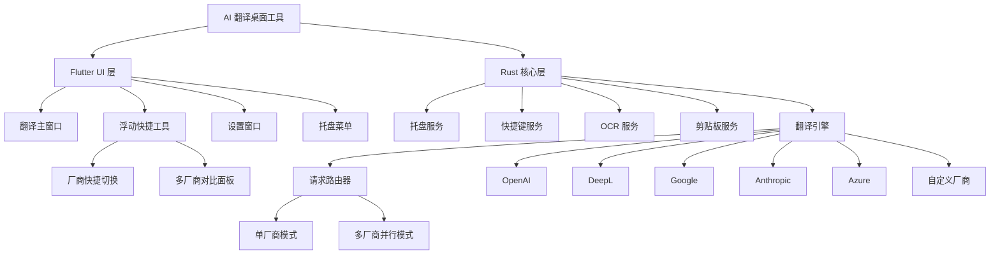
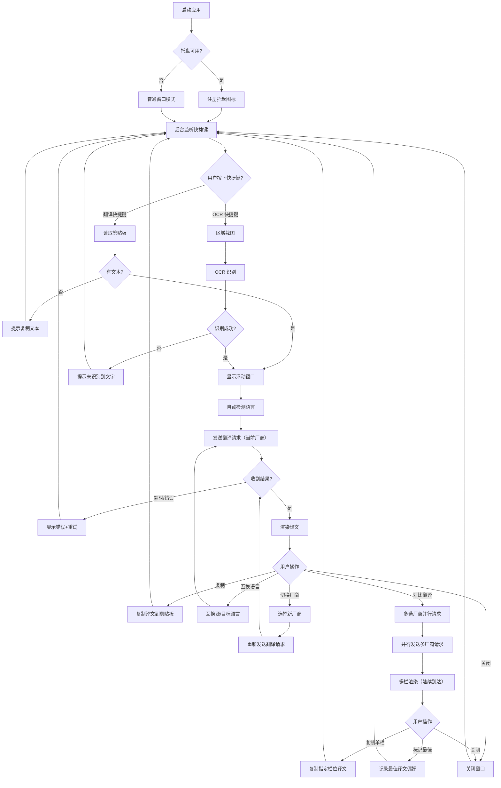
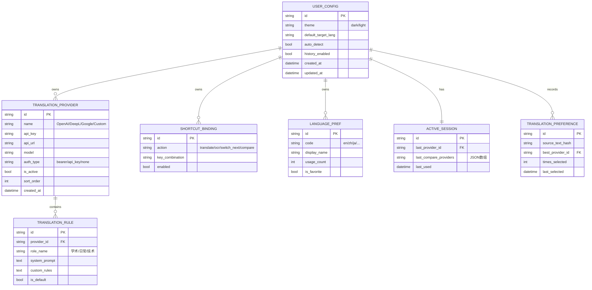

# AI 翻译桌面工具 — 产品需求文档 (PRD)

> 生成日期：2026-04-24
> 技术栈：Flutter (前端) + Rust (后端托盘/OCR/系统交互)
> 目标平台：Linux (Wayland)

---

## 1. 产品概述

### 1.1 背景

桌面用户在阅读外文文档、网页或软件界面时，需要频繁切换翻译工具或浏览器标签，操作链路长、效率低。现有翻译工具多为浏览器插件或独立网页，缺乏系统级集成，无法做到"选中文本即翻译"的无缝体验。

本项目旨在开发一款 Linux Wayland 桌面环境下的 AI 翻译工具，通过 Rust 后端提供系统托盘、OCR 截图识别、快捷键管理等能力，Flutter 前端提供美观的翻译 UI 和浮动快捷工具，实现"随手翻译"的桌面级体验。

### 1.2 目标

1. 翻译请求响应时间 < 2s（P95，网络正常条件下）
2. OCR 识别准确率 > 95%（清晰印刷体文本）
3. 支持至少 5 家主流翻译厂商接入（OpenAI、DeepL、Google、Anthropic、Azure）
4. 支持 20+ 语言互译，含自动语言检测
5. 应用启动到可用状态 < 3s
6. 内存占用 < 150MB（空闲状态）

### 1.3 非目标

- 移动端适配（Linux 桌面专用）
- X11 兼容（仅支持 Wayland）
- GNOME 桌面支持（V2 规划）
- Sway 桌面支持（V2 规划）
- 离线翻译模型（依赖云端 API）
- 实时语音翻译（V2 规划）

---

## 2. 用户与场景

### 2.1 目标用户

| 角色 | 描述 | 核心诉求 |
|------|------|---------|
| 开发者 | 阅读英文文档、Stack Overflow、GitHub Issues | 快速翻译技术术语，保持上下文 |
| 学术研究者 | 阅读外文论文、文献 | 批量翻译段落，支持专业术语 |
| 普通用户 | 浏览外文网页、邮件、聊天 | 简单直观的翻译操作，一键互换语言 |

### 2.2 用户故事

- 作为开发者，我希望选中文本后按快捷键即可翻译，以便阅读文档时不用切换窗口
- 作为学术研究者，我希望自定义翻译角色和规则，以便获得更符合学术场景的翻译结果
- 作为普通用户，我希望截图后自动识别并翻译文字，以便翻译图片中的内容
- 作为多语言用户，我希望快速互换源语言和目标语言，以便双向翻译时不用重新选择
- 作为注重效率的用户，我希望应用常驻托盘，以便随时唤出使用
- 作为多配置用户，我希望在浮动窗口中快速切换翻译厂商或模型，以便对比不同引擎的翻译质量
- 作为严谨用户，我希望同时使用多个厂商翻译同一段文本，以便选择最准确的译文

### 2.3 核心场景

**场景 1：快捷键翻译选中文本**

- 前置条件：应用已启动并最小化到托盘，用户在其他窗口选中了一段外文文本
- 操作步骤：
  1. 用户按下自定义快捷键（默认 `Ctrl+Alt+[`）
  2. 浮动翻译窗口出现在鼠标附近
  3. 自动读取剪贴板内容并发送翻译请求
  4. 翻译结果实时显示在浮动窗口中
- 预期结果：1-2 秒内显示翻译结果，用户可复制结果或关闭窗口

**场景 2：OCR 截图翻译**

- 前置条件：用户看到图片或无法复制的文本区域
- 操作步骤：
  1. 用户按下 OCR 快捷键（默认 `Ctrl+Alt+]`）
  2. 屏幕出现区域选择框
  3. 用户框选目标区域后松开
  4. 系统截取区域并进行 OCR 识别
  5. 识别文字自动送入翻译引擎
  6. 翻译结果显示在浮动窗口
- 预期结果：3-5 秒内显示识别文字及翻译结果

**场景 3：切换翻译厂商和模型**

- 前置条件：用户打开主设置窗口
- 操作步骤：
  1. 用户在设置中选择翻译厂商（如 OpenAI）
  2. 输入 API Key、自定义 URL（可选）、选择模型
  3. 设置系统提示词 / 翻译规则
  4. 保存配置并测试连接
- 预期结果：配置保存成功，测试连接返回正常

**场景 4：快捷切换翻译厂商**

- 前置条件：用户已配置多个翻译厂商（如 OpenAI-GPT4、DeepL、Google），浮动窗口已打开
- 操作步骤：
  1. 浮动窗口顶部显示当前使用的厂商名称和模型
  2. 用户点击厂商名称，展开已配置的厂商列表
  3. 用户选择另一个厂商（如从 OpenAI 切换到 DeepL）
  4. 系统使用新厂商重新翻译当前文本
- 预期结果：1-2 秒内显示新厂商的翻译结果，厂商选择状态持久化到下次使用

**场景 5：多厂商同时翻译对比**

- 前置条件：用户已配置多个翻译厂商，浮动窗口已打开并显示翻译结果
- 操作步骤：
  1. 用户点击浮动窗口中的"对比翻译"按钮（或图标）
  2. 系统弹出厂商多选面板，用户勾选 2-4 个厂商
  3. 确认后，系统并行向所有选中厂商发送翻译请求
  4. 浮动窗口展开为多栏布局，每栏显示一个厂商的翻译结果
  5. 每个结果栏顶部显示厂商名称和响应时间
  6. 用户可点击任一结果栏的复制按钮
- 预期结果：所有厂商结果在 2-3 秒内陆续到达并显示，最慢的厂商超时（10s）后显示错误

---

## 3. 功能需求

### 3.1 功能架构



### 3.2 功能清单

| 功能 | 描述 | 所属模块 | 优先级 | 验收标准 |
|------|------|---------|--------|---------|
| 系统托盘 | 应用最小化到系统托盘，支持托盘菜单（打开/设置/退出） | 托盘管理 | P0 | 右键托盘菜单正常显示，点击可执行对应操作 |
| 浮动翻译窗口 | 快捷键唤出浮动窗口，显示翻译结果 | 翻译 UI | P0 | 窗口出现在鼠标附近，结果 2s 内显示，支持复制 |
| 快捷键翻译 | 自定义快捷键触发翻译，自动读取剪贴板 | 快捷键管理 | P0 | 快捷键全局生效，可自定义修改 |
| 语言选择 | 支持源语言和目标语言选择，支持快捷互换 | 翻译 UI | P0 | 互换按钮一键切换，自动检测语言准确 |
| 自动语言检测 | 自动识别输入文本的语言 | 翻译引擎 | P0 | 检测准确率 > 90%（常见语言） |
| 多厂商接入 | 支持 OpenAI、DeepL、Google、Anthropic、Azure | 翻译引擎 | P0 | 每个厂商配置后可正常翻译 |
| 自定义厂商 | 支持自定义 API URL、模型、角色、规则 | 翻译引擎 | P1 | 自定义配置保存后可正常使用 |
| 翻译规则/角色 | 自定义系统提示词，支持预设角色（学术/日常/技术） | 翻译引擎 | P1 | 切换角色后翻译风格明显变化 |
| OCR 截图翻译 | 区域截图 → OCR 识别 → 翻译 | OCR 服务 | P0 | 截图识别准确率 > 95%，翻译正常 |
| 设置面板 | 管理厂商配置、快捷键、语言偏好、外观设置 | 设置管理 | P0 | 所有配置持久化，重启不丢失 |
| 多语言 UI | 应用界面支持多语言切换 | 国际化 | P1 | 支持中/英/日三套界面语言 |
| 美观 UI 设计 | 现代化设计，支持主题切换 | UI 设计 | P1 | 视觉效果一致，暗色/亮色主题可用 |
| 厂商快捷切换 | 浮动窗口中快速切换已配置的翻译厂商或模型 | 翻译 UI | P0 | 点击切换后 2s 内显示新结果，状态持久化 |
| 多厂商对比翻译 | 同时选择 2-4 个厂商并行翻译，对比结果 | 翻译引擎 | P1 | 多栏布局显示结果，标注响应时间，支持单独复制 |

### 3.3 详细需求

#### 功能 1：系统托盘

**所属模块：** 托盘管理

**输入：**
- 用户右键点击托盘图标
- 用户左键双击托盘图标

**处理逻辑：**
1. 应用启动后注册系统托盘图标
2. 右键显示菜单：[打开翻译窗口 | 设置 | 关于 | 退出]
3. 左键双击打开主翻译窗口
4. 窗口关闭时最小化到托盘而非退出

**输出：**
- 托盘图标显示（使用应用 logo）
- 右键菜单弹出

**异常处理：**
- KDE Plasma：通过 `libappindicator` 注册 SNI，KDE 托盘自动识别
- Hyprland：检测 waybar 是否运行，未运行时提示用户
- 托盘不可用时降级为普通窗口模式，提示用户

---

#### 功能 2：浮动翻译窗口

**所属模块：** 翻译 UI

**输入：**
- 用户按下翻译快捷键
- 剪贴板中的文本内容

**处理逻辑：**
1. 监听全局快捷键
2. 快捷键触发时获取当前鼠标位置
3. 读取剪贴板文本
4. 在鼠标附近创建浮动窗口（无边框、圆角、阴影）
5. 发送翻译请求，显示加载状态
6. 收到结果后渲染翻译文本
7. 窗口支持拖拽移动、ESC 关闭、点击外部关闭

**输出：**
- 浮动窗口显示原文和译文
- 提供复制译文按钮
- 提供语言互换按钮

**异常处理：**
- KDE Plasma：使用 xdg-toplevel + KWin 窗口规则（保持置顶、无边框）
- Hyprland：使用 layer-shell 协议创建 overlay 层窗口，通过 `hyprctl` 设置 float/pin/noanim
- 剪贴板为空时提示"请先复制要翻译的文本"
- 翻译请求超时（10s）时显示错误信息和重试按钮
- API Key 无效时提示配置错误

---

#### 功能 3：语言选择与快捷互换

**所属模块：** 翻译 UI

**输入：**
- 用户点击语言选择下拉框
- 用户点击互换按钮

**处理逻辑：**
1. 源语言默认"自动检测"，目标语言默认用户上次选择
2. 语言列表按常用程度排序，支持搜索
3. 点击互换按钮时：源语言 ←→ 目标语言
4. 如果源语言为"自动检测"，互换后检测到的语言变为源语言

**输出：**
- 语言选择器展开/收起
- 互换动画反馈

**异常处理：**
- 自动检测失败时回退到默认源语言

---

#### 功能 4：多厂商接入与自定义配置

**所属模块：** 翻译引擎

**输入：**
- 用户选择厂商类型
- 用户填写 API Key、自定义 URL（可选）、模型名称
- 用户设置翻译角色和规则（系统提示词）

**处理逻辑：**
1. 内置厂商模板（OpenAI、DeepL、Google、Anthropic、Azure）
2. 每个厂商预填默认 API URL 和可用模型列表
3. 支持自定义厂商：填写任意 OpenAI 兼容接口
4. 翻译规则模板：学术翻译、日常翻译、技术文档、代码注释
5. 用户可编辑系统提示词，如"你是一位专业的学术论文翻译专家..."
6. 配置保存到本地 JSON/SQLite
7. 提供"测试连接"按钮验证配置

**输出：**
- 配置列表展示
- 测试连接结果（成功/失败及原因）

**异常处理：**
- API Key 格式错误时即时提示
- 网络不可达时提示检查网络
- 模型不存在时提示可用模型列表

---

#### 功能 5：OCR 截图翻译

**所属模块：** OCR 服务

**输入：**
- 用户按下 OCR 快捷键
- 用户框选屏幕区域

**处理逻辑：**
1. 监听 OCR 全局快捷键
2. 触发后屏幕变暗，显示区域选择框
3. 用户框选后截取该区域图像
4. 调用 OCR 引擎识别文字（使用 tesseract 或云端 OCR）
5. 识别结果送入翻译引擎
6. 翻译结果在浮动窗口显示，同时展示原文和译文

**输出：**
- 区域选择界面
- OCR 识别文字
- 翻译结果

**异常处理：**
- KDE Plasma：调用 `xdg-desktop-portal-kde` 截图，失败时提示授权
- Hyprland：使用 `grim` + `slurp` 组合，未安装时提示用户安装
- OCR 识别为空时提示"未识别到文字"
- 识别文字过长时截断并提示

---

#### 功能 6：自定义快捷键

**所属模块：** 快捷键管理

**输入：**
- 用户在设置中点击快捷键输入框
- 用户按下目标按键组合

**处理逻辑：**
1. 默认快捷键：翻译 `Ctrl+Alt+[`，OCR `Ctrl+Alt+]`
2. 快捷键输入框进入录制模式
3. 用户按下按键组合后自动保存
4. 检测快捷键冲突，冲突时提示
5. 注册/注销系统全局快捷键（通过 Rust 后端）

**输出：**
- 快捷键显示更新
- 冲突警告（如有）

**异常处理：**
- KDE Plasma：优先使用 `KGlobalAccle` D-Bus 注册，失败时回退到 evdev
- Hyprland：通过 evdev 监听或 `hyprctl bind` 动态绑定
- 快捷键已被系统占用时提示更换
- 启动时检测桌面环境，自动选择对应快捷键方案

---

#### 功能 7：厂商快捷切换

**所属模块：** 翻译 UI

**输入：**
- 用户点击浮动窗口顶部的厂商名称/模型标签
- 用户从下拉列表中选择另一个已配置的厂商

**处理逻辑：**
1. 浮动窗口顶部显示当前使用的厂商名称和模型（如 "OpenAI · gpt-4o"）
2. 点击后展开下拉列表，列出所有已配置且激活的厂商
3. 每个选项显示：厂商图标/名称 + 模型名称 + 响应时间（最近一次）
4. 用户选择新厂商后：
   - 更新当前使用厂商
   - 使用新厂商重新翻译当前文本
   - 显示加载状态
5. 厂商选择状态持久化，下次打开浮动窗口时默认使用上次选择的厂商
6. 支持快捷键切换：`Ctrl+Tab` 循环切换已配置厂商

**输出：**
- 下拉列表展开/收起
- 切换后显示新厂商的翻译结果
- 顶部标签更新为新厂商名称

**异常处理：**
- 仅配置了一个厂商时，隐藏切换入口
- 选中厂商配置无效（API Key 过期等）时提示并跳回上一可用厂商
- 切换请求超时（10s）时显示错误，保留原文不变

---

#### 功能 8：多厂商对比翻译

**所属模块：** 翻译引擎

**输入：**
- 用户点击浮动窗口中的"对比翻译"按钮
- 用户在厂商多选面板中勾选 2-4 个厂商
- 用户确认开始对比

**处理逻辑：**
1. 点击"对比翻译"按钮后弹出厂商多选面板
2. 面板列出所有已配置且激活的厂商，支持多选（最少 2 个，最多 4 个）
3. 用户确认后：
   - 浮动窗口从单栏布局切换为多栏布局（2-4 栏）
   - Rust 后端并行向所有选中厂商发送翻译请求
   - 每个栏位顶部显示厂商名称、模型、加载状态
   - 结果到达后立即渲染，不等待所有厂商完成
   - 每个栏位显示响应时间（从发送到收到结果）
4. 每个结果栏提供独立操作：
   - 复制该栏位的译文
   - 标记为"最佳译文"（记录到偏好）
   - 重新翻译该栏位
5. 对比模式状态不持久化，关闭浮动窗口后恢复单厂商模式
6. 支持快捷键：`Ctrl+Shift+M` 快速进入对比模式（使用上次选择的厂商组合）

**输出：**
- 多栏布局的翻译结果
- 每个栏位标注厂商名称、模型、响应时间
- 加载中的栏位显示进度指示器

**异常处理：**
- 某个厂商请求失败时，该栏位显示错误信息，不影响其他厂商
- 所有厂商均失败时显示总体错误提示
- 对比模式下窗口宽度不足时，自动切换为垂直滚动布局
- 用户配置的厂商数量 < 2 时，禁用对比按钮并提示"请先配置至少 2 个翻译厂商"

---

## 4. 非功能需求

### 4.1 性能

- 翻译请求响应时间 < 2s（P95，网络正常）
- 浮动窗口从快捷键触发到显示 < 300ms
- OCR 识别 + 翻译总耗时 < 5s（P95）
- 多厂商对比翻译：4 厂商并行请求总耗时 < 3s（P95，以最慢厂商计）
- 厂商切换响应时间 < 2s（P95）
- 应用内存占用 < 150MB（空闲），< 300MB（翻译中），< 400MB（4 厂商对比中）
- 应用启动到可用 < 3s

### 4.2 安全

- API Key 本地加密存储（使用 OS 密钥环或加密文件）
- 不上传用户剪贴板内容，仅在用户触发翻译时发送
- 翻译请求使用 HTTPS
- 不记录翻译历史（隐私优先，可选开启历史记录）

### 4.3 兼容性

**目标桌面环境（首发支持）：**

| 桌面环境 | Compositor | 托盘协议 | 截图方案 | 快捷键方案 | 浮动窗口方案 |
|---------|-----------|---------|---------|-----------|-------------|
| KDE Plasma 6+ | KWin (Wayland) | StatusNotifierItem (plasma-workspace) | xdg-desktop-portal-kde | KGlobalAccel D-Bus / evdev | xdg-toplevel + KWin 窗口规则 |
| Hyprland 0.35+ | Hyprland | StatusNotifierItem (waybar/swaybar) | grim + slurp / xdg-desktop-portal-hyprland | evdev 层 / hyprctl bind | layer-shell (zwlr_layer_shell_v1) |

**通用技术要求：**
- Flutter 3.41.7 + Dart 3.9.2
- Rust 1.85+ (edition 2024)
- flutter_rust_bridge 2.11.0
- 托盘统一使用 `status-notifier-item` Rust crate
- 剪贴板使用 `wl-clipboard-rs`（Wayland 原生）
- 桌面环境检测：启动时通过 `$XDG_CURRENT_DESKTOP` 和 `$WAYLAND_DISPLAY` 识别

**KDE Plasma 专项适配：**
- 托盘：通过 `libappindicator` 注册 SNI，KDE 托盘自动识别
- 截图：调用 `xdg-desktop-portal-kde` 的 `org.freedesktop.portal.Screenshot` 接口
- 快捷键：优先使用 `KGlobalAccel` D-Bus 服务注册全局快捷键，回退到 evdev 监听
- 浮动窗口：使用标准 xdg-toplevel，通过 KWin 规则设置为"保持置顶"和"无边框"
- 主题：跟随 KDE 系统主题（通过 `qt5ct`/`qt6ct` 或 D-Bus 获取）

**Hyprland 专项适配：**
- 托盘：依赖 waybar 或兼容 SNI 的面板，检测 waybar 是否运行
- 截图：优先使用 `grim` + `slurp` 组合（原生 Wayland 工具），回退到 portal
- 快捷键：通过 evdev 设备监听（`/dev/input/event*`），或使用 `hyprctl` 动态绑定
- 浮动窗口：使用 `layer-shell` 协议创建 overlay 层窗口，实现真正的"浮动"效果
- 窗口规则：通过 `hyprctl keyword` 设置窗口为 `float`、`pin`、`noanim`

### 4.4 数据

- 配置数据存储：`~/.config/flutter-translate/config.json` 或 SQLite
- API Key 存储：使用 `libsecret`（KDE 通过 KWallet，Hyprland 通过 gnome-keyring 或加密文件）
- 不存储翻译历史（默认），用户可手动开启
- 配置支持导入/导出
- 桌面环境配置：`~/.config/flutter-translate/desktop-env.json`（记录检测到的桌面环境和适配方案）

**Hyprland 依赖工具链：**
- `grim`：屏幕截图
- `slurp`：区域选择
- `waybar`：托盘显示（可选）
- `wl-clipboard`：剪贴板操作

**KDE Plasma 依赖服务：**
- `xdg-desktop-portal-kde`：截图和屏幕共享
- `KGlobalAccel`：全局快捷键
- `KWallet`：密钥存储
- `plasma-workspace`：托盘支持

---

## 5. 技术栈选型

### 5.1 核心框架版本

| 组件 | 版本 | 说明 |
|------|------|------|
| Flutter | 3.41.7 | 稳定版，支持 Linux 桌面 |
| Dart | 3.9.2 | 与 Flutter 3.41.7 配套 |
| Rust | 1.85+ | edition 2024，支持最新异步特性 |
| flutter_rust_bridge | 2.11.0 | 最新稳定版，支持异步 FFI |

### 5.2 Flutter 依赖清单

```yaml
# pubspec.yaml
dependencies:
  flutter:
    sdk: flutter
  flutter_localizations:
    sdk: flutter

  # 状态管理
  flutter_riverpod: ^2.6.1
  riverpod_annotation: ^2.6.1

  # 路由
  go_router: ^16.2.0

  # FFI 桥接
  flutter_rust_bridge: ^2.11.0
  freezed_annotation: ^3.0.0
  json_annotation: ^4.9.0

  # UI 组件
  flutter_animate: ^4.5.2
  google_fonts: ^6.2.1
  lucide_icons: ^0.257.0

  # 工具类
  intl: ^0.20.2
  shared_preferences: ^2.5.3
  file_picker: ^10.1.0
  clipboard: ^0.1.3

  # 主题
  dynamic_color: ^1.7.0

dev_dependencies:
  flutter_test:
    sdk: flutter
  build_runner: ^2.4.15
  riverpod_generator: ^2.6.5
  freezed: ^3.0.6
  json_serializable: ^6.9.5
  flutter_lints: ^6.0.0
```

### 5.3 Rust 依赖清单

```toml
# native/Cargo.toml
[package]
name = "flutter-translate-native"
version = "0.1.0"
edition = "2024"

[lib]
crate-type = ["cdylib", "staticlib"]

[dependencies]
# FFI 桥接
flutter_rust_bridge = { version = "2.11", features = ["chrono"] }
tokio = { version = "1.47", features = ["full"] }

# HTTP 客户端
reqwest = { version = "0.12", features = ["json", "stream"] }
serde = { version = "1.0", features = ["derive"] }
serde_json = "1.0"

# 托盘
status-notifier-item = "0.1.0"
# 或使用 libappindicator-sys + 自定义实现

# 快捷键
evdev = "0.13"
zbus = "5.11"  # D-Bus（KDE KGlobalAccel）

# 剪贴板
wl-clipboard-rs = "0.10"

# OCR
tesseract = "0.15"
image = { version = "0.25", features = ["png"] }

# 配置存储
serde = { version = "1.0", features = ["derive"] }
sqlx = { version = "0.9", features = ["runtime-tokio", "sqlite"] }
secret-service = "5.1"  # freedesktop Secret Service
keyring = "4.0"

# 日志
tracing = "0.1"
tracing-subscriber = { version = "0.3", features = ["env-filter"] }

# 工具类
chrono = { version = "0.4", features = ["serde"] }
uuid = { version = "1.18", features = ["v4", "serde"] }
anyhow = "1.0"
thiserror = "2.0"

[dev-dependencies]
tokio-test = "0.4"
mockito = "1.7"
```

### 5.4 系统依赖

| 依赖 | 版本要求 | 用途 | 安装命令 |
|------|---------|------|---------|
| tesseract-ocr | 5.3+ | OCR 引擎 | `sudo apt install tesseract-ocr` |
| tesseract-ocr-chi-sim | 5.3+ | 中文 OCR 数据 | `sudo apt install tesseract-ocr-chi-sim` |
| libsecret-1-dev | - | 密钥存储 | `sudo apt install libsecret-1-dev` |
| libgtk-3-dev | 3.24+ | Flutter Linux 嵌入 | `sudo apt install libgtk-3-dev` |
| clang | 14+ | FFI 编译 | `sudo apt install clang` |
| cmake | 3.20+ | 构建系统 | `sudo apt install cmake` |
| pkg-config | - | 依赖查找 | `sudo apt install pkg-config` |
| grim | 1.4+ | Hyprland 截图 | `sudo apt install grim` |
| slurp | 1.3+ | Hyprland 区域选择 | `sudo apt install slurp` |

### 5.5 版本兼容性矩阵

| Flutter | Dart | flutter_rust_bridge | Rust | 状态 |
|---------|------|---------------------|------|------|
| 3.41.7 | 3.9.2 | 2.11.0 | 1.85+ | ✅ 推荐 |
| 3.38.x | 3.8.x | 2.9+ | 1.82+ | ✅ 兼容 |
| 3.35.x | 3.7.x | 2.7+ | 1.80+ | ⚠️ 部分特性受限 |

### 5.6 技术选型理由

| 选型 | 理由 |
|------|------|
| Riverpod | 编译时安全、支持代码生成、与 freezed 集成良好 |
| go_router | Flutter 官方推荐路由、支持声明式路由、深度链接 |
| flutter_rust_bridge | 自动生成类型安全 FFI、支持异步、活跃维护 |
| reqwest | Rust 生态最成熟的 HTTP 客户端、原生异步支持 |
| tokio | Rust 异步运行时标准、与 reqwest 深度集成 |
| zbus | 纯 Rust D-Bus 实现、无 C 依赖、异步支持 |
| evdev | 直接读取 Linux 输入设备、不依赖 X11/Wayland |
| status-notifier-item | 纯 Rust SNI 实现、跨桌面兼容 |
| sqlx | 编译时 SQL 检查、异步支持、SQLite 成熟驱动 |

---

## 6. 用户流程



---

## 7. 数据模型



---

## 8. 代码结构目录

### 8.1 项目整体结构

```
flutter-translate/
├── Cargo.toml                          # Rust workspace 根配置 (edition 2024)
├── pubspec.yaml                        # Flutter 依赖配置 (Flutter 3.41.7)
├── flutter_rust_bridge.yaml            # FFI 桥接配置
├── docs/                               # 项目文档
├── native/                             # Rust 原生代码
│   ├── Cargo.toml
│   ├── src/
│   │   ├── main.rs                     # Rust 入口（系统托盘、事件循环）
│   │   ├── lib.rs                      # FFI 导出接口
│   │   ├── tray/                       # 托盘服务
│   │   │   ├── mod.rs
│   │   │   ├── indicator.rs            # SNI 托盘注册
│   │   │   └── menu.rs                 # 托盘菜单
│   │   ├── hotkey/                     # 快捷键服务
│   │   │   ├── mod.rs
│   │   │   ├── kde.rs                  # KGlobalAccel D-Bus 集成
│   │   │   ├── hyprland.rs             # evdev / hyprctl 集成
│   │   │   └── evdev.rs                # 通用 evdev 监听
│   │   ├── clipboard/                  # 剪贴板服务
│   │   │   ├── mod.rs
│   │   │   └── wl.rs                   # wl-clipboard-rs 封装
│   │   ├── ocr/                        # OCR 服务
│   │   │   ├── mod.rs
│   │   │   ├── tesseract.rs            # tesseract 引擎
│   │   │   ├── screenshot.rs           # 截图实现
│   │   │   ├── kde.rs                  # xdg-desktop-portal-kde
│   │   │   └── hyprland.rs             # grim + slurp
│   │   ├── translate/                  # 翻译引擎
│   │   │   ├── mod.rs
│   │   │   ├── engine.rs               # 翻译引擎核心
│   │   │   ├── router.rs               # 请求路由器（单/多模式）
│   │   │   ├── provider/               # 厂商实现
│   │   │   │   ├── mod.rs
│   │   │   │   ├── openai.rs
│   │   │   │   ├── deepl.rs
│   │   │   │   ├── google.rs
│   │   │   │   ├── anthropic.rs
│   │   │   │   ├── azure.rs
│   │   │   │   └── custom.rs
│   │   │   └── rule.rs                 # 翻译规则/角色
│   │   ├── config/                     # 配置管理
│   │   │   ├── mod.rs
│   │   │   ├── storage.rs              # JSON/SQLite 存储
│   │   │   ├── secret.rs               # libsecret/KWallet 加密
│   │   │   └── desktop_env.rs          # 桌面环境检测
│   │   └── ffi/                        # FFI 桥接层
│   │       ├── mod.rs
│   │       ├── bridge.rs               # flutter_rust_bridge 导出
│   │       └── types.rs                # 共享类型定义
│   └── tests/
│       ├── translate_test.rs
│       └── config_test.rs
├── flutter/                            # Flutter 应用
│   ├── lib/
│   │   ├── main.dart                   # 应用入口
│   │   ├── app.dart                    # MaterialApp 配置
│   │   ├── core/                       # 核心服务
│   │   │   ├── ffi_bridge.dart         # FFI 桥接调用
│   │   │   ├── config_manager.dart     # 配置管理
│   │   │   └── theme_manager.dart      # 主题管理
│   │   ├── models/                     # 数据模型
│   │   │   ├── provider_config.dart    # 厂商配置
│   │   │   ├── translation_rule.dart   # 翻译规则
│   │   │   ├── shortcut_binding.dart   # 快捷键绑定
│   │   │   └── language_pref.dart      # 语言偏好
│   │   ├── providers/                  # 状态管理 (Riverpod/Provider)
│   │   │   ├── translate_provider.dart # 翻译状态
│   │   │   ├── config_provider.dart    # 配置状态
│   │   │   ├── theme_provider.dart     # 主题状态
│   │   │   └── session_provider.dart   # 会话状态
│   │   ├── services/                   # 业务服务
│   │   │   ├── translate_service.dart  # 翻译服务
│   │   │   ├── ocr_service.dart        # OCR 服务
│   │   │   └── hotkey_service.dart     # 快捷键服务
│   │   ├── screens/                    # 页面
│   │   │   ├── translate/              # 翻译相关页面
│   │   │   │   ├── floating_window.dart # 浮动翻译窗口
│   │   │   │   ├── provider_switcher.dart # 厂商切换器
│   │   │   │   └── compare_panel.dart  # 多厂商对比面板
│   │   │   ├── settings/               # 设置页面
│   │   │   │   ├── settings_screen.dart
│   │   │   │   ├── provider_config_page.dart
│   │   │   │   ├── shortcut_config_page.dart
│   │   │   │   └── appearance_page.dart
│   │   │   └── main_screen.dart        # 主窗口
│   │   ├── widgets/                    # 通用组件
│   │   │   ├── language_selector.dart  # 语言选择器
│   │   │   ├── provider_badge.dart     # 厂商标签
│   │   │   ├── result_card.dart        # 结果卡片
│   │   │   └── loading_indicator.dart  # 加载指示器
│   │   ├── utils/                      # 工具类
│   │   │   ├── constants.dart          # 常量定义
│   │   │   ├── helpers.dart            # 辅助函数
│   │   │   └── validators.dart         # 表单验证
│   │   └── l10n/                       # 国际化
│   │       ├── app_zh.arb
│   │       ├── app_en.arb
│   │       └── app_ja.arb
│   ├── assets/                         # 静态资源
│   │   ├── icons/                      # 图标
│   │   └── images/                     # 图片
│   ├── test/                           # Flutter 测试
│   │   ├── widget_test.dart
│   │   └── provider_test.dart
│   └── linux/                          # Linux 平台配置
│       ├── CMakeLists.txt
│       ├── main.cc
│       └── flutter/
└── scripts/                            # 构建脚本
    ├── build.sh                        # 完整构建
    ├── gen_bridge.sh                   # 生成 FFI 桥接代码
    └── package.sh                      # 打包发布
```

### 8.2 Flutter 模块说明 (Flutter 3.41.7)

| 目录 | 职责 | 关键技术 |
|------|------|---------|
| `core/` | FFI 桥接、配置管理、主题管理 | `flutter_rust_bridge`、`shared_preferences` |
| `models/` | 数据模型定义，与 Rust 类型对齐 | `freezed`、`json_serializable` |
| `providers/` | 全局状态管理 | `riverpod` (推荐) 或 `provider` |
| `screens/` | 页面级组件，按功能模块组织 | `go_router` 路由 |
| `widgets/` | 可复用 UI 组件 | 响应式设计、主题适配 |
| `services/` | 业务逻辑封装，调用 FFI 接口 | 异步流处理、错误边界 |
| `l10n/` | 多语言资源文件 | `flutter_localizations` |

### 8.3 Rust 模块说明 (edition 2024)

| 模块 | 职责 | 关键 crate |
|------|------|-----------|
| `tray/` | 系统托盘注册、菜单渲染 | `libappindicator`、`status-notifier-item` |
| `hotkey/` | 全局快捷键注册、事件分发 | `evdev`、`zbus` (D-Bus)、`hyprland` |
| `clipboard/` | Wayland 剪贴板读写 | `wl-clipboard-rs` |
| `ocr/` | 截图、OCR 识别 | `tesseract`、`image`、`serde` |
| `translate/` | 翻译引擎、厂商适配、并行请求 | `reqwest`、`tokio`、`serde_json` |
| `config/` | 配置存储、密钥管理、环境检测 | `serde`、`sqlx`、`secret-service` |
| `ffi/` | FFI 桥接层，导出 Flutter 可调用的接口 | `flutter_rust_bridge` |

### 8.4 FFI 通信机制

```
┌─────────────────────────────────────────────────────────────┐
│                     Flutter (Dart)                           │
│  ┌──────────────┐  ┌──────────────┐  ┌──────────────────┐  │
│  │  UI Widgets  │  │  Providers   │  │  FFI Bridge      │  │
│  └──────┬───────┘  └──────┬───────┘  └────────┬─────────┘  │
│         │                 │                    │            │
│         └─────────────────┴────────────────────┘            │
│                              │                              │
└──────────────────────────────┼──────────────────────────────┘
                               │ flutter_rust_bridge
                               │ (代码自动生成)
┌──────────────────────────────┼──────────────────────────────┐
│                     Rust (Native)                            │
│                              │                              │
│  ┌───────────────────────────┴───────────────────────────┐  │
│  │                    FFI Layer                          │  │
│  │  ┌─────────────┐  ┌─────────────┐  ┌──────────────┐  │  │
│  │  │  Bridge     │  │  Types      │  │  Error       │  │  │
│  │  │  (导出函数) │  │  (共享定义) │  │  Mapping     │  │  │
│  │  └──────┬──────┘  └──────┬──────┘  └──────┬───────┘  │  │
│  └─────────┼────────────────┼────────────────┼──────────┘  │
│            │                │                │              │
│  ┌─────────┴────────────────┴────────────────┴──────────┐  │
│  │                 Business Logic                        │  │
│  │  ┌──────────┐ ┌──────────┐ ┌──────────┐ ┌─────────┐ │  │
│  │  │ Translate│ │  OCR     │ │ Hotkey   │ │ Config  │ │  │
│  │  │ Engine   │ │ Service  │ │ Service  │ │ Manager │ │  │
│  │  └──────────┘ └──────────┘ └──────────┘ └─────────┘ │  │
│  └──────────────────────────────────────────────────────┘  │
└─────────────────────────────────────────────────────────────┘
```

**FFI 关键接口：**

```rust
// native/src/ffi/bridge.rs (示例)
#[frb]
pub async fn translate(
    text: String,
    source_lang: String,
    target_lang: String,
    provider_id: String,
) -> Result<TranslationResult, TranslateError> { ... }

#[frb]
pub async fn translate_compare(
    text: String,
    source_lang: String,
    target_lang: String,
    provider_ids: Vec<String>,
) -> Result<Vec<TranslationResult>, TranslateError> { ... }

#[frb]
pub fn get_providers() -> Vec<ProviderConfig> { ... }

#[frb]
pub fn save_provider(config: ProviderConfig) -> Result<(), ConfigError> { ... }

#[frb]
pub fn detect_desktop_env() -> DesktopEnv { ... }

#[frb]
pub async fn ocr_screenshot() -> Result<String, OcrError> { ... }
```

### 8.5 构建流程

```bash
# 1. 生成 FFI 桥接代码
flutter_rust_bridge_code_gen

# 2. 构建 Rust 动态库
cargo build --release --lib

# 3. 构建 Flutter 应用
flutter build linux --release

# 4. 打包（可选）
./scripts/package.sh
```

---

## 9. 排期与里程碑

| 阶段 | 内容 | 工期 | 交付物 |
|------|------|------|--------|
| M1 | 项目搭建：Flutter + Rust 框架集成、桌面环境检测、托盘基础 | 1 周 | 可运行版本：自动检测 KDE/Hyprland，托盘基础功能 |
| M2 | 翻译引擎：多厂商接入、API 配置管理、语言选择 | 1.5 周 | 支持 3+ 厂商翻译，配置持久化 |
| M3 | KDE Plasma 适配：KGlobalAccle 快捷键、portal 截图、KWin 窗口规则 | 1 周 | KDE 下完整可用：快捷键 + 截图 + 托盘 + 浮动窗口 |
| M4 | Hyprland 适配：evdev 快捷键、grim/slurp 截图、layer-shell 浮动窗口 | 1.5 周 | Hyprland 下完整可用：快捷键 + 截图 + 托盘 + 浮动窗口 |
| M5 | 设置面板 + 自定义快捷键 + 主题 + 多语言 UI | 1 周 | 完整设置功能，跟随系统主题 |
| M6 | 优化与测试：双桌面测试、性能优化、Bug 修复、打包发布 | 1 周 | 可发布的稳定版本，KDE + Hyprland 双平台验证 |

**总工期：约 7 周**

---

## 10. 验收标准

1. 应用启动后托盘图标正常显示，右键菜单可执行打开/设置/退出操作
2. 按下翻译快捷键后，浮动窗口在 300ms 内出现在鼠标附近
3. 自动读取剪贴板文本，2 秒内显示翻译结果（网络正常）
4. 语言互换按钮一键切换源语言和目标语言，翻译结果自动更新
5. 自动语言检测准确率 > 90%（中/英/日/韩/法/德/西/俄）
6. 至少 5 家翻译厂商可配置并正常使用
7. 自定义厂商配置（URL + API Key + 模型）保存后可正常翻译
8. 翻译角色/规则切换后，翻译风格有明显变化
9. OCR 截图翻译：区域选择 → 识别 → 翻译全流程可用，识别准确率 > 95%
10. 快捷键可在设置中自定义，修改后立即生效
11. 所有配置重启后不丢失
12. 应用内存占用 < 150MB（空闲），< 300MB（翻译中）
13. 暗色/亮色主题切换正常，界面美观一致
14. API Key 使用系统密钥环加密存储，不以明文保存

**厂商切换验收：**
15. 配置多个厂商后，浮动窗口顶部显示当前厂商名称，点击可展开切换列表
16. 切换厂商后 2 秒内显示新厂商翻译结果
17. 厂商选择状态在关闭并重新打开浮动窗口后保持
18. `Ctrl+Tab` 快捷键可循环切换已配置厂商
19. 仅配置一个厂商时，切换入口自动隐藏

**多厂商对比验收：**
20. 点击"对比翻译"按钮后弹出厂商多选面板，支持选择 2-4 个厂商
21. 多厂商并行请求，结果陆续到达并实时渲染，不等待最慢的厂商
22. 多栏布局中每个栏位标注厂商名称、模型、响应时间
23. 每个栏位可独立复制译文
24. 某个厂商请求失败时不影响其他厂商结果展示
25. 配置厂商数量 < 2 时，对比按钮禁用并提示原因
26. `Ctrl+Shift+M` 快捷键可使用上次选择的厂商组合快速进入对比模式

**KDE Plasma 专项验收：**
27. 在 KDE Plasma 6+ (Wayland) 下，托盘图标正常显示于系统托盘
28. 截图功能通过 `xdg-desktop-portal-kde` 正常工作，用户授权后完成截图
29. 全局快捷键通过 `KGlobalAccle` 或 evdev 正常注册和触发
30. 浮动窗口在 KWin 下保持置顶且无边框

**Hyprland 专项验收：**
31. 在 Hyprland 0.35+ 下，托盘图标通过 waybar 正常显示（waybar 运行时）
32. 截图功能通过 `grim` + `slurp` 正常工作，区域选择流畅
33. 全局快捷键通过 evdev 或 `hyprctl` 正常注册和触发
34. 浮动窗口通过 layer-shell 协议正确显示为 overlay 层，不被其他窗口遮挡

---

## 11. 风险与依赖

| 风险/依赖 | 影响桌面 | 影响 | 缓解措施 |
|-----------|---------|------|---------|
| KDE portal 版本差异 | KDE Plasma | xdg-desktop-portal-kde 旧版本截图接口不兼容 | 检测 portal 版本，提供 grim 备选方案 |
| KGlobalAccle 权限 | KDE Plasma | 部分 KDE 配置限制 D-Bus 注册快捷键 | 回退到 evdev 监听，引导用户手动配置 |
| Hyprland 托盘依赖 | Hyprland | waybar 未运行时托盘不可见 | 检测 waybar 进程，提示用户安装或降级为窗口模式 |
| grim/slurp 权限 | Hyprland | 截图工具未安装或权限不足 | 启动时检测依赖，提供一键安装指引 |
| layer-shell 兼容性 | Hyprland | 部分 Hyprland 版本 layer-shell 行为不一致 | 测试 0.35+ 版本，回退到 xdg-toplevel |
| Flutter Linux 桌面集成 | 通用 | Flutter 对 Linux 桌面系统级功能支持有限 | 通过 Rust FFI 实现托盘、快捷键、截图等系统功能 |
| 第三方 API 稳定性 | 通用 | 翻译服务不可用导致功能失效 | 支持多厂商切换，自动重试，离线提示 |
| OCR 引擎选型 | 通用 | tesseract 准确率受限，云端 OCR 有成本 | 默认使用 tesseract，支持配置云端 OCR 作为可选 |
| API Key 安全存储 | 通用 | libsecret 在某些环境不可用 | 降级为加密文件存储，提示用户风险 |
| 桌面环境检测失败 | 通用 | 无法自动选择适配方案 | 提供手动选择桌面环境的设置项 |
| 多厂商并发请求 | 通用 | 4 厂商并行时可能触发 API 限流 | 请求间隔 100ms 错峰，支持配置限流策略 |
| 对比模式窗口宽度 | 通用 | 多栏布局在小屏幕下显示不全 | 宽度不足时自动切换为垂直滚动布局 |
